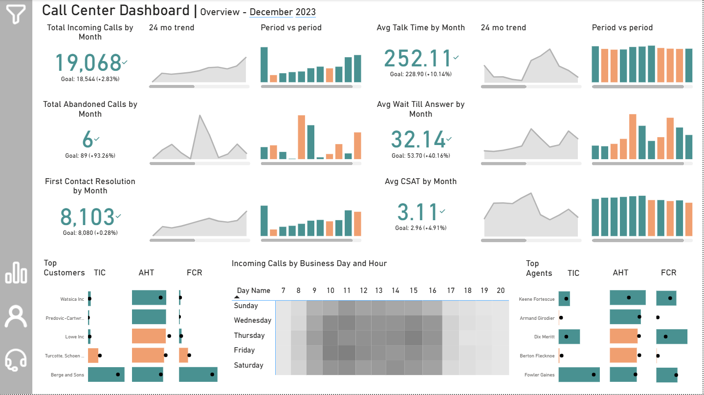
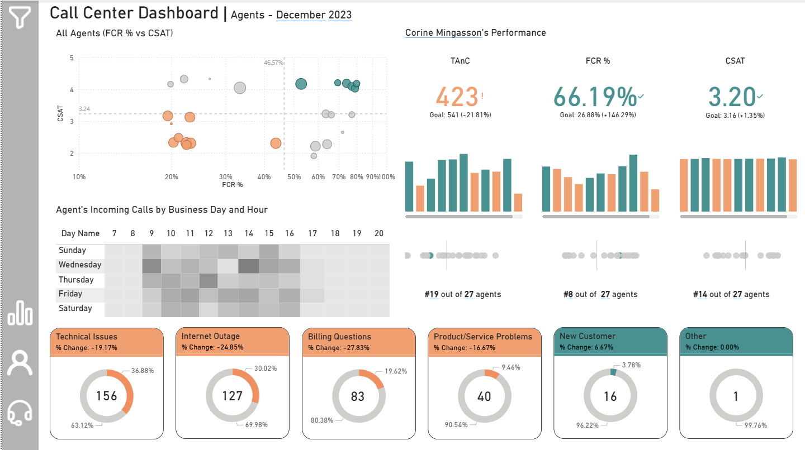

# Call Center Analysis

**Data analysis project inspired by Tableau's Call Center Accelerator: https://exchange.tableau.com/en-gb/products/623?version=2021.2**

## 📚  Table of Contents
- 📄 [ Importing The Datasets (SQL)](https://github.com/mihaivlasceanu/Call-Center-Data-Analysis?tab=readme-ov-file#importing-the-datasets)
- 🧹 [Creating Additional Tables (SQL)](https://github.com/mihaivlasceanu/Call-Center-Data-Analysis?tab=readme-ov-file#creating-additional-tables)
- 📈 [Performance Overview (SQL)](https://github.com/mihaivlasceanu/Call-Center-Data-Analysis?tab=readme-ov-file#performance-overview)
- 👨‍💼 [Customer Analysis (SQL)](https://github.com/mihaivlasceanu/Call-Center-Data-Analysis?tab=readme-ov-file#customer-analysis)
- 📊 [Agent Analysis (SQL)](https://github.com/mihaivlasceanu/Call-Center-Data-Analysis?tab=readme-ov-file#agent-analysis)
- 🎨 [Data Visualization (Tableau)](https://github.com/mihaivlasceanu/Call-Center-Data-Analysis?tab=readme-ov-file#data-visualization)
- 💡 [Key Findings and Next Steps](https://github.com/mihaivlasceanu/Call-Center-Data-Analysis?tab=readme-ov-file#key-findings-and-next-steps)


## Importing The Datasets

```sql
CREATE TABLE calls_data (
	call_id INTEGER,
	call_datetime TEXT,
	customer TEXT,
	call_reason TEXT,
	agent TEXT,
	abandon_flag BOOLEAN,
	first_contact_resolution_flag BOOLEAN,
	customer_satisfaction INTEGER,
	handle_time INTEGER,
	wait_time INTEGER,
	talk_time INTEGER
)

-- \COPY calls_data FROM 'C:\Users\Mihai\Desktop\Call Center\calls_data_expert.csv' WITH CSV HEADER DELIMITER ','

SHOW DATESTYLE

SET DATESTYLE = DMY

ALTER TABLE calls_data
ALTER COLUMN call_datetime TYPE TIMESTAMP USING call_datetime::TIMESTAMP WITHOUT TIME ZONE

SELECT
*
FROM calls_data
LIMIT 5
```
| call_id | call_datetime       | customer        | call_reason      | agent            | abandon_flag | first_contact_resolution_flag | customer_satisfaction | handle_time | wait_time | talk_time |
|---------|---------------------|-----------------|------------------|------------------|--------------|-------------------------------|-----------------------|-------------|-----------|-----------|
| 3141604 | 2023-04-06 15:13:00 | West-McLaughlin | Technical Issues | Corine Mingasson | false        | false                         | 2                     | 111         | 11        | 72        |
| 1814651 | 2022-08-14 14:08:00 | West-McLaughlin | Technical Issues | Corine Mingasson | false        | false                         | 2                     | 151         | 11        | 102       |
| 1382579 | 2022-02-18 10:23:00 | West-McLaughlin | Technical Issues | Corine Mingasson | false        | false                         | 2                     | 171         | 11        | 117       |
| 3070979 | 2023-03-03 10:48:00 | West-McLaughlin | Technical Issues | Corine Mingasson | false        | false                         | 2                     | 191         | 11        | 132       |
| 3707471 | 2023-11-09 11:27:00 | West-McLaughlin | Technical Issues | Corine Mingasson | false        | false                         | 2                     | 200         | 11        | 139       |
## Creating Additional Tables 

Later on, we will be needing a few date dimension/scaffolding tables that will allow us to identify the dates on which certain agents or customers were inactive.
```sql
CREATE TABLE date_scaffolding (
date_time TIMESTAMP
)

-- \COPY date_scaffolding FROM 'C:\Users\Mihai\Desktop\Call Center\scaffolding_single_column_v2.csv' WITH CSV HEADER DELIMITER ','

SELECT * FROM date_scaffolding
```
| date_time           |
|---------------------|
| 2022-01-30 07:00:00 |
| 2022-01-30 08:00:00 |
| 2022-01-30 09:00:00 |
| 2022-01-30 10:00:00 |
| 2022-01-30 11:00:00 |
| 2022-01-30 12:00:00 |
| 2022-01-30 13:00:00 |
| 2022-01-30 14:00:00 |
| 2022-01-30 15:00:00 |
| 2022-01-30 16:00:00 |
| 2022-01-30 17:00:00 |
| 2022-01-30 18:00:00 |
| 2022-01-30 19:00:00 |
| 2022-01-30 20:00:00 |
| 2022-01-31 07:00:00 |
| 2022-01-31 08:00:00 |
| 2022-01-31 09:00:00 |
| 2022-01-31 10:00:00 |
| 2022-01-31 11:00:00 |
| 2022-01-31 12:00:00 |
Creating a cross table with dates and employee names only:

```sql
SELECT 
DISTINCT agent
INTO agents_only
FROM calls_data

SELECT * FROM agents_only
```
| agent                    |
|--------------------------|
| Anabel Grebert           |
| Aprilette Fallawe        |
| Armand Girodier          |
| Benjie Pyott             |
| Berton Flecknoe          |
| Brinna Colecrough        |
| Christoforo Swaine       |
| Corine Mingasson         |
| Danielle Baffin          |
| Dix Meritt               |
| Elfrida Balazot          |
| Fowler Gaines            |
| Gabriella Galliver       |
| Hansiain Rodder          |
| Keene Fortescue          |
| Koralle Patey            |
| Margarete Von Der Empten |
| Mikaela Bartoli          |
| Nerita Coultas           |
| Odelia Scothron          |
| Reinwald Lowis           |
| Renee Biaggelli          |
| Reta Winscum             |
| Sarette Lifsey           |
| Shellysheldon Soffe      |
| Stillmann Ramelet        |
| Tamqrah Scorah           |
| Valentijn Lambdin        |
| Zola Rawkesby            |
```sql
CREATE TABLE date_and_agents AS
SELECT * FROM agents_only
CROSS JOIN date_scaffolding
ORDER BY 1,2

SELECT * FROM date_and_agents
LIMIT 20
```
| agent          | date_time           |
|----------------|---------------------|
| Anabel Grebert | 2022-01-30 07:00:00 |
| Anabel Grebert | 2022-01-30 08:00:00 |
| Anabel Grebert | 2022-01-30 09:00:00 |
| Anabel Grebert | 2022-01-30 10:00:00 |
| Anabel Grebert | 2022-01-30 11:00:00 |
| Anabel Grebert | 2022-01-30 12:00:00 |
| Anabel Grebert | 2022-01-30 13:00:00 |
| Anabel Grebert | 2022-01-30 14:00:00 |
| Anabel Grebert | 2022-01-30 15:00:00 |
| Anabel Grebert | 2022-01-30 16:00:00 |
| Anabel Grebert | 2022-01-30 17:00:00 |
| Anabel Grebert | 2022-01-30 18:00:00 |
| Anabel Grebert | 2022-01-30 19:00:00 |
| Anabel Grebert | 2022-01-30 20:00:00 |
| Anabel Grebert | 2022-01-31 07:00:00 |
| Anabel Grebert | 2022-01-31 08:00:00 |
| Anabel Grebert | 2022-01-31 09:00:00 |
| Anabel Grebert | 2022-01-31 10:00:00 |
| Anabel Grebert | 2022-01-31 11:00:00 |
| Anabel Grebert | 2022-01-31 12:00:00 |

Creating a cross table with dates and customer names only:
```sql
SELECT 
DISTINCT customer
INTO customers_only
FROM calls_data

SELECT * FROM customers_only
```
| customer                          |
|-----------------------------------|
| Anderson, Schoen and Pfannerstill |
| Berge and Sons                    |
| Hyatt, Will and Rodriguez         |
| Jenkins-Armstrong                 |
| Lowe Inc                          |
| Nienow LLC                        |
| Predovic-Cartwright               |
| Stiedemann Inc                    |
| Toy, Rippin and Beier             |
| Turcotte, Schoen and Carroll      |
| Watsica Inc                       |
| West-McLaughlin                   |
```sql
CREATE TABLE date_and_customers AS
SELECT * FROM customers_only
CROSS JOIN date_scaffolding
ORDER BY 1,2

SELECT * FROM date_and_customers
LIMIT 20
```
| customer                          | date_time           |
|-----------------------------------|---------------------|
| Anderson, Schoen and Pfannerstill | 2022-01-30 07:00:00 |
| Anderson, Schoen and Pfannerstill | 2022-01-30 08:00:00 |
| Anderson, Schoen and Pfannerstill | 2022-01-30 09:00:00 |
| Anderson, Schoen and Pfannerstill | 2022-01-30 10:00:00 |
| Anderson, Schoen and Pfannerstill | 2022-01-30 11:00:00 |
| Anderson, Schoen and Pfannerstill | 2022-01-30 12:00:00 |
| Anderson, Schoen and Pfannerstill | 2022-01-30 13:00:00 |
| Anderson, Schoen and Pfannerstill | 2022-01-30 14:00:00 |
| Anderson, Schoen and Pfannerstill | 2022-01-30 15:00:00 |
| Anderson, Schoen and Pfannerstill | 2022-01-30 16:00:00 |
| Anderson, Schoen and Pfannerstill | 2022-01-30 17:00:00 |
| Anderson, Schoen and Pfannerstill | 2022-01-30 18:00:00 |
| Anderson, Schoen and Pfannerstill | 2022-01-30 19:00:00 |
| Anderson, Schoen and Pfannerstill | 2022-01-30 20:00:00 |
| Anderson, Schoen and Pfannerstill | 2022-01-31 07:00:00 |
| Anderson, Schoen and Pfannerstill | 2022-01-31 08:00:00 |
| Anderson, Schoen and Pfannerstill | 2022-01-31 09:00:00 |
| Anderson, Schoen and Pfannerstill | 2022-01-31 10:00:00 |
| Anderson, Schoen and Pfannerstill | 2022-01-31 11:00:00 |
| Anderson, Schoen and Pfannerstill | 2022-01-31 12:00:00 |

Creating a cross table with dates, customer names and call reasons only:
```sql
SELECT 
DISTINCT call_reason
INTO call_reasons_only
FROM calls_data

SELECT * FROM call_reasons_only
```
| call_reason              |
|--------------------------|
| Billing Questions        |
| Internet Outage          |
| New Customer             |
| Other                    |
| Product/Service Problems |
| Technical Issues         |
```sql
CREATE TABLE date_and_customers_and_reasons AS
SELECT * FROM customers_only
CROSS JOIN date_scaffolding
CROSS JOIN call_reasons_only
ORDER BY 1,2

SELECT * FROM date_and_customers_and_reasons
LIMIT 20
```
| customer                          | date_time           | call_reason              |
|-----------------------------------|---------------------|--------------------------|
| Anderson, Schoen and Pfannerstill | 2022-01-30 07:00:00 | Internet Outage          |
| Anderson, Schoen and Pfannerstill | 2022-01-30 07:00:00 | New Customer             |
| Anderson, Schoen and Pfannerstill | 2022-01-30 07:00:00 | Other                    |
| Anderson, Schoen and Pfannerstill | 2022-01-30 07:00:00 | Billing Questions        |
| Anderson, Schoen and Pfannerstill | 2022-01-30 07:00:00 | Product/Service Problems |
| Anderson, Schoen and Pfannerstill | 2022-01-30 07:00:00 | Technical Issues         |
| Anderson, Schoen and Pfannerstill | 2022-01-30 08:00:00 | Technical Issues         |
| Anderson, Schoen and Pfannerstill | 2022-01-30 08:00:00 | Product/Service Problems |
| Anderson, Schoen and Pfannerstill | 2022-01-30 08:00:00 | Other                    |
| Anderson, Schoen and Pfannerstill | 2022-01-30 08:00:00 | New Customer             |
| Anderson, Schoen and Pfannerstill | 2022-01-30 08:00:00 | Billing Questions        |
| Anderson, Schoen and Pfannerstill | 2022-01-30 08:00:00 | Internet Outage          |
| Anderson, Schoen and Pfannerstill | 2022-01-30 09:00:00 | Billing Questions        |
| Anderson, Schoen and Pfannerstill | 2022-01-30 09:00:00 | Internet Outage          |
| Anderson, Schoen and Pfannerstill | 2022-01-30 09:00:00 | Other                    |
| Anderson, Schoen and Pfannerstill | 2022-01-30 09:00:00 | New Customer             |
| Anderson, Schoen and Pfannerstill | 2022-01-30 09:00:00 | Product/Service Problems |
| Anderson, Schoen and Pfannerstill | 2022-01-30 09:00:00 | Technical Issues         |
| Anderson, Schoen and Pfannerstill | 2022-01-30 10:00:00 | Product/Service Problems |
| Anderson, Schoen and Pfannerstill | 2022-01-30 10:00:00 | Technical Issues         |

Creating a cross table with dates, agent names and call reasons only:
```sql
CREATE TABLE date_and_agents_and_reasons AS
SELECT * FROM agents_only
CROSS JOIN date_scaffolding
CROSS JOIN call_reasons_only
ORDER BY 1,2

SELECT * FROM date_and_agents_and_reasons
LIMIT 20
```
| agent          | date_time           | call_reason              |
|----------------|---------------------|--------------------------|
| Anabel Grebert | 2022-01-30 07:00:00 | Billing Questions        |
| Anabel Grebert | 2022-01-30 07:00:00 | Product/Service Problems |
| Anabel Grebert | 2022-01-30 07:00:00 | Other                    |
| Anabel Grebert | 2022-01-30 07:00:00 | New Customer             |
| Anabel Grebert | 2022-01-30 07:00:00 | Internet Outage          |
| Anabel Grebert | 2022-01-30 07:00:00 | Technical Issues         |
| Anabel Grebert | 2022-01-30 08:00:00 | Technical Issues         |
| Anabel Grebert | 2022-01-30 08:00:00 | Internet Outage          |
| Anabel Grebert | 2022-01-30 08:00:00 | Product/Service Problems |
| Anabel Grebert | 2022-01-30 08:00:00 | New Customer             |
| Anabel Grebert | 2022-01-30 08:00:00 | Other                    |
| Anabel Grebert | 2022-01-30 08:00:00 | Billing Questions        |
| Anabel Grebert | 2022-01-30 09:00:00 | Product/Service Problems |
| Anabel Grebert | 2022-01-30 09:00:00 | Billing Questions        |
| Anabel Grebert | 2022-01-30 09:00:00 | Internet Outage          |
| Anabel Grebert | 2022-01-30 09:00:00 | New Customer             |
| Anabel Grebert | 2022-01-30 09:00:00 | Other                    |
| Anabel Grebert | 2022-01-30 09:00:00 | Technical Issues         |
| Anabel Grebert | 2022-01-30 10:00:00 | Technical Issues         |
| Anabel Grebert | 2022-01-30 10:00:00 | Product/Service Problems |

## Performance Overview

**1.1 TIC - Total Incoming Calls**
-- percent change vs previous month (MoM, Month-over-Month)
-- percent change vs same month, previous year (SMPY)
```sql
WITH tic_cte AS (
SELECT 
DATE_PART('year', call_datetime) AS year,
TRIM(TO_CHAR(call_datetime, 'Month')) AS month,
COUNT(call_id) AS tic,
ARRAY_POSITION(ARRAY['January', 'February', 'March', 'April', 'May', 'June', 'July', 'August', 'September', 'October', 'November', 'December'], TRIM(TO_CHAR(call_datetime, 'Month'))) AS month_order
FROM calls_data
GROUP BY 1,2
)

SELECT
year,
month,
tic,
LAG(tic, 1) OVER (ORDER BY year, month_order) AS tic_mom,
ROUND(100.0*(tic - LAG(tic, 1) OVER (ORDER BY year, month_order)) / LAG(tic, 1) OVER (ORDER BY year, month_order), 2) AS pct_change_mom,
LAG(tic, 12) OVER (ORDER BY year, month_order) AS tic_smpy,
ROUND(100.0*(tic - LAG(tic, 12) OVER (ORDER BY year, month_order)) / LAG(tic, 12) OVER (ORDER BY year, month_order), 2) AS pct_change_smpy
FROM tic_cte
```
| year | month     | tic   | tic_mom | pct_change_mom | tic_smpy | pct_change_smpy |
|------|-----------|-------|---------|----------------|----------|-----------------|
| 2022 | January   | 296   |         |                |          |                 |
| 2022 | February  | 6134  | 296     | 1972.30        |          |                 |
| 2022 | March     | 5465  | 6134    | -10.91         |          |                 |
| 2022 | April     | 5979  | 5465    | 9.41           |          |                 |
| 2022 | May       | 6687  | 5979    | 11.84          |          |                 |
| 2022 | June      | 7842  | 6687    | 17.27          |          |                 |
| 2022 | July      | 9961  | 7842    | 27.02          |          |                 |
| 2022 | August    | 10290 | 9961    | 3.30           |          |                 |
| 2022 | September | 9154  | 10290   | -11.04         |          |                 |
| 2022 | October   | 11054 | 9154    | 20.76          |          |                 |
| 2022 | November  | 16925 | 11054   | 53.11          |          |                 |
| 2022 | December  | 19789 | 16925   | 16.92          |          |                 |
| 2023 | January   | 23914 | 19789   | 20.84          | 296      | 7979.05         |
| 2023 | February  | 4869  | 23914   | -79.64         | 6134     | -20.62          |
| 2023 | March     | 6128  | 4869    | 25.86          | 5465     | 12.13           |
| 2023 | April     | 6894  | 6128    | 12.50          | 5979     | 15.30           |
| 2023 | May       | 7335  | 6894    | 6.40           | 6687     | 9.69            |
| 2023 | June      | 9561  | 7335    | 30.35          | 7842     | 21.92           |
| 2023 | July      | 10635 | 9561    | 11.23          | 9961     | 6.77            |
| 2023 | August    | 9493  | 10635   | -10.74         | 10290    | -7.75           |
| 2023 | September | 10597 | 9493    | 11.63          | 9154     | 15.76           |
| 2023 | October   | 17054 | 10597   | 60.93          | 11054    | 54.28           |
| 2023 | November  | 18544 | 17054   | 8.74           | 16925    | 9.57            |
| 2023 | December  | 19072 | 18544   | 2.85           | 19789    | -3.62           |

---
**1.2 TIC - Total Incoming Calls** (percent change Year-to-Date)
```sql
WITH tic_cte AS (
SELECT 
DATE_PART('year', call_datetime) AS year,
TRIM(TO_CHAR(call_datetime, 'Month')) AS month,
COUNT(call_id) AS tic,
ARRAY_POSITION(ARRAY['January', 'February', 'March', 'April', 'May', 'June', 'July', 'August', 'September', 'October', 'November', 'December'], TRIM(TO_CHAR(call_datetime, 'Month'))) AS month_order
FROM calls_data
GROUP BY 1,2
)

, tic_ytd_cte AS (
SELECT
year,
month,
month_order,
tic,
SUM(tic) OVER (PARTITION BY year ORDER BY year, month_order) AS tic_ytd
FROM tic_cte
GROUP BY year, month, month_order, tic
)

SELECT
year, 
month, 
tic_ytd,
LAG(tic_ytd, 12) OVER (ORDER BY year, month_order) AS tic_ytd_prev_year,
ROUND(100.0*(tic_ytd - LAG(tic_ytd, 12) OVER (ORDER BY year, month_order)) / LAG(tic_ytd, 12) OVER (ORDER BY year, month_order), 1) AS pct_change_ytd
FROM tic_ytd_cte
```
| year | month     | tic_ytd | tic_ytd_prev_year | pct_change_ytd |
|------|-----------|---------|-------------------|----------------|
| 2022 | January   | 296     |                   |                |
| 2022 | February  | 6430    |                   |                |
| 2022 | March     | 11895   |                   |                |
| 2022 | April     | 17874   |                   |                |
| 2022 | May       | 24561   |                   |                |
| 2022 | June      | 32403   |                   |                |
| 2022 | July      | 42364   |                   |                |
| 2022 | August    | 52654   |                   |                |
| 2022 | September | 61808   |                   |                |
| 2022 | October   | 72862   |                   |                |
| 2022 | November  | 89787   |                   |                |
| 2022 | December  | 109576  |                   |                |
| 2023 | January   | 23914   | 296               | 7979.1         |
| 2023 | February  | 28783   | 6430              | 347.6          |
| 2023 | March     | 34911   | 11895             | 193.5          |
| 2023 | April     | 41805   | 17874             | 133.9          |
| 2023 | May       | 49140   | 24561             | 100.1          |
| 2023 | June      | 58701   | 32403             | 81.2           |
| 2023 | July      | 69336   | 42364             | 63.7           |
| 2023 | August    | 78829   | 52654             | 49.7           |
| 2023 | September | 89426   | 61808             | 44.7           |
| 2023 | October   | 106480  | 72862             | 46.1           |
| 2023 | November  | 125024  | 89787             | 39.2           |
| 2023 | December  | 144096  | 109576            | 31.5           |

---
**2.1 Abandoned Calls**
-- percent change vs previous month (MoM, Month-over-Month)
-- percent change vs same month, previous year (SMPY)
```sql
WITH abandoned_cte AS (
SELECT 
DATE_PART('year', call_datetime) AS year,
TRIM(TO_CHAR(call_datetime, 'Month')) AS month,
COUNT(call_id) FILTER (WHERE abandon_flag = true) AS abandoned_calls,
ARRAY_POSITION(ARRAY['January', 'February', 'March', 'April', 'May', 'June', 'July', 'August', 'September', 'October', 'November', 'December'], TRIM(TO_CHAR(call_datetime, 'Month'))) AS month_order
FROM calls_data
GROUP BY 1,2
)

SELECT
year,
month,
abandoned_calls,
LAG(abandoned_calls, 1) OVER (ORDER BY year, month_order) AS abandoned_mom,
ROUND(100.0*(abandoned_calls - LAG(abandoned_calls, 1) OVER (ORDER BY year, month_order)) / LAG(abandoned_calls, 1) OVER (ORDER BY year, month_order), 2) AS pct_change_mom,
LAG(abandoned_calls, 12) OVER (ORDER BY year, month_order) AS abandoned_smpy,
ROUND(100.0*(abandoned_calls - LAG(abandoned_calls, 12) OVER (ORDER BY year, month_order)) / LAG(abandoned_calls, 12) OVER (ORDER BY year, month_order), 2) AS pct_change_smpy
FROM abandoned_cte
```
| year | month     | abandoned_calls | abandoned_mom | pct_change_mom | abandoned_smpy | pct_change_smpy |
|------|-----------|-----------------|---------------|----------------|----------------|-----------------|
| 2022 | January   | 3               |               |                |                |                 |
| 2022 | February  | 31              | 3             | 933.33         |                |                 |
| 2022 | March     | 49              | 31            | 58.06          |                |                 |
| 2022 | April     | 21              | 49            | -57.14         |                |                 |
| 2022 | May       | 1               | 21            | -95.24         |                |                 |
| 2022 | June      | 146             | 1             | 14500.00       |                |                 |
| 2022 | July      | 82              | 146           | -43.84         |                |                 |
| 2022 | August    | 5               | 82            | -93.90         |                |                 |
| 2022 | September | 17              | 5             | 240.00         |                |                 |
| 2022 | October   | 50              | 17            | 194.12         |                |                 |
| 2022 | November  | 19              | 50            | -62.00         |                |                 |
| 2022 | December  | 89              | 19            | 368.42         |                |                 |
| 2023 | January   | 40              | 89            | -55.06         | 3              | 1233.33         |
| 2023 | February  | 46              | 40            | 15.00          | 31             | 48.39           |
| 2023 | March     | 24              | 46            | -47.83         | 49             | -51.02          |
| 2023 | April     | 1               | 24            | -95.83         | 21             | -95.24          |
| 2023 | May       | 146             | 1             | 14500.00       | 1              | 14500.00        |
| 2023 | June      | 113             | 146           | -22.60         | 146            | -22.60          |
| 2023 | July      | 6               | 113           | -94.69         | 82             | -92.68          |
| 2023 | August    | 17              | 6             | 183.33         | 5              | 240.00          |
| 2023 | September | 50              | 17            | 194.12         | 17             | 194.12          |
| 2023 | October   | 19              | 50            | -62.00         | 50             | -62.00          |
| 2023 | November  | 89              | 19            | 368.42         | 19             | 368.42          |
| 2023 | December  | 6               | 89            | -93.26         | 89             | -93.26          |

---
**2.2 Abandoned Calls** (percent change Year-to-Date)
```sql
WITH abandoned_cte AS (
SELECT 
DATE_PART('year', call_datetime) AS year,
TRIM(TO_CHAR(call_datetime, 'Month')) AS month,
COUNT(call_id) FILTER (WHERE abandon_flag = true) AS abandoned_calls,
ARRAY_POSITION(ARRAY['January', 'February', 'March', 'April', 'May', 'June', 'July', 'August', 'September', 'October', 'November', 'December'], TRIM(TO_CHAR(call_datetime, 'Month'))) AS month_order
FROM calls_data
GROUP BY 1,2
)

, abandoned_ytd_cte AS (
SELECT
year,
month,
month_order,
abandoned_calls,
SUM(abandoned_calls) OVER (PARTITION BY year ORDER BY year, month_order) AS abandoned_ytd
FROM abandoned_cte
GROUP BY year, month, month_order, abandoned_calls
)

SELECT
year, 
month, 
abandoned_ytd,
LAG(abandoned_ytd, 12) OVER (ORDER BY year, month_order) AS abandoned_ytd_prev_year,
ROUND(100.0*(abandoned_ytd - LAG(abandoned_ytd, 12) OVER (ORDER BY year, month_order)) / LAG(abandoned_ytd, 12) OVER (ORDER BY year, month_order), 1) AS pct_change_ytd
FROM abandoned_ytd_cte
```
| year | month     | abandoned_ytd | abandoned_ytd_prev_year | pct_change_ytd |
|------|-----------|---------------|-------------------------|----------------|
| 2022 | January   | 3             |                         |                |
| 2022 | February  | 34            |                         |                |
| 2022 | March     | 83            |                         |                |
| 2022 | April     | 104           |                         |                |
| 2022 | May       | 105           |                         |                |
| 2022 | June      | 251           |                         |                |
| 2022 | July      | 333           |                         |                |
| 2022 | August    | 338           |                         |                |
| 2022 | September | 355           |                         |                |
| 2022 | October   | 405           |                         |                |
| 2022 | November  | 424           |                         |                |
| 2022 | December  | 513           |                         |                |
| 2023 | January   | 40            | 3                       | 1233.3         |
| 2023 | February  | 86            | 34                      | 152.9          |
| 2023 | March     | 110           | 83                      | 32.5           |
| 2023 | April     | 111           | 104                     | 6.7            |
| 2023 | May       | 257           | 105                     | 144.8          |
| 2023 | June      | 370           | 251                     | 47.4           |
| 2023 | July      | 376           | 333                     | 12.9           |
| 2023 | August    | 393           | 338                     | 16.3           |
| 2023 | September | 443           | 355                     | 24.8           |
| 2023 | October   | 462           | 405                     | 14.1           |
| 2023 | November  | 551           | 424                     | 30.0           |
| 2023 | December  | 557           | 513                     | 8.6            |

---
**3.1 FCR - First Contact Resolution**
-- percent change vs previous month (MoM, Month-over-Month)
-- percent change vs same month, previous year (SMPY)
```sql
WITH fcr_cte AS (
SELECT 
DATE_PART('year', call_datetime) AS year,
TRIM(TO_CHAR(call_datetime, 'Month')) AS month,
COUNT(call_id) FILTER (WHERE first_contact_resolution_flag = true) AS fcr,
ARRAY_POSITION(ARRAY['January', 'February', 'March', 'April', 'May', 'June', 'July', 'August', 'September', 'October', 'November', 'December'], TRIM(TO_CHAR(call_datetime, 'Month'))) AS month_order
FROM calls_data
GROUP BY 1,2
)

SELECT
year,
month,
fcr,
LAG(fcr, 1) OVER (ORDER BY year, month_order) AS fcr_mom,
ROUND(100.0*(fcr - LAG(fcr, 1) OVER (ORDER BY year, month_order)) / LAG(fcr, 1) OVER (ORDER BY year, month_order), 2) AS pct_change_mom,
LAG(fcr, 12) OVER (ORDER BY year, month_order) AS fcr_smpy,
ROUND(100.0*(fcr - LAG(fcr, 12) OVER (ORDER BY year, month_order)) / LAG(fcr, 12) OVER (ORDER BY year, month_order), 2) AS pct_change_smpy
FROM fcr_cte
```
| year | month     | fcr   | fcr_mom | pct_change_mom | fcr_smpy | pct_change_smpy |
|------|-----------|-------|---------|----------------|----------|-----------------|
| 2022 | January   | 160   |         |                |          |                 |
| 2022 | February  | 3131  | 160     | 1856.88        |          |                 |
| 2022 | March     | 2707  | 3131    | -13.54         |          |                 |
| 2022 | April     | 3304  | 2707    | 22.05          |          |                 |
| 2022 | May       | 4171  | 3304    | 26.24          |          |                 |
| 2022 | June      | 5072  | 4171    | 21.60          |          |                 |
| 2022 | July      | 5908  | 5072    | 16.48          |          |                 |
| 2022 | August    | 4964  | 5908    | -15.98         |          |                 |
| 2022 | September | 4640  | 4964    | -6.53          |          |                 |
| 2022 | October   | 5174  | 4640    | 11.51          |          |                 |
| 2022 | November  | 8227  | 5174    | 59.01          |          |                 |
| 2022 | December  | 7954  | 8227    | -3.32          |          |                 |
| 2023 | January   | 10116 | 7954    | 27.18          | 160      | 6222.50         |
| 2023 | February  | 2183  | 10116   | -78.42         | 3131     | -30.28          |
| 2023 | March     | 3077  | 2183    | 40.95          | 2707     | 13.67           |
| 2023 | April     | 3410  | 3077    | 10.82          | 3304     | 3.21            |
| 2023 | May       | 4081  | 3410    | 19.68          | 4171     | -2.16           |
| 2023 | June      | 5125  | 4081    | 25.58          | 5072     | 1.04            |
| 2023 | July      | 5375  | 5125    | 4.88           | 5908     | -9.02           |
| 2023 | August    | 4912  | 5375    | -8.61          | 4964     | -1.05           |
| 2023 | September | 5296  | 4912    | 7.82           | 4640     | 14.14           |
| 2023 | October   | 8557  | 5296    | 61.57          | 5174     | 65.38           |
| 2023 | November  | 8080  | 8557    | -5.57          | 8227     | -1.79           |
| 2023 | December  | 8107  | 8080    | 0.33           | 7954     | 1.92            |

---
**3.2 FCR** (percent change Year-to-Date)
```sql
WITH fcr_cte AS (
SELECT 
DATE_PART('year', call_datetime) AS year,
TRIM(TO_CHAR(call_datetime, 'Month')) AS month,
COUNT(call_id) FILTER (WHERE first_contact_resolution_flag = true) AS fcr,
ARRAY_POSITION(ARRAY['January', 'February', 'March', 'April', 'May', 'June', 'July', 'August', 'September', 'October', 'November', 'December'], TRIM(TO_CHAR(call_datetime, 'Month'))) AS month_order
FROM calls_data
GROUP BY 1,2
)

, fcr_ytd_cte AS (
SELECT
year,
month,
month_order,
fcr,
SUM(fcr) OVER (PARTITION BY year ORDER BY year, month_order) AS fcr_ytd
FROM fcr_cte
GROUP BY year, month, month_order, fcr
)

SELECT
year, 
month, 
fcr_ytd,
LAG(fcr_ytd, 12) OVER (ORDER BY year, month_order) AS fcr_ytd_prev_year,
ROUND(100.0*(fcr_ytd - LAG(fcr_ytd, 12) OVER (ORDER BY year, month_order)) / LAG(fcr_ytd, 12) OVER (ORDER BY year, month_order), 1) AS pct_change_ytd
FROM fcr_ytd_cte
```
| year | month     | fcr_ytd | fcr_ytd_prev_year | pct_change_ytd |
|------|-----------|---------|-------------------|----------------|
| 2022 | January   | 160     |                   |                |
| 2022 | February  | 3291    |                   |                |
| 2022 | March     | 5998    |                   |                |
| 2022 | April     | 9302    |                   |                |
| 2022 | May       | 13473   |                   |                |
| 2022 | June      | 18545   |                   |                |
| 2022 | July      | 24453   |                   |                |
| 2022 | August    | 29417   |                   |                |
| 2022 | September | 34057   |                   |                |
| 2022 | October   | 39231   |                   |                |
| 2022 | November  | 47458   |                   |                |
| 2022 | December  | 55412   |                   |                |
| 2023 | January   | 10116   | 160               | 6222.5         |
| 2023 | February  | 12299   | 3291              | 273.7          |
| 2023 | March     | 15376   | 5998              | 156.4          |
| 2023 | April     | 18786   | 9302              | 102.0          |
| 2023 | May       | 22867   | 13473             | 69.7           |
| 2023 | June      | 27992   | 18545             | 50.9           |
| 2023 | July      | 33367   | 24453             | 36.5           |
| 2023 | August    | 38279   | 29417             | 30.1           |
| 2023 | September | 43575   | 34057             | 27.9           |
| 2023 | October   | 52132   | 39231             | 32.9           |
| 2023 | November  | 60212   | 47458             | 26.9           |
| 2023 | December  | 68319   | 55412             | 23.3           |

---
**4.1 Average Talk Time**
-- percent change vs previous month (MoM, Month-over-Month)
-- percent change vs same month, previous year (SMPY)
```sql
WITH talk_cte AS (
SELECT 
DATE_PART('year', call_datetime) AS year,
TRIM(TO_CHAR(call_datetime, 'Month')) AS month,
ROUND(AVG(talk_time),1) AS avg_talk_time,
ARRAY_POSITION(ARRAY['January', 'February', 'March', 'April', 'May', 'June', 'July', 'August', 'September', 'October', 'November', 'December'], TRIM(TO_CHAR(call_datetime, 'Month'))) AS month_order
FROM calls_data
GROUP BY 1,2
)

SELECT
year,
month,
avg_talk_time,
LAG(avg_talk_time, 1) OVER (ORDER BY year, month_order) AS avg_talk_time_mom,
ROUND(100.0*(avg_talk_time - LAG(avg_talk_time, 1) OVER (ORDER BY year, month_order)) / LAG(avg_talk_time, 1) OVER (ORDER BY year, month_order), 2) AS pct_change_mom,
LAG(avg_talk_time, 12) OVER (ORDER BY year, month_order) AS avg_talk_time_smpy,
ROUND(100.0*(avg_talk_time - LAG(avg_talk_time, 12) OVER (ORDER BY year, month_order)) / LAG(avg_talk_time, 12) OVER (ORDER BY year, month_order), 2) AS pct_change_smpy
FROM talk_cte
```
| year | month     | avg_talk_time | avg_talk_time_mom | pct_change_mom | avg_talk_time_smpy | pct_change_smpy |
|------|-----------|---------------|-------------------|----------------|--------------------|-----------------|
| 2022 | January   | 235.2         |                   |                |                    |                 |
| 2022 | February  | 224.9         | 235.2             | -4.38          |                    |                 |
| 2022 | March     | 224.9         | 224.9             | 0.00           |                    |                 |
| 2022 | April     | 222.6         | 224.9             | -1.02          |                    |                 |
| 2022 | May       | 221.6         | 222.6             | -0.45          |                    |                 |
| 2022 | June      | 239.5         | 221.6             | 8.08           |                    |                 |
| 2022 | July      | 243.9         | 239.5             | 1.84           |                    |                 |
| 2022 | August    | 250.1         | 243.9             | 2.54           |                    |                 |
| 2022 | September | 234.4         | 250.1             | -6.28          |                    |                 |
| 2022 | October   | 230.8         | 234.4             | -1.54          |                    |                 |
| 2022 | November  | 224.7         | 230.8             | -2.64          |                    |                 |
| 2022 | December  | 230.0         | 224.7             | 2.36           |                    |                 |
| 2023 | January   | 245.5         | 230.0             | 6.74           | 235.2              | 4.38            |
| 2023 | February  | 227.4         | 245.5             | -7.37          | 224.9              | 1.11            |
| 2023 | March     | 222.3         | 227.4             | -2.24          | 224.9              | -1.16           |
| 2023 | April     | 223.6         | 222.3             | 0.58           | 222.6              | 0.45            |
| 2023 | May       | 240.2         | 223.6             | 7.42           | 221.6              | 8.39            |
| 2023 | June      | 243.4         | 240.2             | 1.33           | 239.5              | 1.63            |
| 2023 | July      | 249.5         | 243.4             | 2.51           | 243.9              | 2.30            |
| 2023 | August    | 233.4         | 249.5             | -6.45          | 250.1              | -6.68           |
| 2023 | September | 229.1         | 233.4             | -1.84          | 234.4              | -2.26           |
| 2023 | October   | 227.4         | 229.1             | -0.74          | 230.8              | -1.47           |
| 2023 | November  | 228.9         | 227.4             | 0.66           | 224.7              | 1.87            |
| 2023 | December  | 252.1         | 228.9             | 10.14          | 230.0              | 9.61            |

---
**4.2 Average Talk Time** (percent change Year-to-Date)
```sql
WITH talk_cte AS (
SELECT 
DATE_PART('year', call_datetime) AS year,
TRIM(TO_CHAR(call_datetime, 'Month')) AS month,
ROUND(AVG(talk_time),1) AS avg_talk_time,
ARRAY_POSITION(ARRAY['January', 'February', 'March', 'April', 'May', 'June', 'July', 'August', 'September', 'October', 'November', 'December'], TRIM(TO_CHAR(call_datetime, 'Month'))) AS month_order
FROM calls_data
GROUP BY 1,2
)

, talk_ytd_cte AS (
SELECT
year,
month,
month_order,
avg_talk_time,
ROUND(AVG(avg_talk_time) OVER (PARTITION BY year ORDER BY year, month_order), 1) AS avg_talk_time_ytd
FROM talk_cte
GROUP BY year, month, month_order, avg_talk_time
)

SELECT
year, 
month, 
avg_talk_time_ytd,
LAG(avg_talk_time_ytd, 12) OVER (ORDER BY year, month_order) AS avg_talk_time_ytd_prev_year,
ROUND(100.0*(avg_talk_time_ytd - LAG(avg_talk_time_ytd, 12) OVER (ORDER BY year, month_order)) / LAG(avg_talk_time_ytd, 12) OVER (ORDER BY year, month_order), 1) AS pct_change_ytd
FROM talk_ytd_cte
```
| year | month     | avg_talk_time_ytd | avg_talk_time_ytd_prev_year | pct_change_ytd |
|------|-----------|-------------------|-----------------------------|----------------|
| 2022 | January   | 235.2             |                             |                |
| 2022 | February  | 230.1             |                             |                |
| 2022 | March     | 228.3             |                             |                |
| 2022 | April     | 226.9             |                             |                |
| 2022 | May       | 225.8             |                             |                |
| 2022 | June      | 228.1             |                             |                |
| 2022 | July      | 230.4             |                             |                |
| 2022 | August    | 232.8             |                             |                |
| 2022 | September | 233.0             |                             |                |
| 2022 | October   | 232.8             |                             |                |
| 2022 | November  | 232.1             |                             |                |
| 2022 | December  | 231.9             |                             |                |
| 2023 | January   | 245.5             | 235.2                       | 4.4            |
| 2023 | February  | 236.5             | 230.1                       | 2.8            |
| 2023 | March     | 231.7             | 228.3                       | 1.5            |
| 2023 | April     | 229.7             | 226.9                       | 1.2            |
| 2023 | May       | 231.8             | 225.8                       | 2.7            |
| 2023 | June      | 233.7             | 228.1                       | 2.5            |
| 2023 | July      | 236.0             | 230.4                       | 2.4            |
| 2023 | August    | 235.7             | 232.8                       | 1.2            |
| 2023 | September | 234.9             | 233.0                       | 0.8            |
| 2023 | October   | 234.2             | 232.8                       | 0.6            |
| 2023 | November  | 233.7             | 232.1                       | 0.7            |
| 2023 | December  | 235.2             | 231.9                       | 1.4            |

---
**5.1 Average Wait Till Answer**
-- percent change vs previous month (MoM, Month-0ver-Month)
-- percent change vs same month, previous year (SMPY)
```sql
WITH wait_cte AS (
SELECT 
DATE_PART('year', call_datetime) AS year,
TRIM(TO_CHAR(call_datetime, 'Month')) AS month,
ROUND(AVG(wait_time),1) AS avg_wait_time,
ARRAY_POSITION(ARRAY['January', 'February', 'March', 'April', 'May', 'June', 'July', 'August', 'September', 'October', 'November', 'December'], TRIM(TO_CHAR(call_datetime, 'Month'))) AS month_order
FROM calls_data
GROUP BY 1,2
)

SELECT
year,
month,
avg_wait_time,
LAG(avg_wait_time, 1) OVER (ORDER BY year, month_order) AS avg_wait_time_mom,
ROUND(100.0*(avg_wait_time - LAG(avg_wait_time, 1) OVER (ORDER BY year, month_order)) / LAG(avg_wait_time, 1) OVER (ORDER BY year, month_order), 2) AS pct_change_mom,
LAG(avg_wait_time, 12) OVER (ORDER BY year, month_order) AS avg_wait_time_smpy,
ROUND(100.0*(avg_wait_time - LAG(avg_wait_time, 12) OVER (ORDER BY year, month_order)) / LAG(avg_wait_time, 12) OVER (ORDER BY year, month_order), 2) AS pct_change_smpy
FROM wait_cte
```
| year | month     | avg_wait_time | avg_wait_time_mom | pct_change_mom | avg_wait_time_smpy | pct_change_smpy |
|------|-----------|---------------|-------------------|----------------|--------------------|-----------------|
| 2022 | January   | 27.8          |                   |                |                    |                 |
| 2022 | February  | 25.7          | 27.8              | -7.55          |                    |                 |
| 2022 | March     | 29.4          | 25.7              | 14.40          |                    |                 |
| 2022 | April     | 35.8          | 29.4              | 21.77          |                    |                 |
| 2022 | May       | 43.6          | 35.8              | 21.79          |                    |                 |
| 2022 | June      | 100.9         | 43.6              | 131.42         |                    |                 |
| 2022 | July      | 69.8          | 100.9             | -30.82         |                    |                 |
| 2022 | August    | 40.3          | 69.8              | -42.26         |                    |                 |
| 2022 | September | 47.5          | 40.3              | 17.87          |                    |                 |
| 2022 | October   | 93.7          | 47.5              | 97.26          |                    |                 |
| 2022 | November  | 67.9          | 93.7              | -27.53         |                    |                 |
| 2022 | December  | 53.5          | 67.9              | -21.21         |                    |                 |
| 2023 | January   | 30.1          | 53.5              | -43.74         | 27.8               | 8.27            |
| 2023 | February  | 28.7          | 30.1              | -4.65          | 25.7               | 11.67           |
| 2023 | March     | 34.0          | 28.7              | 18.47          | 29.4               | 15.65           |
| 2023 | April     | 45.0          | 34.0              | 32.35          | 35.8               | 25.70           |
| 2023 | May       | 99.7          | 45.0              | 121.56         | 43.6               | 128.67          |
| 2023 | June      | 74.0          | 99.7              | -25.78         | 100.9              | -26.66          |
| 2023 | July      | 40.5          | 74.0              | -45.27         | 69.8               | -41.98          |
| 2023 | August    | 48.7          | 40.5              | 20.25          | 40.3               | 20.84           |
| 2023 | September | 91.9          | 48.7              | 88.71          | 47.5               | 93.47           |
| 2023 | October   | 70.2          | 91.9              | -23.61         | 93.7               | -25.08          |
| 2023 | November  | 53.7          | 70.2              | -23.50         | 67.9               | -20.91          |
| 2023 | December  | 32.1          | 53.7              | -40.22         | 53.5               | -40.00          |

---
**5.2 Average Wait Till Answer** (percent change Year-to-Date)
```sql
WITH wait_cte AS (
SELECT 
DATE_PART('year', call_datetime) AS year,
TRIM(TO_CHAR(call_datetime, 'Month')) AS month,
ROUND(AVG(wait_time),1) AS avg_wait_time,
ARRAY_POSITION(ARRAY['January', 'February', 'March', 'April', 'May', 'June', 'July', 'August', 'September', 'October', 'November', 'December'], TRIM(TO_CHAR(call_datetime, 'Month'))) AS month_order
FROM calls_data
GROUP BY 1,2
)

, wait_ytd_cte AS (
SELECT
year,
month,
month_order,
avg_wait_time,
ROUND(AVG(avg_wait_time) OVER (PARTITION BY year ORDER BY year, month_order), 1) AS avg_wait_time_ytd
FROM wait_cte
GROUP BY year, month, month_order, avg_wait_time
)

SELECT
year, 
month, 
avg_wait_time_ytd,
LAG(avg_wait_time_ytd, 12) OVER (ORDER BY year, month_order) AS avg_wait_time_ytd_prev_year,
ROUND(100.0*(avg_wait_time_ytd - LAG(avg_wait_time_ytd, 12) OVER (ORDER BY year, month_order)) / LAG(avg_wait_time_ytd, 12) OVER (ORDER BY year, month_order), 1) AS pct_change_ytd
FROM wait_ytd_cte
```
| year | month     | avg_wait_time_ytd | avg_wait_time_ytd_prev_year | pct_change_ytd |
|------|-----------|-------------------|-----------------------------|----------------|
| 2022 | January   | 27.8              |                             |                |
| 2022 | February  | 26.8              |                             |                |
| 2022 | March     | 27.6              |                             |                |
| 2022 | April     | 29.7              |                             |                |
| 2022 | May       | 32.5              |                             |                |
| 2022 | June      | 43.9              |                             |                |
| 2022 | July      | 47.6              |                             |                |
| 2022 | August    | 46.7              |                             |                |
| 2022 | September | 46.8              |                             |                |
| 2022 | October   | 51.5              |                             |                |
| 2022 | November  | 52.9              |                             |                |
| 2022 | December  | 53.0              |                             |                |
| 2023 | January   | 30.1              | 27.8                        | 8.3            |
| 2023 | February  | 29.4              | 26.8                        | 9.7            |
| 2023 | March     | 30.9              | 27.6                        | 12.0           |
| 2023 | April     | 34.5              | 29.7                        | 16.2           |
| 2023 | May       | 47.5              | 32.5                        | 46.2           |
| 2023 | June      | 51.9              | 43.9                        | 18.2           |
| 2023 | July      | 50.3              | 47.6                        | 5.7            |
| 2023 | August    | 50.1              | 46.7                        | 7.3            |
| 2023 | September | 54.7              | 46.8                        | 16.9           |
| 2023 | October   | 56.3              | 51.5                        | 9.3            |
| 2023 | November  | 56.0              | 52.9                        | 5.9            |
| 2023 | December  | 54.1              | 53.0                        | 2.1            |

---
**6.1 CSAT - Customer Satisfaction Score**
-- percent change vs previous month (MoM, Month-over-Month)
-- percent change vs same month, previous year (SMPY)
```sql
WITH csat_cte AS (
SELECT 
DATE_PART('year', call_datetime) AS year,
TRIM(TO_CHAR(call_datetime, 'Month')) AS month,
ROUND(AVG(customer_satisfaction),1) AS avg_csat,
ARRAY_POSITION(ARRAY['January', 'February', 'March', 'April', 'May', 'June', 'July', 'August', 'September', 'October', 'November', 'December'], TRIM(TO_CHAR(call_datetime, 'Month'))) AS month_order
FROM calls_data
GROUP BY 1,2
)

SELECT
year,
month,
avg_csat,
LAG(avg_csat, 1) OVER (ORDER BY year, month_order) AS avg_csat_mom,
ROUND(100.0*(avg_csat - LAG(avg_csat, 1) OVER (ORDER BY year, month_order)) / LAG(avg_csat, 1) OVER (ORDER BY year, month_order), 2) AS pct_change_mom,
LAG(avg_csat, 12) OVER (ORDER BY year, month_order) AS avg_csat_smpy,
ROUND(100.0*(avg_csat - LAG(avg_csat, 12) OVER (ORDER BY year, month_order)) / LAG(avg_csat, 12) OVER (ORDER BY year, month_order), 2) AS pct_change_smpy
FROM csat_cte
```
| year | month     | avg_csat | avg_csat_mom | pct_change_mom | avg_csat_smpy | pct_change_smpy |
|------|-----------|----------|--------------|----------------|---------------|-----------------|
| 2022 | January   | 3.1      |              |                |               |                 |
| 2022 | February  | 3.4      | 3.1          | 9.68           |               |                 |
| 2022 | March     | 3.4      | 3.4          | 0.00           |               |                 |
| 2022 | April     | 3.4      | 3.4          | 0.00           |               |                 |
| 2022 | May       | 3.5      | 3.4          | 2.94           |               |                 |
| 2022 | June      | 3.6      | 3.5          | 2.86           |               |                 |
| 2022 | July      | 3.2      | 3.6          | -11.11         |               |                 |
| 2022 | August    | 3.1      | 3.2          | -3.13          |               |                 |
| 2022 | September | 3.2      | 3.1          | 3.23           |               |                 |
| 2022 | October   | 3.3      | 3.2          | 3.13           |               |                 |
| 2022 | November  | 3.1      | 3.3          | -6.06          |               |                 |
| 2022 | December  | 3.0      | 3.1          | -3.23          |               |                 |
| 2023 | January   | 3.3      | 3.0          | 10.00          | 3.1           | 6.45            |
| 2023 | February  | 3.4      | 3.3          | 3.03           | 3.4           | 0.00            |
| 2023 | March     | 3.4      | 3.4          | 0.00           | 3.4           | 0.00            |
| 2023 | April     | 3.5      | 3.4          | 2.94           | 3.4           | 2.94            |
| 2023 | May       | 3.5      | 3.5          | 0.00           | 3.5           | 0.00            |
| 2023 | June      | 3.6      | 3.5          | 2.86           | 3.6           | 0.00            |
| 2023 | July      | 3.2      | 3.6          | -11.11         | 3.2           | 0.00            |
| 2023 | August    | 3.2      | 3.2          | 0.00           | 3.1           | 3.23            |
| 2023 | September | 3.1      | 3.2          | -3.13          | 3.2           | -3.13           |
| 2023 | October   | 3.2      | 3.1          | 3.23           | 3.3           | -3.03           |
| 2023 | November  | 3.0      | 3.2          | -6.25          | 3.1           | -3.23           |
| 2023 | December  | 3.1      | 3.0          | 3.33           | 3.0           | 3.33            |

---
**6.2 CSAT - Customer Satisfaction Score** (percent change Year-to-Date)
```sql
WITH csat_cte AS (
SELECT 
DATE_PART('year', call_datetime) AS year,
TRIM(TO_CHAR(call_datetime, 'Month')) AS month,
ROUND(AVG(customer_satisfaction),1) AS avg_csat,
ARRAY_POSITION(ARRAY['January', 'February', 'March', 'April', 'May', 'June', 'July', 'August', 'September', 'October', 'November', 'December'], TRIM(TO_CHAR(call_datetime, 'Month'))) AS month_order
FROM calls_data
GROUP BY 1,2
)

, csat_ytd_cte AS (
SELECT
year,
month,
month_order,
avg_csat,
ROUND(AVG(avg_csat) OVER (PARTITION BY year ORDER BY year, month_order), 1) AS avg_csat_ytd
FROM csat_cte
GROUP BY year, month, month_order, avg_csat
)

SELECT
year, 
month, 
avg_csat_ytd,
LAG(avg_csat_ytd, 12) OVER (ORDER BY year, month_order) AS avg_csat_ytd_prev_year,
ROUND(100.0*(avg_csat_ytd - LAG(avg_csat_ytd, 12) OVER (ORDER BY year, month_order)) / LAG(avg_csat_ytd, 12) OVER (ORDER BY year, month_order), 1) AS pct_change_ytd
FROM csat_ytd_cte
```
| year | month     | avg_csat_ytd | avg_csat_ytd_prev_year | pct_change_ytd |
|------|-----------|--------------|------------------------|----------------|
| 2022 | January   | 3.1          |                        |                |
| 2022 | February  | 3.3          |                        |                |
| 2022 | March     | 3.3          |                        |                |
| 2022 | April     | 3.3          |                        |                |
| 2022 | May       | 3.4          |                        |                |
| 2022 | June      | 3.4          |                        |                |
| 2022 | July      | 3.4          |                        |                |
| 2022 | August    | 3.3          |                        |                |
| 2022 | September | 3.3          |                        |                |
| 2022 | October   | 3.3          |                        |                |
| 2022 | November  | 3.3          |                        |                |
| 2022 | December  | 3.3          |                        |                |
| 2023 | January   | 3.3          | 3.1                    | 6.5            |
| 2023 | February  | 3.4          | 3.3                    | 3.0            |
| 2023 | March     | 3.4          | 3.3                    | 3.0            |
| 2023 | April     | 3.4          | 3.3                    | 3.0            |
| 2023 | May       | 3.4          | 3.4                    | 0.0            |
| 2023 | June      | 3.5          | 3.4                    | 2.9            |
| 2023 | July      | 3.4          | 3.4                    | 0.0            |
| 2023 | August    | 3.4          | 3.3                    | 3.0            |
| 2023 | September | 3.4          | 3.3                    | 3.0            |
| 2023 | October   | 3.3          | 3.3                    | 0.0            |
| 2023 | November  | 3.3          | 3.3                    | 0.0            |
| 2023 | December  | 3.3          | 3.3                    | 0.0            |

---
**7.1 Incoming Calls by Business Day and Hour**
```sql
WITH day_hour_cte AS (
SELECT 
*,
DATE_TRUNC('hour', call_datetime) AS call_datetime_2,
DATE_PART('year', call_datetime) AS year,
TRIM(TO_CHAR(call_datetime, 'Month')) AS month,
TRIM(TO_CHAR(call_datetime, 'Day')) AS day,
DATE_PART('hour', DATE_TRUNC('hour', call_datetime)) AS hour
FROM calls_data
)

, day_hour_cte_2 AS (
SELECT
call_datetime_2,
year,
month,
day,
hour,
COUNT(*) AS calls
FROM day_hour_cte
GROUP BY 1,2,3,4,5
)

, day_hour_cte_3 AS (
SELECT
year, 
month,
day,
hour,
ROUND(AVG(calls)) As avg_calls
FROM day_hour_cte_2
GROUP BY 1,2,3,4
)

SELECT
year,
month,
day,
MAX(CASE WHEN hour = 7 THEN avg_calls END) AS "7",
MAX(CASE WHEN hour = 8 THEN avg_calls END) AS "8",
MAX(CASE WHEN hour = 9 THEN avg_calls END) AS "9",
MAX(CASE WHEN hour = 10 THEN avg_calls END) AS "10",
MAX(CASE WHEN hour = 11 THEN avg_calls END) AS "11",
MAX(CASE WHEN hour = 12 THEN avg_calls END) AS "12",
MAX(CASE WHEN hour = 13 THEN avg_calls END) AS "13",
MAX(CASE WHEN hour = 14 THEN avg_calls END) AS "14",
MAX(CASE WHEN hour = 15 THEN avg_calls END) AS "15",
MAX(CASE WHEN hour = 16 THEN avg_calls END) AS "16",
MAX(CASE WHEN hour = 17 THEN avg_calls END) AS "17",
MAX(CASE WHEN hour = 18 THEN avg_calls END) AS "18",
MAX(CASE WHEN hour = 19 THEN avg_calls END) AS "19",
MAX(CASE WHEN hour = 20 THEN avg_calls END) AS "20"
FROM day_hour_cte_3
GROUP by year, month, day
ORDER BY year, 
		 ARRAY_POSITION(ARRAY['January', 'February', 'March', 'April', 'May', 'June', 'July', 'August', 'September', 'October', 'November', 'December'], month),
		 ARRAY_POSITION(ARRAY['Wednesday', 'Thursday', 'Friday', 'Saturday', 'Sunday'], day)
LIMIT 20
```
| year | month    | day       | 7 | 8  | 9  | 10 | 11 | 12 | 13 | 14 | 15 | 16 | 17 | 18 | 19 | 20 |
|------|----------|-----------|---|----|----|----|----|----|----|----|----|----|----|----|----|----|
| 2022 | January  | Sunday    |   | 6  | 31 | 40 | 47 | 53 | 33 | 29 | 23 | 26 | 8  |    |    |    |
| 2022 | February | Wednesday |   | 6  | 26 | 38 | 40 | 42 | 38 | 47 | 41 | 29 | 6  |    |    |    |
| 2022 | February | Thursday  |   | 5  | 31 | 41 | 67 | 37 | 44 | 47 | 43 | 25 | 5  |    |    |    |
| 2022 | February | Friday    |   | 7  | 29 | 50 | 54 | 42 | 42 | 37 | 30 | 34 | 5  |    |    |    |
| 2022 | February | Saturday  |   | 5  | 25 | 40 | 55 | 35 | 37 | 34 | 37 | 31 | 7  |    |    |    |
| 2022 | February | Sunday    |   | 4  | 27 | 35 | 34 | 29 | 41 | 29 | 22 | 27 | 5  |    |    |    |
| 2022 | March    | Wednesday |   | 4  | 17 | 24 | 30 | 33 | 29 | 32 | 34 | 20 | 5  |    |    | 1  |
| 2022 | March    | Thursday  |   | 4  | 27 | 27 | 32 | 24 | 33 | 48 | 36 | 23 | 5  |    |    |    |
| 2022 | March    | Friday    |   | 7  | 41 | 41 | 37 | 50 | 40 | 29 | 36 | 29 | 4  |    |    |    |
| 2022 | March    | Saturday  |   | 5  | 34 | 39 | 33 | 27 | 23 | 42 | 42 | 25 | 4  |    |    |    |
| 2022 | March    | Sunday    |   | 5  | 20 | 28 | 30 | 27 | 25 | 26 | 42 | 28 | 3  |    |    |    |
| 2022 | April    | Wednesday |   | 4  | 25 | 36 | 26 | 36 | 34 | 39 | 41 | 25 | 2  |    |    |    |
| 2022 | April    | Thursday  |   | 7  | 30 | 39 | 47 | 32 | 35 | 45 | 45 | 27 | 4  |    |    |    |
| 2022 | April    | Friday    |   | 7  | 27 | 33 | 41 | 29 | 40 | 36 | 34 | 28 | 6  |    |    |    |
| 2022 | April    | Saturday  |   | 6  | 22 | 42 | 36 | 35 | 32 | 48 | 42 | 25 | 4  |    |    |    |
| 2022 | April    | Sunday    |   | 7  | 30 | 39 | 41 | 28 | 38 | 34 | 35 | 22 | 1  |    |    |    |
| 2022 | May      | Wednesday |   | 10 | 31 | 37 | 63 | 48 | 62 | 44 | 47 | 27 | 3  |    |    |    |
| 2022 | May      | Thursday  |   | 10 | 30 | 45 | 66 | 33 | 32 | 42 | 32 | 21 | 2  |    |    |    |
| 2022 | May      | Friday    |   | 13 | 29 | 45 | 45 | 28 | 37 | 43 | 37 | 42 | 3  |    |    |    |
| 2022 | May      | Saturday  |   | 15 | 35 | 44 | 47 | 39 | 43 | 35 | 34 | 26 | 2  |    |    |    |

---
**7.2 Incoming Calls by Business Day and Hour** (Year-to-Date)
```sql
WITH day_hour_cte AS (
SELECT 
*,
DATE_TRUNC('hour', call_datetime) AS call_datetime_2,
DATE_PART('year', call_datetime) AS year,
TRIM(TO_CHAR(call_datetime, 'Month')) AS month,
TRIM(TO_CHAR(call_datetime, 'Day')) AS day,
DATE_PART('hour', DATE_TRUNC('hour', call_datetime)) AS hour
FROM calls_data
)

, day_hour_cte_2 AS (
SELECT
call_datetime_2,
year,
month,
day,
hour,
COUNT(*) AS calls
FROM day_hour_cte
GROUP BY 1,2,3,4,5
)

, day_hour_cte_3 AS (
SELECT
year, 
month,
day,
hour,
ROUND(AVG(calls)) As avg_calls
FROM day_hour_cte_2
GROUP BY 1,2,3,4
)

, day_hour_ytd AS (
SELECT
year, 
month,
day,
hour,
avg_calls,
ROUND(AVG(avg_calls) OVER (PARTITION BY day, hour, year ORDER BY year, ARRAY_POSITION(ARRAY['January', 'February', 'March', 'April', 'May', 'June', 'July', 'August', 'September', 'October', 'November', 'December'], month))) AS avg_calls_ytd
FROM day_hour_cte_3
ORDER BY year, 
		 ARRAY_POSITION(ARRAY['January', 'February', 'March', 'April', 'May', 'June', 'July', 'August', 'September', 'October', 'November', 'December'], month),
		 ARRAY_POSITION(ARRAY['Wednesday', 'Thursday', 'Friday', 'Saturday', 'Sunday'], day),
		 hour
)

SELECT
year,
month,
day,
MAX(CASE WHEN hour = 7 THEN avg_calls_ytd END) AS "7",
MAX(CASE WHEN hour = 8 THEN avg_calls_ytd END) AS "8",
MAX(CASE WHEN hour = 9 THEN avg_calls_ytd END) AS "9",
MAX(CASE WHEN hour = 10 THEN avg_calls_ytd END) AS "10",
MAX(CASE WHEN hour = 11 THEN avg_calls_ytd END) AS "11",
MAX(CASE WHEN hour = 12 THEN avg_calls_ytd END) AS "12",
MAX(CASE WHEN hour = 13 THEN avg_calls_ytd END) AS "13",
MAX(CASE WHEN hour = 14 THEN avg_calls_ytd END) AS "14",
MAX(CASE WHEN hour = 15 THEN avg_calls_ytd END) AS "15",
MAX(CASE WHEN hour = 16 THEN avg_calls_ytd END) AS "16",
MAX(CASE WHEN hour = 17 THEN avg_calls_ytd END) AS "17",
MAX(CASE WHEN hour = 18 THEN avg_calls_ytd END) AS "18",
MAX(CASE WHEN hour = 19 THEN avg_calls_ytd END) AS "19",
MAX(CASE WHEN hour = 20 THEN avg_calls_ytd END) AS "20"
FROM day_hour_ytd
GROUP by year, month, day
ORDER BY year, 
		 ARRAY_POSITION(ARRAY['January', 'February', 'March', 'April', 'May', 'June', 'July', 'August', 'September', 'October', 'November', 'December'], month),
		 ARRAY_POSITION(ARRAY['Wednesday', 'Thursday', 'Friday', 'Saturday', 'Sunday'], day)
LIMIT 20
```
| year | month    | day       | 7 | 8 | 9  | 10 | 11 | 12 | 13 | 14 | 15 | 16 | 17 | 18 | 19 | 20 |
|------|----------|-----------|---|---|----|----|----|----|----|----|----|----|----|----|----|----|
| 2022 | January  | Sunday    |   | 6 | 31 | 40 | 47 | 53 | 33 | 29 | 23 | 26 | 8  |    |    |    |
| 2022 | February | Wednesday |   | 6 | 26 | 38 | 40 | 42 | 38 | 47 | 41 | 29 | 6  |    |    |    |
| 2022 | February | Thursday  |   | 5 | 31 | 41 | 67 | 37 | 44 | 47 | 43 | 25 | 5  |    |    |    |
| 2022 | February | Friday    |   | 7 | 29 | 50 | 54 | 42 | 42 | 37 | 30 | 34 | 5  |    |    |    |
| 2022 | February | Saturday  |   | 5 | 25 | 40 | 55 | 35 | 37 | 34 | 37 | 31 | 7  |    |    |    |
| 2022 | February | Sunday    |   | 5 | 29 | 38 | 41 | 41 | 37 | 29 | 23 | 27 | 7  |    |    |    |
| 2022 | March    | Wednesday |   | 5 | 22 | 31 | 35 | 38 | 34 | 40 | 38 | 25 | 6  |    |    | 1  |
| 2022 | March    | Thursday  |   | 5 | 29 | 34 | 50 | 31 | 39 | 48 | 40 | 24 | 5  |    |    |    |
| 2022 | March    | Friday    |   | 7 | 35 | 46 | 46 | 46 | 41 | 33 | 33 | 32 | 5  |    |    |    |
| 2022 | March    | Saturday  |   | 5 | 30 | 40 | 44 | 31 | 30 | 38 | 40 | 28 | 6  |    |    |    |
| 2022 | March    | Sunday    |   | 5 | 26 | 34 | 37 | 36 | 33 | 28 | 29 | 27 | 5  |    |    |    |
| 2022 | April    | Wednesday |   | 5 | 23 | 33 | 32 | 37 | 34 | 39 | 39 | 25 | 4  |    |    |    |
| 2022 | April    | Thursday  |   | 5 | 29 | 36 | 49 | 31 | 37 | 47 | 41 | 25 | 5  |    |    |    |
| 2022 | April    | Friday    |   | 7 | 32 | 41 | 44 | 40 | 41 | 34 | 33 | 30 | 5  |    |    |    |
| 2022 | April    | Saturday  |   | 5 | 27 | 40 | 41 | 32 | 31 | 41 | 40 | 27 | 5  |    |    |    |
| 2022 | April    | Sunday    |   | 6 | 27 | 36 | 38 | 34 | 34 | 30 | 31 | 26 | 4  |    |    |    |
| 2022 | May      | Wednesday |   | 6 | 25 | 34 | 40 | 40 | 41 | 41 | 41 | 25 | 4  |    |    |    |
| 2022 | May      | Thursday  |   | 7 | 30 | 38 | 53 | 32 | 36 | 46 | 39 | 24 | 4  |    |    |    |
| 2022 | May      | Friday    |   | 9 | 32 | 42 | 44 | 37 | 40 | 36 | 34 | 33 | 5  |    |    |    |
| 2022 | May      | Saturday  |   | 8 | 29 | 41 | 43 | 34 | 34 | 40 | 39 | 27 | 4  |    |    |    |

---
**8.1 Top Customers by TIC (Total Incoming Calls)** + percent change MoM (Month-over-Month)
```sql
WITH customer_tic AS (
SELECT
customer,
DATE_PART('year', call_datetime) AS year,
DATE_PART('month', call_datetime) AS month,
COUNT(call_id) AS tic
FROM calls_data
GROUP BY 1,2,3
)

, all_months AS (
SELECT DISTINCT
DATE_PART('year', date_time) AS year,
DATE_PART('month', date_time) AS month,
customer
FROM date_and_customers
)

, tic_with_missing_months_added AS (
SELECT
t1.year,
t1.month,
t1.customer,
COALESCE(tic, 0) AS tic
FROM all_months t1
LEFT JOIN customer_tic t2 ON t1.year = t2.year 
					  AND t1.month = t2.month
					  AND t1.customer = t2.customer
)

, customer_tic_mom AS (
SELECT 
year,
month,
customer,
tic,
LAG(tic, 1) OVER (PARTITION BY customer ORDER BY year, month) AS tic_pm,
ROUND(100.0*(tic - LAG(tic, 1) OVER (PARTITION BY customer ORDER BY year, month)) / LAG(tic, 1) OVER (PARTITION BY customer ORDER BY year, month), 1) AS pct_change_mom,
DENSE_RANK() OVER (PARTITION BY year, month ORDER BY tic DESC) AS customer_rank
FROM tic_with_missing_months_added
)

SELECT
*
FROM customer_tic_mom
WHERE customer_rank <= 5
ORDER BY 1,2,4 DESC
LIMIT 20
```
| year | month | customer                          | tic  | tic_pm | pct_change_mom | customer_rank |
|------|-------|-----------------------------------|------|--------|----------------|---------------|
| 2022 | 1     | Berge and Sons                    | 71   |        |                | 1             |
| 2022 | 1     | Nienow LLC                        | 62   |        |                | 2             |
| 2022 | 1     | Toy, Rippin and Beier             | 42   |        |                | 3             |
| 2022 | 1     | Anderson, Schoen and Pfannerstill | 35   |        |                | 4             |
| 2022 | 1     | West-McLaughlin                   | 34   |        |                | 5             |
| 2022 | 2     | Nienow LLC                        | 1380 | 62     | 2125.8         | 1             |
| 2022 | 2     | Berge and Sons                    | 1223 | 71     | 1622.5         | 2             |
| 2022 | 2     | West-McLaughlin                   | 1148 | 34     | 3276.5         | 3             |
| 2022 | 2     | Toy, Rippin and Beier             | 728  | 42     | 1633.3         | 4             |
| 2022 | 2     | Anderson, Schoen and Pfannerstill | 599  | 35     | 1611.4         | 5             |
| 2022 | 3     | West-McLaughlin                   | 1337 | 1148   | 16.5           | 1             |
| 2022 | 3     | Nienow LLC                        | 1099 | 1380   | -20.4          | 2             |
| 2022 | 3     | Berge and Sons                    | 842  | 1223   | -31.2          | 3             |
| 2022 | 3     | Toy, Rippin and Beier             | 741  | 728    | 1.8            | 4             |
| 2022 | 3     | Anderson, Schoen and Pfannerstill | 603  | 599    | 0.7            | 5             |
| 2022 | 4     | Nienow LLC                        | 1457 | 1099   | 32.6           | 1             |
| 2022 | 4     | West-McLaughlin                   | 1394 | 1337   | 4.3            | 2             |
| 2022 | 4     | Berge and Sons                    | 1066 | 842    | 26.6           | 3             |
| 2022 | 4     | Anderson, Schoen and Pfannerstill | 643  | 603    | 6.6            | 4             |
| 2022 | 4     | Toy, Rippin and Beier             | 555  | 741    | -25.1          | 5             |

---
**8.2 Top Customers by TIC (Total Incoming Calls)** + percent change SMPY (same month, previous year)
```sql
WITH customer_tic AS (
SELECT
customer,
DATE_PART('year', call_datetime) AS year,
DATE_PART('month', call_datetime) AS month,
COUNT(call_id) AS tic
FROM calls_data
GROUP BY 1,2,3
)

, all_months AS (
SELECT DISTINCT
DATE_PART('year', date_time) AS year,
DATE_PART('month', date_time) AS month,
customer
FROM date_and_customers
)

, tic_with_missing_months_added AS (
SELECT
t1.year,
t1.month,
t1.customer,
COALESCE(tic, 0) AS tic
FROM all_months t1
LEFT JOIN customer_tic t2 ON t1.year = t2.year 
					  AND t1.month = t2.month
					  AND t1.customer = t2.customer
)

, customer_tic_smpy AS (
SELECT 
year,
month,
customer,
tic,
LAG(tic, 12) OVER (PARTITION BY customer ORDER BY year, month) AS tic_smpy,
ROUND(100.0*(tic - LAG(tic, 12) OVER (PARTITION BY customer ORDER BY year, month)) / LAG(tic, 12) OVER (PARTITION BY customer ORDER BY year, month), 1) AS pct_change_smpy,
DENSE_RANK() OVER (PARTITION BY year, month ORDER BY tic DESC) AS customer_rank
FROM tic_with_missing_months_added
)

SELECT
*
FROM customer_tic_smpy
WHERE customer_rank <= 5
ORDER BY 1,2,4 DESC
LIMIT 20
OFFSET 100
```
| year | month | customer                          | tic  | tic_smpy | pct_change_smpy | customer_rank |
|------|-------|-----------------------------------|------|----------|-----------------|---------------|
| 2023 | 9     | Nienow LLC                        | 2259 | 1322     | 70.9            | 1             |
| 2023 | 9     | Berge and Sons                    | 2066 | 1459     | 41.6            | 2             |
| 2023 | 9     | West-McLaughlin                   | 1601 | 1059     | 51.2            | 3             |
| 2023 | 9     | Anderson, Schoen and Pfannerstill | 1562 | 964      | 62.0            | 4             |
| 2023 | 9     | Jenkins-Armstrong                 | 1485 | 3099     | -52.1           | 5             |
| 2023 | 10    | Jenkins-Armstrong                 | 3968 | 1511     | 162.6           | 1             |
| 2023 | 10    | Berge and Sons                    | 3160 | 2154     | 46.7            | 2             |
| 2023 | 10    | Nienow LLC                        | 2950 | 2332     | 26.5            | 3             |
| 2023 | 10    | West-McLaughlin                   | 2694 | 1744     | 54.5            | 4             |
| 2023 | 10    | Anderson, Schoen and Pfannerstill | 2142 | 1629     | 31.5            | 5             |
| 2023 | 11    | Jenkins-Armstrong                 | 4698 | 3980     | 18.0            | 1             |
| 2023 | 11    | Nienow LLC                        | 3723 | 2990     | 24.5            | 2             |
| 2023 | 11    | Berge and Sons                    | 3025 | 3151     | -4.0            | 3             |
| 2023 | 11    | West-McLaughlin                   | 2571 | 2596     | -1.0            | 4             |
| 2023 | 11    | Anderson, Schoen and Pfannerstill | 1858 | 2085     | -10.9           | 5             |
| 2023 | 12    | Nienow LLC                        | 4053 | 3926     | 3.2             | 1             |
| 2023 | 12    | Jenkins-Armstrong                 | 3775 | 5051     | -25.3           | 2             |
| 2023 | 12    | Berge and Sons                    | 3696 | 3210     | 15.1            | 3             |
| 2023 | 12    | West-McLaughlin                   | 2732 | 2766     | -1.2            | 4             |
| 2023 | 12    | Anderson, Schoen and Pfannerstill | 2015 | 1989     | 1.3             | 5             |

---
**8.3 Top Customers by TIC (Total Incoming Calls)** + percent change YTD (Year-to-Date)
```sql
WITH customer_tic AS (
SELECT
DATE_PART('year', call_datetime) AS year,
DATE_PART('month', call_datetime) AS month,
customer,
COUNT(call_id) AS tic
FROM calls_data
GROUP BY 1,2,3
)

, customer_tic_ytd AS (
SELECT
year,
month,
customer,
tic,
SUM(tic) OVER (PARTITION BY year, customer ORDER BY year, month) AS tic_ytd
FROM customer_tic
)

, customer_tic_ytd_rank AS (
SELECT 
year,
month,
customer,
tic_ytd,
LAG(tic_ytd, 12) OVER (PARTITION BY customer ORDER BY year, month) AS tic_pytd,
ROUND(100.0*(tic_ytd - LAG(tic_ytd, 12) OVER (PARTITION BY customer ORDER BY year, month)) / LAG(tic_ytd, 12) OVER (PARTITION BY customer ORDER BY year, month), 1) AS pct_change,
DENSE_RANK() OVER (PARTITION BY year, month ORDER BY tic_ytd DESC) AS customer_rank
FROM customer_tic_ytd
) 

SELECT
*
FROM customer_tic_ytd_rank
WHERE customer_rank <= 5
ORDER BY 1,2,4 DESC
LIMIT 20
OFFSET 100
```
| year | month | customer                          | tic_ytd | tic_pytd | pct_change | customer_rank |
|------|-------|-----------------------------------|---------|----------|------------|---------------|
| 2023 | 9     | Jenkins-Armstrong                 | 17677   | 12894    | 37.1       | 1             |
| 2023 | 9     | Nienow LLC                        | 17316   | 11268    | 53.7       | 2             |
| 2023 | 9     | Berge and Sons                    | 16617   | 11229    | 48.0       | 3             |
| 2023 | 9     | West-McLaughlin                   | 13462   | 9555     | 40.9       | 4             |
| 2023 | 9     | Anderson, Schoen and Pfannerstill | 9507    | 6159     | 54.4       | 5             |
| 2023 | 10    | Jenkins-Armstrong                 | 21645   | 14405    | 50.3       | 1             |
| 2023 | 10    | Nienow LLC                        | 20266   | 13600    | 49.0       | 2             |
| 2023 | 10    | Berge and Sons                    | 19777   | 13383    | 47.8       | 3             |
| 2023 | 10    | West-McLaughlin                   | 16156   | 11299    | 43.0       | 4             |
| 2023 | 10    | Anderson, Schoen and Pfannerstill | 11649   | 7788     | 49.6       | 5             |
| 2023 | 11    | Jenkins-Armstrong                 | 26343   | 18385    | 43.3       | 1             |
| 2023 | 11    | Nienow LLC                        | 23989   | 16590    | 44.6       | 2             |
| 2023 | 11    | Berge and Sons                    | 22802   | 16534    | 37.9       | 3             |
| 2023 | 11    | West-McLaughlin                   | 18727   | 13895    | 34.8       | 4             |
| 2023 | 11    | Anderson, Schoen and Pfannerstill | 13507   | 9873     | 36.8       | 5             |
| 2023 | 12    | Jenkins-Armstrong                 | 30118   | 23436    | 28.5       | 1             |
| 2023 | 12    | Nienow LLC                        | 28042   | 20516    | 36.7       | 2             |
| 2023 | 12    | Berge and Sons                    | 26498   | 19744    | 34.2       | 3             |
| 2023 | 12    | West-McLaughlin                   | 21459   | 16661    | 28.8       | 4             |
| 2023 | 12    | Anderson, Schoen and Pfannerstill | 15522   | 11862    | 30.9       | 5             |

---
**9.1 Top Customers by AHT (Average Handle Time)** + percent change MoM (Month-over-Month)
```sql
WITH customer_aht AS (
SELECT
customer,
DATE_PART('year', call_datetime) AS year,
DATE_PART('month', call_datetime) AS month,
ROUND(AVG(handle_time), 1) AS aht
FROM calls_data
GROUP BY 1,2,3
)

, all_months AS (
SELECT DISTINCT
DATE_PART('year', date_time) AS year,
DATE_PART('month', date_time) AS month,
customer
FROM date_and_customers
)

, aht_with_missing_months_added AS (
SELECT
t1.year,
t1.month,
t1.customer,
aht
FROM all_months t1
LEFT JOIN customer_aht t2 ON t1.year = t2.year 
					  AND t1.month = t2.month
					  AND t1.customer = t2.customer
)

, customer_aht_mom AS (
SELECT 
year,
month,
customer,
aht,
LAG(aht, 1) OVER (PARTITION BY customer ORDER BY year, month) AS aht_pm,
ROUND(100.0*(aht - LAG(aht, 1) OVER (PARTITION BY customer ORDER BY year, month)) / LAG(aht, 1) OVER (PARTITION BY customer ORDER BY year, month), 1) AS pct_change_mom,
DENSE_RANK() OVER (PARTITION BY year, month ORDER BY aht DESC NULLS LAST) AS customer_rank
FROM aht_with_missing_months_added
)

SELECT
*
FROM customer_aht_mom
WHERE customer_rank <= 5
ORDER BY 1,2,4 DESC
LIMIT 20
```
| year | month | customer                          | aht   | aht_pm | pct_change_mom | customer_rank |
|------|-------|-----------------------------------|-------|--------|----------------|---------------|
| 2022 | 1     | Watsica Inc                       | 489.0 |        |                | 1             |
| 2022 | 1     | Lowe Inc                          | 450.8 |        |                | 2             |
| 2022 | 1     | West-McLaughlin                   | 420.4 |        |                | 3             |
| 2022 | 1     | Anderson, Schoen and Pfannerstill | 355.2 |        |                | 4             |
| 2022 | 1     | Berge and Sons                    | 354.0 |        |                | 5             |
| 2022 | 2     | Lowe Inc                          | 403.1 | 450.8  | -10.6          | 1             |
| 2022 | 2     | Turcotte, Schoen and Carroll      | 377.0 | 341.4  | 10.4           | 2             |
| 2022 | 2     | Stiedemann Inc                    | 375.8 |        |                | 3             |
| 2022 | 2     | Berge and Sons                    | 359.1 | 354.0  | 1.4            | 4             |
| 2022 | 2     | Anderson, Schoen and Pfannerstill | 359.1 | 355.2  | 1.1            | 4             |
| 2022 | 2     | West-McLaughlin                   | 321.4 | 420.4  | -23.5          | 5             |
| 2022 | 3     | Stiedemann Inc                    | 616.0 | 375.8  | 63.9           | 1             |
| 2022 | 3     | Lowe Inc                          | 477.5 | 403.1  | 18.5           | 2             |
| 2022 | 3     | Turcotte, Schoen and Carroll      | 401.7 | 377.0  | 6.6            | 3             |
| 2022 | 3     | West-McLaughlin                   | 345.7 | 321.4  | 7.6            | 4             |
| 2022 | 3     | Berge and Sons                    | 343.0 | 359.1  | -4.5           | 5             |
| 2022 | 4     | Stiedemann Inc                    | 521.0 | 616.0  | -15.4          | 1             |
| 2022 | 4     | Lowe Inc                          | 399.4 | 477.5  | -16.4          | 2             |
| 2022 | 4     | Berge and Sons                    | 378.1 | 343.0  | 10.2           | 3             |
| 2022 | 4     | Jenkins-Armstrong                 | 373.0 | 311.5  | 19.7           | 4             |

---
**9.2 Top Customers by AHT (Average Handle Time)** + percent change SMPY (same month, previous year)
```sql
WITH customer_aht AS (
SELECT
customer,
DATE_PART('year', call_datetime) AS year,
DATE_PART('month', call_datetime) AS month,
ROUND(AVG(handle_time), 1) AS aht
FROM calls_data
GROUP BY 1,2,3
)

, all_months AS (
SELECT DISTINCT
DATE_PART('year', date_time) AS year,
DATE_PART('month', date_time) AS month,
customer
FROM date_and_customers
)

, aht_with_missing_months_added AS (
SELECT
t1.year,
t1.month,
t1.customer,
aht
FROM all_months t1
LEFT JOIN customer_aht t2 ON t1.year = t2.year 
					  AND t1.month = t2.month
					  AND t1.customer = t2.customer
)

, customer_aht_smpy AS (
SELECT 
year,
month,
customer,
aht,
LAG(aht, 12) OVER (PARTITION BY customer ORDER BY year, month) AS aht_smpy,
ROUND(100.0*(aht - LAG(aht, 12) OVER (PARTITION BY customer ORDER BY year, month)) / LAG(aht, 12) OVER (PARTITION BY customer ORDER BY year, month), 1) AS pct_change_smpy,
DENSE_RANK() OVER (PARTITION BY year, month ORDER BY aht DESC NULLS LAST) AS customer_rank
FROM aht_with_missing_months_added
)

SELECT
*
FROM customer_aht_smpy
WHERE customer_rank <= 5
ORDER BY 1,2,4 DESC
LIMIT 20
OFFSET 102
```
| year | month | customer                     | aht   | aht_smpy | pct_change_smpy | customer_rank |
|------|-------|------------------------------|-------|----------|-----------------|---------------|
| 2023 | 9     | Stiedemann Inc               | 525.8 | 428.6    | 22.7            | 1             |
| 2023 | 9     | Lowe Inc                     | 519.1 | 450.5    | 15.2            | 2             |
| 2023 | 9     | Watsica Inc                  | 496.6 | 367.6    | 35.1            | 3             |
| 2023 | 9     | Turcotte, Schoen and Carroll | 480.0 | 406.6    | 18.1            | 4             |
| 2023 | 9     | West-McLaughlin              | 433.6 | 377.4    | 14.9            | 5             |
| 2023 | 10    | Turcotte, Schoen and Carroll | 510.8 | 472.7    | 8.1             | 1             |
| 2023 | 10    | Lowe Inc                     | 458.2 | 503.8    | -9.1            | 2             |
| 2023 | 10    | Berge and Sons               | 412.8 | 426.7    | -3.3            | 3             |
| 2023 | 10    | Jenkins-Armstrong            | 388.8 | 389.4    | -0.2            | 4             |
| 2023 | 10    | West-McLaughlin              | 371.0 | 439.1    | -15.5           | 5             |
| 2023 | 11    | Lowe Inc                     | 511.2 | 459.6    | 11.2            | 1             |
| 2023 | 11    | Turcotte, Schoen and Carroll | 462.9 | 511.9    | -9.6            | 2             |
| 2023 | 11    | Berge and Sons               | 396.1 | 406.3    | -2.5            | 3             |
| 2023 | 11    | Watsica Inc                  | 393.3 | 353.8    | 11.2            | 4             |
| 2023 | 11    | Jenkins-Armstrong            | 364.2 | 385.5    | -5.5            | 5             |
| 2023 | 12    | Watsica Inc                  | 470.1 | 410.7    | 14.5            | 1             |
| 2023 | 12    | Predovic-Cartwright          | 467.0 |          |                 | 2             |
| 2023 | 12    | Lowe Inc                     | 463.9 | 501.3    | -7.5            | 3             |
| 2023 | 12    | Turcotte, Schoen and Carroll | 440.2 | 463.1    | -4.9            | 4             |
| 2023 | 12    | Berge and Sons               | 427.3 | 401.5    | 6.4             | 5             |

---
**9.3 Top Customers by AHT (Average Handle Time)** + percent change YTD (Year-to-Date)
```sql
WITH customer_aht AS (
SELECT
DATE_PART('year', call_datetime) AS year,
DATE_PART('month', call_datetime) AS month,
customer,
ROUND(AVG(handle_time), 1) AS aht
FROM calls_data
GROUP BY 1,2,3
)

, customer_aht_ytd AS (
SELECT
year,
month,
customer,
aht,
ROUND(AVG(aht) OVER (PARTITION BY year, customer ORDER BY year, month), 1) AS aht_ytd
FROM customer_aht
)

, customer_aht_ytd_rank AS (
SELECT 
year,
month,
customer,
aht_ytd,
LAG(aht_ytd, 12) OVER (PARTITION BY customer ORDER BY year, month) AS aht_pytd,
ROUND(100.0*(aht_ytd - LAG(aht_ytd, 12) OVER (PARTITION BY customer ORDER BY year, month)) / LAG(aht_ytd, 12) OVER (PARTITION BY customer ORDER BY year, month), 1) AS pct_change,
DENSE_RANK() OVER (PARTITION BY year, month ORDER BY aht_ytd DESC NULLS LAST) AS customer_rank
FROM customer_aht_ytd
) 

SELECT
*
FROM customer_aht_ytd_rank
WHERE customer_rank <= 5
ORDER BY 1,2,4 DESC
LIMIT 20
OFFSET 100
```
| year | month | customer                     | aht_ytd | aht_pytd | pct_change | customer_rank |
|------|-------|------------------------------|---------|----------|------------|---------------|
| 2023 | 9     | Lowe Inc                     | 478.4   | 465.5    | 2.8        | 1             |
| 2023 | 9     | Stiedemann Inc               | 442.8   | 437.7    | 1.2        | 2             |
| 2023 | 9     | Turcotte, Schoen and Carroll | 426.5   | 405.8    | 5.1        | 3             |
| 2023 | 9     | Berge and Sons               | 402.1   | 387.7    | 3.7        | 4             |
| 2023 | 9     | Jenkins-Armstrong            | 382.0   | 363.0    | 5.2        | 5             |
| 2023 | 10    | Lowe Inc                     | 476.4   | 469.4    | 1.5        | 1             |
| 2023 | 10    | Turcotte, Schoen and Carroll | 434.9   | 412.5    | 5.4        | 2             |
| 2023 | 10    | Stiedemann Inc               | 429.6   | 447.5    | -4.0       | 3             |
| 2023 | 10    | Berge and Sons               | 403.2   | 391.6    | 3.0        | 4             |
| 2023 | 10    | Jenkins-Armstrong            | 382.7   | 365.6    | 4.7        | 5             |
| 2023 | 11    | Lowe Inc                     | 479.5   | 468.5    | 2.3        | 1             |
| 2023 | 11    | Turcotte, Schoen and Carroll | 437.5   | 421.5    | 3.8        | 2             |
| 2023 | 11    | Stiedemann Inc               | 408.5   | 432.0    | -5.4       | 3             |
| 2023 | 11    | Berge and Sons               | 402.5   | 393.0    | 2.4        | 4             |
| 2023 | 11    | Jenkins-Armstrong            | 381.0   | 367.4    | 3.7        | 5             |
| 2023 | 12    | Lowe Inc                     | 478.2   | 471.2    | 1.5        | 1             |
| 2023 | 12    | Predovic-Cartwright          | 467.0   |          |            | 2             |
| 2023 | 12    | Turcotte, Schoen and Carroll | 437.7   | 425.0    | 3.0        | 3             |
| 2023 | 12    | Berge and Sons               | 404.6   | 393.7    | 2.8        | 4             |
| 2023 | 12    | Stiedemann Inc               | 398.0   | 418.2    | -4.8       | 5             |

---
**10.1 Top Customers by FCR (First Contact Resolution)** + percent change MoM (Month-over-Month)
```sql
WITH customer_fcr AS (
SELECT
customer,
DATE_PART('year', call_datetime) AS year,
DATE_PART('month', call_datetime) AS month,
COUNT(call_id) FILTER (WHERE first_contact_resolution_flag = true) AS fcr
FROM calls_data
GROUP BY 1,2,3
)

, all_months AS (
SELECT DISTINCT
DATE_PART('year', date_time) AS year,
DATE_PART('month', date_time) AS month,
customer
FROM date_and_customers
)

, fcr_with_missing_months_added AS (
SELECT
t1.year,
t1.month,
t1.customer,
fcr
FROM all_months t1
LEFT JOIN customer_fcr t2 ON t1.year = t2.year 
					  AND t1.month = t2.month
					  AND t1.customer = t2.customer
)

, customer_fcr_mom AS (
SELECT 
year,
month,
customer,
fcr,
LAG(fcr, 1) OVER (PARTITION BY customer ORDER BY year, month) AS fcr_pm,
ROUND(100.0*(fcr - LAG(fcr, 1) OVER (PARTITION BY customer ORDER BY year, month)) / LAG(fcr, 1) OVER (PARTITION BY customer ORDER BY year, month), 1) AS pct_change_mom,
DENSE_RANK() OVER (PARTITION BY year, month ORDER BY fcr DESC NULLS LAST) AS customer_rank
FROM fcr_with_missing_months_added
)

SELECT
*
FROM customer_fcr_mom
WHERE customer_rank <= 5
ORDER BY 1,2,4 DESC
LIMIT 20
```
| year | month | customer                          | fcr  | fcr_pm | pct_change_mom | customer_rank |
|------|-------|-----------------------------------|------|--------|----------------|---------------|
| 2022 | 1     | Nienow LLC                        | 48   |        |                | 1             |
| 2022 | 1     | Berge and Sons                    | 45   |        |                | 2             |
| 2022 | 1     | West-McLaughlin                   | 18   |        |                | 3             |
| 2022 | 1     | Toy, Rippin and Beier             | 18   |        |                | 3             |
| 2022 | 1     | Turcotte, Schoen and Carroll      | 9    |        |                | 4             |
| 2022 | 1     | Jenkins-Armstrong                 | 9    |        |                | 4             |
| 2022 | 1     | Anderson, Schoen and Pfannerstill | 7    |        |                | 5             |
| 2022 | 2     | Nienow LLC                        | 919  | 48     | 1814.6         | 1             |
| 2022 | 2     | Berge and Sons                    | 738  | 45     | 1540.0         | 2             |
| 2022 | 2     | West-McLaughlin                   | 538  | 18     | 2888.9         | 3             |
| 2022 | 2     | Anderson, Schoen and Pfannerstill | 218  | 7      | 3014.3         | 4             |
| 2022 | 2     | Toy, Rippin and Beier             | 201  | 18     | 1016.7         | 5             |
| 2022 | 3     | Nienow LLC                        | 741  | 919    | -19.4          | 1             |
| 2022 | 3     | West-McLaughlin                   | 676  | 538    | 25.7           | 2             |
| 2022 | 3     | Berge and Sons                    | 496  | 738    | -32.8          | 3             |
| 2022 | 3     | Anderson, Schoen and Pfannerstill | 182  | 218    | -16.5          | 4             |
| 2022 | 3     | Toy, Rippin and Beier             | 181  | 201    | -10.0          | 5             |
| 2022 | 4     | Nienow LLC                        | 1022 | 741    | 37.9           | 1             |
| 2022 | 4     | West-McLaughlin                   | 755  | 676    | 11.7           | 2             |
| 2022 | 4     | Berge and Sons                    | 596  | 496    | 20.2           | 3             |

---
**10.2 Top Customers by FCR (First Contact Resolution)** + percent change SMPY (same month, previous year)
```sql
WITH customer_fcr AS (
SELECT
customer,
DATE_PART('year', call_datetime) AS year,
DATE_PART('month', call_datetime) AS month,
COUNT(call_id) FILTER (WHERE first_contact_resolution_flag = true) AS fcr
FROM calls_data
GROUP BY 1,2,3
)

, all_months AS (
SELECT DISTINCT
DATE_PART('year', date_time) AS year,
DATE_PART('month', date_time) AS month,
customer
FROM date_and_customers
)

, fcr_with_missing_months_added AS (
SELECT
t1.year,
t1.month,
t1.customer,
fcr
FROM all_months t1
LEFT JOIN customer_fcr t2 ON t1.year = t2.year 
					  AND t1.month = t2.month
					  AND t1.customer = t2.customer
)

, customer_fcr_smpy AS (
SELECT 
year,
month,
customer,
fcr,
LAG(fcr, 12) OVER (PARTITION BY customer ORDER BY year, month) AS fcr_smpy,
ROUND(100.0*(fcr - LAG(fcr, 12) OVER (PARTITION BY customer ORDER BY year, month)) / LAG(fcr, 12) OVER (PARTITION BY customer ORDER BY year, month), 1) AS pct_change_smpy,
DENSE_RANK() OVER (PARTITION BY year, month ORDER BY fcr DESC NULLS LAST) AS customer_rank
FROM fcr_with_missing_months_added
)

SELECT
*
FROM customer_fcr_smpy
WHERE customer_rank <= 5
ORDER BY 1,2,4 DESC
LIMIT 20
OFFSET 102
```
| year | month | customer                          | fcr  | fcr_smpy | pct_change_smpy | customer_rank |
|------|-------|-----------------------------------|------|----------|-----------------|---------------|
| 2023 | 9     | Nienow LLC                        | 1369 | 921      | 48.6            | 1             |
| 2023 | 9     | Berge and Sons                    | 1236 | 851      | 45.2            | 2             |
| 2023 | 9     | West-McLaughlin                   | 802  | 595      | 34.8            | 3             |
| 2023 | 9     | Anderson, Schoen and Pfannerstill | 619  | 429      | 44.3            | 4             |
| 2023 | 9     | Jenkins-Armstrong                 | 545  | 1154     | -52.8           | 5             |
| 2023 | 10    | Jenkins-Armstrong                 | 1958 | 451      | 334.1           | 1             |
| 2023 | 10    | Berge and Sons                    | 1907 | 1144     | 66.7            | 2             |
| 2023 | 10    | Nienow LLC                        | 1630 | 1425     | 14.4            | 3             |
| 2023 | 10    | Anderson, Schoen and Pfannerstill | 1048 | 632      | 65.8            | 4             |
| 2023 | 10    | West-McLaughlin                   | 1007 | 811      | 24.2            | 5             |
| 2023 | 11    | Jenkins-Armstrong                 | 2115 | 1591     | 32.9            | 1             |
| 2023 | 11    | Nienow LLC                        | 1620 | 1666     | -2.8            | 2             |
| 2023 | 11    | Berge and Sons                    | 1519 | 1878     | -19.1           | 3             |
| 2023 | 11    | West-McLaughlin                   | 1038 | 1064     | -2.4            | 4             |
| 2023 | 11    | Anderson, Schoen and Pfannerstill | 798  | 998      | -20.0           | 5             |
| 2023 | 12    | Berge and Sons                    | 1762 | 1527     | 15.4            | 1             |
| 2023 | 12    | Nienow LLC                        | 1708 | 1593     | 7.2             | 2             |
| 2023 | 12    | Jenkins-Armstrong                 | 1522 | 1921     | -20.8           | 3             |
| 2023 | 12    | West-McLaughlin                   | 1159 | 1087     | 6.6             | 4             |
| 2023 | 12    | Anderson, Schoen and Pfannerstill | 937  | 840      | 11.5            | 5             |

---
**10.3 Top Customers by FCR (First Contact Resolution)** + percent change YTD (Year-to-Date)
```sql
WITH customer_fcr AS (
SELECT
DATE_PART('year', call_datetime) AS year,
DATE_PART('month', call_datetime) AS month,
customer,
COUNT(call_id) FILTER (WHERE first_contact_resolution_flag = true) AS fcr
FROM calls_data
GROUP BY 1,2,3
)

, customer_fcr_ytd AS (
SELECT
year,
month,
customer,
fcr,
SUM(fcr) OVER (PARTITION BY year, customer ORDER BY year, month) AS fcr_ytd
FROM customer_fcr
)

, customer_fcr_ytd_rank AS (
SELECT 
year,
month,
customer,
fcr_ytd,
LAG(fcr_ytd, 12) OVER (PARTITION BY customer ORDER BY year, month) AS fcr_pytd,
ROUND(100.0*(fcr_ytd - LAG(fcr_ytd, 12) OVER (PARTITION BY customer ORDER BY year, month)) / LAG(fcr_ytd, 12) OVER (PARTITION BY customer ORDER BY year, month), 1) AS pct_change,
DENSE_RANK() OVER (PARTITION BY year, month ORDER BY fcr_ytd DESC NULLS LAST) AS customer_rank
FROM customer_fcr_ytd
) 

SELECT
*
FROM customer_fcr_ytd_rank
WHERE customer_rank <= 5
ORDER BY 1,2,4 DESC
LIMIT 20
OFFSET 102
```
| year | month | customer                          | fcr_ytd | fcr_pytd | pct_change | customer_rank |
|------|-------|-----------------------------------|---------|----------|------------|---------------|
| 2023 | 9     | Nienow LLC                        | 10415   | 7625     | 36.6       | 1             |
| 2023 | 9     | Berge and Sons                    | 9457    | 7200     | 31.3       | 2             |
| 2023 | 9     | Jenkins-Armstrong                 | 7388    | 5756     | 28.4       | 3             |
| 2023 | 9     | West-McLaughlin                   | 6292    | 5649     | 11.4       | 4             |
| 2023 | 9     | Anderson, Schoen and Pfannerstill | 3608    | 2714     | 32.9       | 5             |
| 2023 | 10    | Nienow LLC                        | 12045   | 9050     | 33.1       | 1             |
| 2023 | 10    | Berge and Sons                    | 11364   | 8344     | 36.2       | 2             |
| 2023 | 10    | Jenkins-Armstrong                 | 9346    | 6207     | 50.6       | 3             |
| 2023 | 10    | West-McLaughlin                   | 7299    | 6460     | 13.0       | 4             |
| 2023 | 10    | Anderson, Schoen and Pfannerstill | 4656    | 3346     | 39.2       | 5             |
| 2023 | 11    | Nienow LLC                        | 13665   | 10716    | 27.5       | 1             |
| 2023 | 11    | Berge and Sons                    | 12883   | 10222    | 26.0       | 2             |
| 2023 | 11    | Jenkins-Armstrong                 | 11461   | 7798     | 47.0       | 3             |
| 2023 | 11    | West-McLaughlin                   | 8337    | 7524     | 10.8       | 4             |
| 2023 | 11    | Anderson, Schoen and Pfannerstill | 5454    | 4344     | 25.6       | 5             |
| 2023 | 12    | Nienow LLC                        | 15373   | 12309    | 24.9       | 1             |
| 2023 | 12    | Berge and Sons                    | 14645   | 11749    | 24.6       | 2             |
| 2023 | 12    | Jenkins-Armstrong                 | 12983   | 9719     | 33.6       | 3             |
| 2023 | 12    | West-McLaughlin                   | 9496    | 8611     | 10.3       | 4             |
| 2023 | 12    | Anderson, Schoen and Pfannerstill | 6391    | 5184     | 23.3       | 5             |

---
**11.1 Top Agents by TIC (Total Incoming Calls)** + percent change MoM (Month-over-Month)
```sql
WITH agent_tic AS (
SELECT
DATE_PART('year', call_datetime) AS year,
DATE_PART('month', call_datetime) AS month,
agent,
COUNT(call_id) AS tic
FROM calls_data
GROUP BY 1,2,3
)

, all_months AS (
SELECT DISTINCT
DATE_PART('year', date_time) AS year,
DATE_PART('month', date_time) AS month,
agent
FROM date_and_agents
)

, tic_with_missing_months_added AS (
SELECT
t1.year,
t1.month,
t1.agent,
tic
FROM all_months t1
LEFT JOIN agent_tic t2 ON t1.year = t2.year 
					  AND t1.month = t2.month
					  AND t1.agent = t2.agent
)

, agent_tic_mom AS (
SELECT 
year,
month,
agent,
tic,
LAG(tic, 1) OVER (PARTITION BY agent ORDER BY year, month) AS tic_pm,
ROUND(100.0*(tic - LAG(tic, 1) OVER (PARTITION BY agent ORDER BY year, month)) / LAG(tic, 1) OVER (PARTITION BY agent ORDER BY year, month), 1) AS pct_change_mom,
DENSE_RANK() OVER (PARTITION BY year, month ORDER BY tic DESC NULLS LAST) AS agent_rank
FROM tic_with_missing_months_added
)

SELECT
*
FROM agent_tic_mom
WHERE agent_rank <= 5
ORDER BY 1,2,4 DESC
LIMIT 20
```
| year | month | agent                    | tic  | tic_pm | pct_change_mom | agent_rank |
|------|-------|--------------------------|------|--------|----------------|------------|
| 2022 | 1     | Reinwald Lowis           | 54   |        |                | 1          |
| 2022 | 1     | Corine Mingasson         | 46   |        |                | 2          |
| 2022 | 1     | Brinna Colecrough        | 41   |        |                | 3          |
| 2022 | 1     | Koralle Patey            | 32   |        |                | 4          |
| 2022 | 1     | Reta Winscum             | 31   |        |                | 5          |
| 2022 | 1     | Nerita Coultas           | 31   |        |                | 5          |
| 2022 | 2     | Corine Mingasson         | 1040 | 46     | 2160.9         | 1          |
| 2022 | 2     | Margarete Von Der Empten | 895  | 20     | 4375.0         | 2          |
| 2022 | 2     | Brinna Colecrough        | 881  | 41     | 2048.8         | 3          |
| 2022 | 2     | Reinwald Lowis           | 798  | 54     | 1377.8         | 4          |
| 2022 | 2     | Reta Winscum             | 786  | 31     | 2435.5         | 5          |
| 2022 | 3     | Margarete Von Der Empten | 1181 | 895    | 32.0           | 1          |
| 2022 | 3     | Corine Mingasson         | 901  | 1040   | -13.4          | 2          |
| 2022 | 3     | Brinna Colecrough        | 834  | 881    | -5.3           | 3          |
| 2022 | 3     | Koralle Patey            | 805  | 483    | 66.7           | 4          |
| 2022 | 3     | Reinwald Lowis           | 740  | 798    | -7.3           | 5          |
| 2022 | 4     | Margarete Von Der Empten | 1131 | 1181   | -4.2           | 1          |
| 2022 | 4     | Corine Mingasson         | 1053 | 901    | 16.9           | 2          |
| 2022 | 4     | Koralle Patey            | 975  | 805    | 21.1           | 3          |
| 2022 | 4     | Reta Winscum             | 951  | 485    | 96.1           | 4          |

---
**11.2 Top Agents by TIC (Total Incoming Calls)** + percent change SMPY (same month, previous year)
```sql
WITH agent_tic AS (
SELECT
DATE_PART('year', call_datetime) AS year,
DATE_PART('month', call_datetime) AS month,
agent,
COUNT(call_id) AS tic
FROM calls_data
GROUP BY 1,2,3
)

, all_months AS (
SELECT DISTINCT
DATE_PART('year', date_time) AS year,
DATE_PART('month', date_time) AS month,
agent
FROM date_and_agents
)

, tic_with_missing_months_added AS (
SELECT
t1.year,
t1.month,
t1.agent,
tic
FROM all_months t1
LEFT JOIN agent_tic t2 ON t1.year = t2.year 
					  AND t1.month = t2.month
					  AND t1.agent = t2.agent
)

, agent_tic_smpy AS (
SELECT 
year,
month,
agent,
tic,
LAG(tic, 12) OVER (PARTITION BY agent ORDER BY year, month) AS tic_smpy,
ROUND(100.0*(tic - LAG(tic, 12) OVER (PARTITION BY agent ORDER BY year, month)) / LAG(tic, 12) OVER (PARTITION BY agent ORDER BY year, month), 1) AS pct_change_smpy,
DENSE_RANK() OVER (PARTITION BY year, month ORDER BY tic DESC NULLS LAST) AS agent_rank
FROM tic_with_missing_months_added
)

SELECT
*
FROM agent_tic_smpy
WHERE agent_rank <= 5
ORDER BY 1,2,4 DESC
LIMIT 20
OFFSET 102
```
| year | month | agent                    | tic  | tic_smpy | pct_change_smpy | agent_rank |
|------|-------|--------------------------|------|----------|-----------------|------------|
| 2023 | 9     | Reinwald Lowis           | 1382 | 1436     | -3.8            | 1          |
| 2023 | 9     | Mikaela Bartoli          | 1371 | 900      | 52.3            | 2          |
| 2023 | 9     | Margarete Von Der Empten | 1267 | 1122     | 12.9            | 3          |
| 2023 | 9     | Corine Mingasson         | 1205 | 1233     | -2.3            | 4          |
| 2023 | 9     | Brinna Colecrough        | 983  | 827      | 18.9            | 5          |
| 2023 | 10    | Reinwald Lowis           | 1620 | 1382     | 17.2            | 1          |
| 2023 | 10    | Corine Mingasson         | 1591 | 1247     | 27.6            | 2          |
| 2023 | 10    | Margarete Von Der Empten | 1579 | 1311     | 20.4            | 3          |
| 2023 | 10    | Mikaela Bartoli          | 1245 | 1332     | -6.5            | 4          |
| 2023 | 10    | Nerita Coultas           | 1074 | 874      | 22.9            | 5          |
| 2023 | 11    | Reta Winscum             | 1615 | 424      | 280.9           | 1          |
| 2023 | 11    | Margarete Von Der Empten | 1514 | 1545     | -2.0            | 2          |
| 2023 | 11    | Danielle Baffin          | 1402 | 995      | 40.9            | 3          |
| 2023 | 11    | Zola Rawkesby            | 1289 | 893      | 44.3            | 4          |
| 2023 | 11    | Reinwald Lowis           | 1207 | 1679     | -28.1           | 5          |
| 2023 | 12    | Margarete Von Der Empten | 1538 | 1592     | -3.4            | 1          |
| 2023 | 12    | Anabel Grebert           | 1349 | 1070     | 26.1            | 2          |
| 2023 | 12    | Fowler Gaines            | 1296 | 1218     | 6.4             | 3          |
| 2023 | 12    | Shellysheldon Soffe      | 1221 | 1253     | -2.6            | 4          |
| 2023 | 12    | Zola Rawkesby            | 1199 | 1370     | -12.5           | 5          |

---
**11.3 Top Agents by TIC (Total Incoming Calls)** + percent change YTD (Year-to-Date)
```sql
WITH agent_tic AS (
SELECT
DATE_PART('year', call_datetime) AS year,
DATE_PART('month', call_datetime) AS month,
agent,
COUNT(call_id) AS tic
FROM calls_data
GROUP BY 1,2,3
)

, agent_tic_ytd AS (
SELECT
year,
month,
agent,
tic,
SUM(tic) OVER (PARTITION BY year, agent ORDER BY year, month) AS tic_ytd
FROM agent_tic
)

, agent_tic_ytd_rank AS (
SELECT 
year,
month,
agent,
tic_ytd,
LAG(tic_ytd, 12) OVER (PARTITION BY agent ORDER BY year, month) AS tic_pytd,
ROUND(100.0*(tic_ytd - LAG(tic_ytd, 12) OVER (PARTITION BY agent ORDER BY year, month)) / LAG(tic_ytd, 12) OVER (PARTITION BY agent ORDER BY year, month), 1) AS pct_change,
DENSE_RANK() OVER (PARTITION BY year, month ORDER BY tic_ytd DESC) AS agent_rank
FROM agent_tic_ytd
) 

SELECT
*
FROM agent_tic_ytd_rank
WHERE agent_rank <= 5
ORDER BY 1,2,4 DESC
LIMIT 20
OFFSET 101
```
| year | month | agent                    | tic_ytd | tic_pytd | pct_change | agent_rank |
|------|-------|--------------------------|---------|----------|------------|------------|
| 2023 | 9     | Corine Mingasson         | 11916   | 10537    | 13.1       | 1          |
| 2023 | 9     | Reinwald Lowis           | 10987   | 8956     | 22.7       | 2          |
| 2023 | 9     | Brinna Colecrough        | 9404    | 7515     | 25.1       | 3          |
| 2023 | 9     | Margarete Von Der Empten | 8349    | 4216     | 98.0       | 4          |
| 2023 | 9     | Nerita Coultas           | 6951    | 5482     | 26.8       | 5          |
| 2023 | 10    | Corine Mingasson         | 13507   | 11784    | 14.6       | 1          |
| 2023 | 10    | Reinwald Lowis           | 12607   | 10338    | 21.9       | 2          |
| 2023 | 10    | Brinna Colecrough        | 10359   | 8534     | 21.4       | 3          |
| 2023 | 10    | Margarete Von Der Empten | 9928    | 4624     | 114.7      | 4          |
| 2023 | 10    | Reta Winscum             | 8559    | 7265     | 17.8       | 5          |
| 2023 | 11    | Corine Mingasson         | 14080   | 13398    | 5.1        | 1          |
| 2023 | 11    | Reinwald Lowis           | 13814   | 12017    | 15.0       | 2          |
| 2023 | 11    | Margarete Von Der Empten | 11442   | 5746     | 99.1       | 3          |
| 2023 | 11    | Brinna Colecrough        | 11324   | 9429     | 20.1       | 4          |
| 2023 | 11    | Reta Winscum             | 10174   | 7341     | 38.6       | 5          |
| 2023 | 12    | Corine Mingasson         | 14503   | 13993    | 3.6        | 1          |
| 2023 | 12    | Reinwald Lowis           | 14463   | 13165    | 9.9        | 2          |
| 2023 | 12    | Margarete Von Der Empten | 12980   | 7057     | 83.9       | 3          |
| 2023 | 12    | Brinna Colecrough        | 12348   | 10466    | 18.0       | 4          |
| 2023 | 12    | Reta Winscum             | 11087   | 7765     | 42.8       | 5          |

---
**12.1 Top Agents by AHT (Average Handle Time)** + percent change MoM (Month-over-Month)
```sql
WITH agent_aht AS (
SELECT
agent,
DATE_PART('year', call_datetime) AS year,
DATE_PART('month', call_datetime) AS month,
ROUND(AVG(handle_time), 1) AS aht
FROM calls_data
GROUP BY 1,2,3
)

, all_months AS (
SELECT DISTINCT
DATE_PART('year', date_time) AS year,
DATE_PART('month', date_time) AS month,
agent
FROM date_and_agents
)

, aht_with_missing_months_added AS (
SELECT
t1.year,
t1.month,
t1.agent,
aht
FROM all_months t1
LEFT JOIN agent_aht t2 ON t1.year = t2.year 
					  AND t1.month = t2.month
					  AND t1.agent = t2.agent
)

, agent_aht_mom AS (
SELECT 
year,
month,
agent,
aht,
LAG(aht, 1) OVER (PARTITION BY agent ORDER BY year, month) AS aht_pm,
ROUND(100.0*(aht - LAG(aht, 1) OVER (PARTITION BY agent ORDER BY year, month)) / LAG(aht, 1) OVER (PARTITION BY agent ORDER BY year, month), 1) AS pct_change_mom,
DENSE_RANK() OVER (PARTITION BY year, month ORDER BY aht DESC NULLS LAST) AS agent_rank
FROM aht_with_missing_months_added
)

SELECT
*
FROM agent_aht_mom
WHERE agent_rank <= 5
ORDER BY 1,2,4 DESC
LIMIT 20
```
| year | month | agent             | aht   | aht_pm | pct_change_mom | agent_rank |
|------|-------|-------------------|-------|--------|----------------|------------|
| 2022 | 1     | Odelia Scothron   | 731.3 |        |                | 1          |
| 2022 | 1     | Reta Winscum      | 435.4 |        |                | 2          |
| 2022 | 1     | Corine Mingasson  | 414.0 |        |                | 3          |
| 2022 | 1     | Brinna Colecrough | 411.9 |        |                | 4          |
| 2022 | 1     | Koralle Patey     | 354.0 |        |                | 5          |
| 2022 | 2     | Koralle Patey     | 374.1 | 354.0  | 5.7            | 1          |
| 2022 | 2     | Brinna Colecrough | 372.0 | 411.9  | -9.7           | 2          |
| 2022 | 2     | Corine Mingasson  | 356.7 | 414.0  | -13.8          | 3          |
| 2022 | 2     | Reta Winscum      | 351.9 | 435.4  | -19.2          | 4          |
| 2022 | 2     | Reinwald Lowis    | 336.5 | 284.6  | 18.2           | 5          |
| 2022 | 3     | Reinwald Lowis    | 368.9 | 336.5  | 9.6            | 1          |
| 2022 | 3     | Berton Flecknoe   | 366.0 | 265.3  | 38.0           | 2          |
| 2022 | 3     | Nerita Coultas    | 359.0 | 335.8  | 6.9            | 3          |
| 2022 | 3     | Brinna Colecrough | 355.9 | 372.0  | -4.3           | 4          |
| 2022 | 3     | Reta Winscum      | 355.7 | 351.9  | 1.1            | 5          |
| 2022 | 4     | Tamqrah Scorah    | 397.5 | 336.6  | 18.1           | 1          |
| 2022 | 4     | Brinna Colecrough | 379.3 | 355.9  | 6.6            | 2          |
| 2022 | 4     | Corine Mingasson  | 370.5 | 325.2  | 13.9           | 3          |
| 2022 | 4     | Reta Winscum      | 356.6 | 355.7  | 0.3            | 4          |
| 2022 | 4     | Nerita Coultas    | 334.4 | 359.0  | -6.9           | 5          |

---
**12.2 Top Agents by AHT (Average Handle Time)** + percent change SMPY (same month, previous year)
```sql
WITH agent_aht AS (
SELECT
agent,
DATE_PART('year', call_datetime) AS year,
DATE_PART('month', call_datetime) AS month,
ROUND(AVG(handle_time), 1) AS aht
FROM calls_data
GROUP BY 1,2,3
)

, all_months AS (
SELECT DISTINCT
DATE_PART('year', date_time) AS year,
DATE_PART('month', date_time) AS month,
agent
FROM date_and_agents
)

, aht_with_missing_months_added AS (
SELECT
t1.year,
t1.month,
t1.agent,
aht
FROM all_months t1
LEFT JOIN agent_aht t2 ON t1.year = t2.year 
					  AND t1.month = t2.month
					  AND t1.agent = t2.agent
)

, agent_aht_smpy AS (
SELECT 
year,
month,
agent,
aht,
LAG(aht, 12) OVER (PARTITION BY agent ORDER BY year, month) AS aht_smpy,
ROUND(100.0*(aht - LAG(aht, 12) OVER (PARTITION BY agent ORDER BY year, month)) / LAG(aht, 12) OVER (PARTITION BY agent ORDER BY year, month), 1) AS pct_change_smpy,
DENSE_RANK() OVER (PARTITION BY year, month ORDER BY aht DESC NULLS LAST) AS agent_rank
FROM aht_with_missing_months_added
)

SELECT
*
FROM agent_aht_smpy
WHERE agent_rank <= 5
ORDER BY 1,2,4 DESC
LIMIT 20
OFFSET 100
```
| year | month | agent              | aht   | aht_smpy | pct_change_smpy | agent_rank |
|------|-------|--------------------|-------|----------|-----------------|------------|
| 2023 | 9     | Fowler Gaines      | 584.5 | 509.8    | 14.7            | 1          |
| 2023 | 9     | Zola Rawkesby      | 560.8 |          |                 | 2          |
| 2023 | 9     | Gabriella Galliver | 533.4 |          |                 | 3          |
| 2023 | 9     | Tamqrah Scorah     | 481.3 | 495.5    | -2.9            | 4          |
| 2023 | 9     | Stillmann Ramelet  | 458.8 | 488.7    | -6.1            | 5          |
| 2023 | 10    | Christoforo Swaine | 741.9 |          |                 | 1          |
| 2023 | 10    | Renee Biaggelli    | 708.4 | 285.2    | 148.4           | 2          |
| 2023 | 10    | Benjie Pyott       | 550.9 |          |                 | 3          |
| 2023 | 10    | Zola Rawkesby      | 487.9 | 586.3    | -16.8           | 4          |
| 2023 | 10    | Fowler Gaines      | 475.7 | 580.6    | -18.1           | 5          |
| 2023 | 11    | Renee Biaggelli    | 788.9 | 708.4    | 11.4            | 1          |
| 2023 | 11    | Armand Girodier    | 532.9 | 360.4    | 47.9            | 2          |
| 2023 | 11    | Berton Flecknoe    | 531.4 | 437.6    | 21.4            | 3          |
| 2023 | 11    | Dix Meritt         | 525.0 | 375.9    | 39.7            | 4          |
| 2023 | 11    | Odelia Scothron    | 504.2 | 433.2    | 16.4            | 5          |
| 2023 | 12    | Keene Fortescue    | 646.0 | 353.4    | 82.8            | 1          |
| 2023 | 12    | Armand Girodier    | 558.0 | 539.2    | 3.5             | 2          |
| 2023 | 12    | Dix Meritt         | 500.3 | 527.5    | -5.2            | 3          |
| 2023 | 12    | Berton Flecknoe    | 485.6 | 513.6    | -5.5            | 4          |
| 2023 | 12    | Fowler Gaines      | 484.8 | 465.5    | 4.1             | 5          |

---
**12.3 Top Agents by AHT (Average Handle Time)** + percent change YTD (Year-to-Date)
```sql
WITH agent_aht AS (
SELECT
DATE_PART('year', call_datetime) AS year,
DATE_PART('month', call_datetime) AS month,
agent,
ROUND(AVG(handle_time), 1) AS aht
FROM calls_data
GROUP BY 1,2,3
)

, agent_aht_ytd AS (
SELECT
year,
month,
agent,
aht,
ROUND(AVG(aht) OVER (PARTITION BY year, agent ORDER BY year, month), 1) AS aht_ytd
FROM agent_aht
)

, agent_aht_ytd_rank AS (
SELECT 
year,
month,
agent,
aht_ytd,
LAG(aht_ytd, 12) OVER (PARTITION BY agent ORDER BY year, month) AS aht_pytd,
ROUND(100.0*(aht_ytd - LAG(aht_ytd, 12) OVER (PARTITION BY agent ORDER BY year, month)) / LAG(aht_ytd, 12) OVER (PARTITION BY agent ORDER BY year, month), 1) AS pct_change,
DENSE_RANK() OVER (PARTITION BY year, month ORDER BY aht_ytd DESC NULLS LAST) AS agent_rank
FROM agent_aht_ytd
) 

SELECT
*
FROM agent_aht_ytd_rank
WHERE agent_rank <= 5
ORDER BY 1,2,4 DESC
LIMIT 20
OFFSET 100
```
| year | month | agent              | aht_ytd | aht_pytd | pct_change | agent_rank |
|------|-------|--------------------|---------|----------|------------|------------|
| 2023 | 9     | Fowler Gaines      | 531.9   | 645.7    | -17.6      | 1          |
| 2023 | 9     | Keene Fortescue    | 525.0   |          |            | 2          |
| 2023 | 9     | Stillmann Ramelet  | 484.6   |          |            | 3          |
| 2023 | 9     | Gabriella Galliver | 480.0   |          |            | 4          |
| 2023 | 9     | Zola Rawkesby      | 477.3   |          |            | 5          |
| 2023 | 10    | Christoforo Swaine | 599.2   |          |            | 1          |
| 2023 | 10    | Fowler Gaines      | 523.8   | 551.5    | -5.0       | 2          |
| 2023 | 10    | Benjie Pyott       | 514.6   |          |            | 3          |
| 2023 | 10    | Zola Rawkesby      | 480.8   |          |            | 4          |
| 2023 | 10    | Keene Fortescue    | 475.7   |          |            | 5          |
| 2023 | 11    | Fowler Gaines      | 516.0   | 528.9    | -2.4       | 1          |
| 2023 | 11    | Dix Meritt         | 512.8   |          |            | 2          |
| 2023 | 11    | Benjie Pyott       | 486.7   |          |            | 3          |
| 2023 | 11    | Zola Rawkesby      | 462.1   |          |            | 4          |
| 2023 | 11    | Gabriella Galliver | 454.6   |          |            | 5          |
| 2023 | 12    | Christoforo Swaine | 551.6   |          |            | 1          |
| 2023 | 12    | Fowler Gaines      | 512.5   | 524.1    | -2.2       | 2          |
| 2023 | 12    | Dix Meritt         | 508.6   |          |            | 3          |
| 2023 | 12    | Benjie Pyott       | 484.2   |          |            | 4          |
| 2023 | 12    | Keene Fortescue    | 483.0   |          |            | 5          |

---
**13.1 Top Agents by FCR (First Contact Resolution)** + percent change MoM (Month-over-Month)
```sql
WITH agent_fcr AS (
SELECT
agent,
DATE_PART('year', call_datetime) AS year,
DATE_PART('month', call_datetime) AS month,
COUNT(call_id) FILTER (WHERE first_contact_resolution_flag = true) AS fcr
FROM calls_data
GROUP BY 1,2,3
)

, all_months AS (
SELECT DISTINCT
DATE_PART('year', date_time) AS year,
DATE_PART('month', date_time) AS month,
agent
FROM date_and_agents
)

, fcr_with_missing_months_added AS (
SELECT
t1.year,
t1.month,
t1.agent,
fcr
FROM all_months t1
LEFT JOIN agent_fcr t2 ON t1.year = t2.year 
					  AND t1.month = t2.month
					  AND t1.agent = t2.agent
)

, agent_fcr_mom AS (
SELECT 
year,
month,
agent,
fcr,
LAG(fcr, 1) OVER (PARTITION BY agent ORDER BY year, month) AS fcr_pm,
ROUND(100.0*(fcr - LAG(fcr, 1) OVER (PARTITION BY agent ORDER BY year, month)) / LAG(fcr, 1) OVER (PARTITION BY agent ORDER BY year, month), 1) AS pct_change_mom,
DENSE_RANK() OVER (PARTITION BY year, month ORDER BY fcr DESC NULLS LAST) AS agent_rank
FROM fcr_with_missing_months_added
)

SELECT
*
FROM agent_fcr_mom
WHERE agent_rank <= 5
ORDER BY 1,2,4 DESC
LIMIT 20
```

| year | month | agent                    | fcr | fcr_pm | pct_change_mom | agent_rank |
|------|-------|--------------------------|-----|--------|----------------|------------|
| 2022 | 1     | Reinwald Lowis           | 45  |        |                | 1          |
| 2022 | 1     | Corine Mingasson         | 30  |        |                | 2          |
| 2022 | 1     | Nerita Coultas           | 25  |        |                | 3          |
| 2022 | 1     | Reta Winscum             | 23  |        |                | 4          |
| 2022 | 1     | Margarete Von Der Empten | 9   |        |                | 5          |
| 2022 | 1     | Koralle Patey            | 9   |        |                | 5          |
| 2022 | 1     | Brinna Colecrough        | 9   |        |                | 5          |
| 2022 | 2     | Reinwald Lowis           | 634 | 45     | 1308.9         | 1          |
| 2022 | 2     | Reta Winscum             | 605 | 23     | 2530.4         | 2          |
| 2022 | 2     | Corine Mingasson         | 484 | 30     | 1513.3         | 3          |
| 2022 | 2     | Nerita Coultas           | 454 | 25     | 1716.0         | 4          |
| 2022 | 2     | Margarete Von Der Empten | 429 | 9      | 4666.7         | 5          |
| 2022 | 3     | Margarete Von Der Empten | 714 | 429    | 66.4           | 1          |
| 2022 | 3     | Reinwald Lowis           | 588 | 634    | -7.3           | 2          |
| 2022 | 3     | Corine Mingasson         | 406 | 484    | -16.1          | 3          |
| 2022 | 3     | Reta Winscum             | 357 | 605    | -41.0          | 4          |
| 2022 | 3     | Nerita Coultas           | 204 | 454    | -55.1          | 5          |
| 2022 | 4     | Margarete Von Der Empten | 780 | 714    | 9.2            | 1          |
| 2022 | 4     | Reta Winscum             | 725 | 357    | 103.1          | 2          |
| 2022 | 4     | Corine Mingasson         | 639 | 406    | 57.4           | 3          |

---
**13.2 Top Agents by FCR (First Contact Resolution)** + percent change SMPY (same month, previous year)
```sql
WITH agent_fcr AS (
SELECT
agent,
DATE_PART('year', call_datetime) AS year,
DATE_PART('month', call_datetime) AS month,
COUNT(call_id) FILTER (WHERE first_contact_resolution_flag = true) AS fcr
FROM calls_data
GROUP BY 1,2,3
)

, all_months AS (
SELECT DISTINCT
DATE_PART('year', date_time) AS year,
DATE_PART('month', date_time) AS month,
agent
FROM date_and_agents
)

, fcr_with_missing_months_added AS (
SELECT
t1.year,
t1.month,
t1.agent,
fcr
FROM all_months t1
LEFT JOIN agent_fcr t2 ON t1.year = t2.year 
					  AND t1.month = t2.month
					  AND t1.agent = t2.agent
)

, agent_fcr_smpy AS (
SELECT 
year,
month,
agent,
fcr,
LAG(fcr, 12) OVER (PARTITION BY agent ORDER BY year, month) AS fcr_smpy,
ROUND(100.0*(fcr - LAG(fcr, 12) OVER (PARTITION BY agent ORDER BY year, month)) / LAG(fcr, 12) OVER (PARTITION BY agent ORDER BY year, month), 1) AS pct_change_smpy,
DENSE_RANK() OVER (PARTITION BY year, month ORDER BY fcr DESC NULLS LAST) AS agent_rank
FROM fcr_with_missing_months_added
)

SELECT
*
FROM agent_fcr_smpy
WHERE agent_rank <= 5
ORDER BY 1,2,4 DESC
LIMIT 20
OFFSET 102
```
| year | month | agent                    | fcr  | fcr_smpy | pct_change_smpy | agent_rank |
|------|-------|--------------------------|------|----------|-----------------|------------|
| 2023 | 9     | Reinwald Lowis           | 1156 | 1210     | -4.5            | 1          |
| 2023 | 9     | Margarete Von Der Empten | 860  | 643      | 33.7            | 2          |
| 2023 | 9     | Corine Mingasson         | 829  | 817      | 1.5             | 3          |
| 2023 | 9     | Nerita Coultas           | 645  | 574      | 12.4            | 4          |
| 2023 | 9     | Danielle Baffin          | 349  |          |                 | 5          |
| 2023 | 10    | Reinwald Lowis           | 1332 | 1155     | 15.3            | 1          |
| 2023 | 10    | Nerita Coultas           | 829  | 671      | 23.5            | 2          |
| 2023 | 10    | Margarete Von Der Empten | 803  | 988      | -18.7           | 3          |
| 2023 | 10    | Keene Fortescue          | 785  | 105      | 647.6           | 4          |
| 2023 | 10    | Corine Mingasson         | 766  | 589      | 30.1            | 5          |
| 2023 | 11    | Reta Winscum             | 979  | 191      | 412.6           | 1          |
| 2023 | 11    | Reinwald Lowis           | 954  | 1364     | -30.1           | 2          |
| 2023 | 11    | Danielle Baffin          | 794  | 524      | 51.5            | 3          |
| 2023 | 11    | Shellysheldon Soffe      | 753  | 438      | 71.9            | 4          |
| 2023 | 11    | Nerita Coultas           | 745  | 790      | -5.7            | 5          |
| 2023 | 12    | Anabel Grebert           | 713  | 377      | 89.1            | 1          |
| 2023 | 12    | Danielle Baffin          | 630  | 668      | -5.7            | 2          |
| 2023 | 12    | Reta Winscum             | 586  | 878      | -33.3           | 3          |
| 2023 | 12    | Nerita Coultas           | 545  | 712      | -23.5           | 4          |
| 2023 | 12    | Shellysheldon Soffe      | 534  | 611      | -12.6           | 5          |

---
**13.3 Top Agents by FCR (First Contact Resolution)** + percent change YTD (Year-to-Date)
```sql
WITH agent_fcr AS (
SELECT
DATE_PART('year', call_datetime) AS year,
DATE_PART('month', call_datetime) AS month,
agent,
COUNT(call_id) FILTER (WHERE first_contact_resolution_flag = true) AS fcr
FROM calls_data
GROUP BY 1,2,3
)

, agent_fcr_ytd AS (
SELECT
year,
month,
agent,
fcr,
SUM(fcr) OVER (PARTITION BY year, agent ORDER BY year, month) AS fcr_ytd
FROM agent_fcr
)

, agent_fcr_ytd_rank AS (
SELECT 
year,
month,
agent,
fcr_ytd,
LAG(fcr_ytd, 12) OVER (PARTITION BY agent ORDER BY year, month) AS fcr_pytd,
ROUND(100.0*(fcr_ytd - LAG(fcr_ytd, 12) OVER (PARTITION BY agent ORDER BY year, month)) / LAG(fcr_ytd, 12) OVER (PARTITION BY agent ORDER BY year, month), 1) AS pct_change,
DENSE_RANK() OVER (PARTITION BY year, month ORDER BY fcr_ytd DESC NULLS LAST) AS agent_rank
FROM agent_fcr_ytd
) 

SELECT
*
FROM agent_fcr_ytd_rank
WHERE agent_rank <= 5
ORDER BY 1,2,4 DESC
LIMIT 20
OFFSET 102
```
| year | month | agent                    | fcr_ytd | fcr_pytd | pct_change | agent_rank |
|------|-------|--------------------------|---------|----------|------------|------------|
| 2023 | 9     | Reinwald Lowis           | 9060    | 7379     | 22.8       | 1          |
| 2023 | 9     | Corine Mingasson         | 5702    | 6785     | -16.0      | 2          |
| 2023 | 9     | Nerita Coultas           | 5385    | 4157     | 29.5       | 3          |
| 2023 | 9     | Margarete Von Der Empten | 4323    | 2718     | 59.1       | 4          |
| 2023 | 9     | Shellysheldon Soffe      | 2722    | 112      | 2330.4     | 5          |
| 2023 | 10    | Reinwald Lowis           | 10392   | 8534     | 21.8       | 1          |
| 2023 | 10    | Corine Mingasson         | 6468    | 7374     | -12.3      | 2          |
| 2023 | 10    | Nerita Coultas           | 6214    | 4828     | 28.7       | 3          |
| 2023 | 10    | Reta Winscum             | 5489    | 4782     | 14.8       | 4          |
| 2023 | 10    | Margarete Von Der Empten | 5126    | 2871     | 78.5       | 5          |
| 2023 | 11    | Reinwald Lowis           | 11346   | 9898     | 14.6       | 1          |
| 2023 | 11    | Nerita Coultas           | 6959    | 5618     | 23.9       | 2          |
| 2023 | 11    | Corine Mingasson         | 6622    | 8166     | -18.9      | 3          |
| 2023 | 11    | Reta Winscum             | 6468    | 4811     | 34.4       | 4          |
| 2023 | 11    | Margarete Von Der Empten | 5780    | 3514     | 64.5       | 5          |
| 2023 | 12    | Reinwald Lowis           | 11848   | 10802    | 9.7        | 1          |
| 2023 | 12    | Nerita Coultas           | 7504    | 6330     | 18.5       | 2          |
| 2023 | 12    | Reta Winscum             | 7054    | 5002     | 41.0       | 3          |
| 2023 | 12    | Corine Mingasson         | 6902    | 8487     | -18.7      | 4          |
| 2023 | 12    | Margarete Von Der Empten | 6294    | 4502     | 39.8       | 5          |

## Customer Analysis

**1.1 Answered Calls by Issue**
-- percent change vs previous month (MoM, Month-0ver-Month)
-- percent of total for the "current" month
```sql
WITH answered_by_reason AS (
SELECT 
DATE_PART('year', call_datetime) AS year,
TRIM(TO_CHAR(call_datetime, 'Month')) AS month,
call_reason,
COUNT(call_id) FILTER (WHERE abandon_flag = false) AS answered_calls,
ARRAY_POSITION(ARRAY['January', 'February', 'March', 'April', 'May', 'June', 'July', 'August', 'September', 'October', 'November', 'December'], TRIM(TO_CHAR(call_datetime, 'Month'))) AS month_order
FROM calls_data
GROUP BY 1,2,3
)

SELECT
year,
month,
call_reason,
answered_calls,
LAG(answered_calls, 1) OVER (PARTITION BY call_reason ORDER BY year, month_order) AS answered_mom,
ROUND(100.0*(answered_calls - LAG(answered_calls, 1) OVER (PARTITION BY call_reason ORDER BY year, month_order)) / LAG(answered_calls, 1) OVER (PARTITION BY call_reason ORDER BY year, month_order), 2) AS pct_change_mom,
SUM(answered_calls) OVER (PARTITION BY year, month) AS answered_total,
ROUND(100.0*answered_calls/SUM(answered_calls) OVER (PARTITION BY year, month), 2)  AS pct_of_total
FROM answered_by_reason
ORDER BY year, 
		 ARRAY_POSITION(ARRAY['January', 'February', 'March', 'April', 'May', 'June', 'July', 'August', 'September', 'October', 'November', 'December'], month),
		 call_reason
LIMIT 20
```
| year | month    | call_reason              | answered_calls | answered_mom | pct_change_mom | answered_total | pct_of_total |
|------|----------|--------------------------|----------------|--------------|----------------|----------------|--------------|
| 2022 | January  | Billing Questions        | 50             |              |                | 293            | 17.06        |
| 2022 | January  | Internet Outage          | 82             |              |                | 293            | 27.99        |
| 2022 | January  | New Customer             | 6              |              |                | 293            | 2.05         |
| 2022 | January  | Other                    | 3              |              |                | 293            | 1.02         |
| 2022 | January  | Product/Service Problems | 21             |              |                | 293            | 7.17         |
| 2022 | January  | Technical Issues         | 131            |              |                | 293            | 44.71        |
| 2022 | February | Billing Questions        | 1369           | 50           | 2638.00        | 6103           | 22.43        |
| 2022 | February | Internet Outage          | 1773           | 82           | 2062.20        | 6103           | 29.05        |
| 2022 | February | New Customer             | 157            | 6            | 2516.67        | 6103           | 2.57         |
| 2022 | February | Other                    | 18             | 3            | 500.00         | 6103           | 0.29         |
| 2022 | February | Product/Service Problems | 465            | 21           | 2114.29        | 6103           | 7.62         |
| 2022 | February | Technical Issues         | 2321           | 131          | 1671.76        | 6103           | 38.03        |
| 2022 | March    | Billing Questions        | 1231           | 1369         | -10.08         | 5416           | 22.73        |
| 2022 | March    | Internet Outage          | 1527           | 1773         | -13.87         | 5416           | 28.19        |
| 2022 | March    | New Customer             | 124            | 157          | -21.02         | 5416           | 2.29         |
| 2022 | March    | Other                    | 19             | 18           | 5.56           | 5416           | 0.35         |
| 2022 | March    | Product/Service Problems | 483            | 465          | 3.87           | 5416           | 8.92         |
| 2022 | March    | Technical Issues         | 2032           | 2321         | -12.45         | 5416           | 37.52        |
| 2022 | April    | Billing Questions        | 1329           | 1231         | 7.96           | 5958           | 22.31        |
| 2022 | April    | Internet Outage          | 1789           | 1527         | 17.16          | 5958           | 30.03        |

---
**1.2 Answered Calls by Issue**
-- percent change vs same month, previous year (SMPY)
-- percent of total for the "current" month
```sql
WITH answered_by_reason AS (
SELECT 
DATE_PART('year', call_datetime) AS year,
TRIM(TO_CHAR(call_datetime, 'Month')) AS month,
call_reason,
COUNT(call_id) FILTER (WHERE abandon_flag = false) AS answered_calls,
ARRAY_POSITION(ARRAY['January', 'February', 'March', 'April', 'May', 'June', 'July', 'August', 'September', 'October', 'November', 'December'], TRIM(TO_CHAR(call_datetime, 'Month'))) AS month_order
FROM calls_data
GROUP BY 1,2,3
)

SELECT
year,
month,
call_reason,
answered_calls,
LAG(answered_calls, 12) OVER (PARTITION BY call_reason ORDER BY year, month_order) AS answered_smpy,
ROUND(100.0*(answered_calls - LAG(answered_calls, 12) OVER (PARTITION BY call_reason ORDER BY year, month_order)) / LAG(answered_calls, 12) OVER (PARTITION BY call_reason ORDER BY year, month_order), 2) AS pct_change_smpy,
SUM(answered_calls) OVER (PARTITION BY year, month) AS answered_total,
ROUND(100.0*answered_calls/SUM(answered_calls) OVER (PARTITION BY year, month), 2)  AS pct_of_total
FROM answered_by_reason
ORDER BY year, 
		 ARRAY_POSITION(ARRAY['January', 'February', 'March', 'April', 'May', 'June', 'July', 'August', 'September', 'October', 'November', 'December'], month),
		 call_reason
LIMIT 20
OFFSET 100
```
| year | month  | call_reason              | answered_calls | answered_smpy | pct_change_smpy | answered_total | pct_of_total |
|------|--------|--------------------------|----------------|---------------|-----------------|----------------|--------------|
| 2023 | May    | Product/Service Problems | 607            | 588           | 3.23            | 7189           | 8.44         |
| 2023 | May    | Technical Issues         | 2703           | 2523          | 7.13            | 7189           | 37.60        |
| 2023 | June   | Billing Questions        | 2084           | 1697          | 22.80           | 9448           | 22.06        |
| 2023 | June   | Internet Outage          | 2795           | 2239          | 24.83           | 9448           | 29.58        |
| 2023 | June   | New Customer             | 218            | 178           | 22.47           | 9448           | 2.31         |
| 2023 | June   | Other                    | 45             | 26            | 73.08           | 9448           | 0.48         |
| 2023 | June   | Product/Service Problems | 823            | 681           | 20.85           | 9448           | 8.71         |
| 2023 | June   | Technical Issues         | 3483           | 2875          | 21.15           | 9448           | 36.86        |
| 2023 | July   | Billing Questions        | 2311           | 2147          | 7.64            | 10629          | 21.74        |
| 2023 | July   | Internet Outage          | 3189           | 2814          | 13.33           | 10629          | 30.00        |
| 2023 | July   | New Customer             | 252            | 223           | 13.00           | 10629          | 2.37         |
| 2023 | July   | Other                    | 35             | 32            | 9.38            | 10629          | 0.33         |
| 2023 | July   | Product/Service Problems | 883            | 830           | 6.39            | 10629          | 8.31         |
| 2023 | July   | Technical Issues         | 3959           | 3833          | 3.29            | 10629          | 37.25        |
| 2023 | August | Billing Questions        | 2153           | 2253          | -4.44           | 9476           | 22.72        |
| 2023 | August | Internet Outage          | 2670           | 2990          | -10.70          | 9476           | 28.18        |
| 2023 | August | New Customer             | 243            | 230           | 5.65            | 9476           | 2.56         |
| 2023 | August | Other                    | 38             | 39            | -2.56           | 9476           | 0.40         |
| 2023 | August | Product/Service Problems | 810            | 864           | -6.25           | 9476           | 8.55         |
| 2023 | August | Technical Issues         | 3562           | 3909          | -8.88           | 9476           | 37.59        |

---
**1.3 Answered Calls by Issue** (percent change Year-to-Date)
```sql
WITH answered_by_reason AS (
SELECT 
DATE_PART('year', call_datetime) AS year,
TRIM(TO_CHAR(call_datetime, 'Month')) AS month,
call_reason,
COUNT(call_id) FILTER (WHERE abandon_flag = false) AS answered_calls,
ARRAY_POSITION(ARRAY['January', 'February', 'March', 'April', 'May', 'June', 'July', 'August', 'September', 'October', 'November', 'December'], TRIM(TO_CHAR(call_datetime, 'Month'))) AS month_order
FROM calls_data
GROUP BY 1,2,3
)

, answered_by_reason_ytd AS (
SELECT
year,
month,
month_order,
call_reason,
answered_calls,
SUM(answered_calls) OVER (PARTITION BY year, call_reason ORDER BY year, month_order) AS answered_ytd
FROM answered_by_reason
GROUP BY year, month, month_order, call_reason, answered_calls
)

SELECT
year, 
month, 
call_reason,
answered_ytd,
LAG(answered_ytd, 12) OVER (PARTITION BY call_reason ORDER BY year, month_order) AS answered_ytd_prev_year,
ROUND(100.0*(answered_ytd - LAG(answered_ytd, 12) OVER (PARTITION BY call_reason ORDER BY year, month_order)) / LAG(answered_ytd, 12) OVER (PARTITION BY call_reason ORDER BY year, month_order), 1) AS pct_change_ytd,
SUM(answered_ytd) OVER (PARTITION BY year, month) AS answered_total,
ROUND(100.0*answered_ytd/SUM(answered_ytd) OVER (PARTITION BY year, month), 2)  AS pct_of_total
FROM answered_by_reason_ytd
ORDER BY year, 
		 ARRAY_POSITION(ARRAY['January', 'February', 'March', 'April', 'May', 'June', 'July', 'August', 'September', 'October', 'November', 'December'], month),
		 call_reason
LIMIT 20
OFFSET 100
```
| year | month  | call_reason              | answered_ytd | answered_ytd_prev_year | pct_change_ytd | answered_total | pct_of_total |
|------|--------|--------------------------|--------------|------------------------|----------------|----------------|--------------|
| 2023 | May    | Product/Service Problems | 4323         | 2070                   | 108.8          | 48883          | 8.84         |
| 2023 | May    | Technical Issues         | 18387        | 9176                   | 100.4          | 48883          | 37.61        |
| 2023 | June   | Billing Questions        | 12847        | 7183                   | 78.9           | 58331          | 22.02        |
| 2023 | June   | Internet Outage          | 16816        | 9278                   | 81.2           | 58331          | 28.83        |
| 2023 | June   | New Customer             | 1428         | 773                    | 84.7           | 58331          | 2.45         |
| 2023 | June   | Other                    | 224          | 116                    | 93.1           | 58331          | 0.38         |
| 2023 | June   | Product/Service Problems | 5146         | 2751                   | 87.1           | 58331          | 8.82         |
| 2023 | June   | Technical Issues         | 21870        | 12051                  | 81.5           | 58331          | 37.49        |
| 2023 | July   | Billing Questions        | 15158        | 9330                   | 62.5           | 68960          | 21.98        |
| 2023 | July   | Internet Outage          | 20005        | 12092                  | 65.4           | 68960          | 29.01        |
| 2023 | July   | New Customer             | 1680         | 996                    | 68.7           | 68960          | 2.44         |
| 2023 | July   | Other                    | 259          | 148                    | 75.0           | 68960          | 0.38         |
| 2023 | July   | Product/Service Problems | 6029         | 3581                   | 68.4           | 68960          | 8.74         |
| 2023 | July   | Technical Issues         | 25829        | 15884                  | 62.6           | 68960          | 37.46        |
| 2023 | August | Billing Questions        | 17311        | 11583                  | 49.5           | 78436          | 22.07        |
| 2023 | August | Internet Outage          | 22675        | 15082                  | 50.3           | 78436          | 28.91        |
| 2023 | August | New Customer             | 1923         | 1226                   | 56.9           | 78436          | 2.45         |
| 2023 | August | Other                    | 297          | 187                    | 58.8           | 78436          | 0.38         |
| 2023 | August | Product/Service Problems | 6839         | 4445                   | 53.9           | 78436          | 8.72         |
| 2023 | August | Technical Issues         | 29391        | 19793                  | 48.5           | 78436          | 37.47        |

---
**2.1 Answered Calls by Issue and by Customer**
-- percent change vs previous month (MoM, Month-over-Month)
-- percent of total for the "current" month
```sql
WITH answered_by_reason_and_customer AS (
SELECT 
DATE_PART('year', call_datetime) AS year,
TRIM(TO_CHAR(call_datetime, 'Month')) AS month,
call_reason,
customer,
COUNT(call_id) FILTER (WHERE abandon_flag = false) AS answered_calls,
ARRAY_POSITION(ARRAY['January', 'February', 'March', 'April', 'May', 'June', 'July', 'August', 'September', 'October', 'November', 'December'], TRIM(TO_CHAR(call_datetime, 'Month'))) AS month_order
FROM calls_data
GROUP BY 1,2,3,4
)

, all_months AS (
SELECT DISTINCT
DATE_PART('year', date_time) AS year,
DATE_PART('month', date_time) AS month,
customer, 
call_reason
FROM date_and_customers_and_reasons
)

, answered_with_missing_months_added AS (
SELECT
t1.year,
t1.month,
month_order,
t1.customer,
t1.call_reason,
answered_calls
FROM all_months t1
LEFT JOIN answered_by_reason_and_customer t2 ON t1.year = t2.year 
					  AND t1.month = t2.month_order
					  AND t1.customer = t2.customer
					  AND t1.call_reason=t2.call_reason
)

SELECT
year,
month,
customer,
call_reason,
answered_calls,
LAG(answered_calls, 1) OVER (PARTITION BY customer, call_reason ORDER BY year, month) AS answered_mom,
ROUND(100.0*(answered_calls - LAG(answered_calls, 1) OVER (PARTITION BY customer, call_reason ORDER BY year, month)) / NULLIF(LAG(answered_calls, 1) OVER (PARTITION BY customer, call_reason ORDER BY year, month), 0), 2) AS pct_change_mom,
SUM(answered_calls) OVER (PARTITION BY year, month, customer) AS answered_total,
ROUND(100.0*answered_calls/SUM(answered_calls) OVER (PARTITION BY year, month, customer), 2)  AS pct_of_total
FROM answered_with_missing_months_added
ORDER BY year, 
		 month,
		 customer,
		 call_reason
LIMIT 20
OFFSET 100
```
| year | month | customer            | call_reason              | answered_calls | answered_mom | pct_change_mom | answered_total | pct_of_total |
|------|-------|---------------------|--------------------------|----------------|--------------|----------------|----------------|--------------|
| 2022 | 2     | Lowe Inc            | Product/Service Problems | 10             |              |                | 107            | 9.35         |
| 2022 | 2     | Lowe Inc            | Technical Issues         | 44             | 3            | 1366.67        | 107            | 41.12        |
| 2022 | 2     | Nienow LLC          | Billing Questions        | 320            | 11           | 2809.09        | 1377           | 23.24        |
| 2022 | 2     | Nienow LLC          | Internet Outage          | 403            | 11           | 3563.64        | 1377           | 29.27        |
| 2022 | 2     | Nienow LLC          | New Customer             | 36             | 2            | 1700.00        | 1377           | 2.61         |
| 2022 | 2     | Nienow LLC          | Other                    | 2              |              |                | 1377           | 0.15         |
| 2022 | 2     | Nienow LLC          | Product/Service Problems | 94             | 5            | 1780.00        | 1377           | 6.83         |
| 2022 | 2     | Nienow LLC          | Technical Issues         | 522            | 32           | 1531.25        | 1377           | 37.91        |
| 2022 | 2     | Predovic-Cartwright | Billing Questions        |                |              |                |                |              |
| 2022 | 2     | Predovic-Cartwright | Internet Outage          |                |              |                |                |              |
| 2022 | 2     | Predovic-Cartwright | New Customer             |                |              |                |                |              |
| 2022 | 2     | Predovic-Cartwright | Other                    |                |              |                |                |              |
| 2022 | 2     | Predovic-Cartwright | Product/Service Problems |                |              |                |                |              |
| 2022 | 2     | Predovic-Cartwright | Technical Issues         |                |              |                |                |              |
| 2022 | 2     | Stiedemann Inc      | Billing Questions        | 1              |              |                | 9              | 11.11        |
| 2022 | 2     | Stiedemann Inc      | Internet Outage          | 2              |              |                | 9              | 22.22        |
| 2022 | 2     | Stiedemann Inc      | New Customer             | 1              |              |                | 9              | 11.11        |
| 2022 | 2     | Stiedemann Inc      | Other                    |                |              |                | 9              |              |
| 2022 | 2     | Stiedemann Inc      | Product/Service Problems |                |              |                | 9              |              |
| 2022 | 2     | Stiedemann Inc      | Technical Issues         | 5              |              |                | 9              | 55.56        |
---
**2.2 Answered Calls by Issue and by Customer**
-- percent change vs same month, previous year (SMPY)
-- percent of total for the "current" month
```sql
WITH answered_by_reason_and_customer AS (
SELECT 
DATE_PART('year', call_datetime) AS year,
TRIM(TO_CHAR(call_datetime, 'Month')) AS month,
call_reason,
customer,
COUNT(call_id) FILTER (WHERE abandon_flag = false) AS answered_calls,
ARRAY_POSITION(ARRAY['January', 'February', 'March', 'April', 'May', 'June', 'July', 'August', 'September', 'October', 'November', 'December'], TRIM(TO_CHAR(call_datetime, 'Month'))) AS month_order
FROM calls_data
GROUP BY 1,2,3,4
)

, all_months AS (
SELECT DISTINCT
DATE_PART('year', date_time) AS year,
DATE_PART('month', date_time) AS month,
customer, 
call_reason
FROM date_and_customers_and_reasons
)

, answered_with_missing_months_added AS (
SELECT
t1.year,
t1.month,
month_order,
t1.customer,
t1.call_reason,
answered_calls
FROM all_months t1
LEFT JOIN answered_by_reason_and_customer t2 ON t1.year = t2.year 
					  AND t1.month = t2.month_order
					  AND t1.customer = t2.customer
					  AND t1.call_reason=t2.call_reason
)

SELECT
year,
month,
customer,
call_reason,
answered_calls,
LAG(answered_calls, 12) OVER (PARTITION BY customer, call_reason ORDER BY year, month) AS answered_smpy,
ROUND(100.0*(answered_calls - LAG(answered_calls, 12) OVER (PARTITION BY customer, call_reason ORDER BY year, month)) / NULLIF(LAG(answered_calls, 12) OVER (PARTITION BY customer, call_reason ORDER BY year, month), 0), 2) AS pct_change_smpy,
SUM(answered_calls) OVER (PARTITION BY year, month, customer) AS answered_total,
ROUND(100.0*answered_calls/SUM(answered_calls) OVER (PARTITION BY year, month, customer), 2)  AS pct_of_total
FROM answered_with_missing_months_added
ORDER BY year, 
		 month,
		 customer,
		 call_reason
LIMIT 20
OFFSET 1000
```
| year | month | customer                          | call_reason              | answered_calls | answered_smpy | pct_change_smpy | answered_total | pct_of_total |
|------|-------|-----------------------------------|--------------------------|----------------|---------------|-----------------|----------------|--------------|
| 2023 | 2     | Watsica Inc                       | Product/Service Problems | 11             | 8             | 37.50           | 120            | 9.17         |
| 2023 | 2     | Watsica Inc                       | Technical Issues         | 41             | 29            | 41.38           | 120            | 34.17        |
| 2023 | 2     | West-McLaughlin                   | Billing Questions        | 285            | 264           | 7.95            | 1179           | 24.17        |
| 2023 | 2     | West-McLaughlin                   | Internet Outage          | 326            | 304           | 7.24            | 1179           | 27.65        |
| 2023 | 2     | West-McLaughlin                   | New Customer             | 34             | 30            | 13.33           | 1179           | 2.88         |
| 2023 | 2     | West-McLaughlin                   | Other                    | 1              | 4             | -75.00          | 1179           | 0.08         |
| 2023 | 2     | West-McLaughlin                   | Product/Service Problems | 114            | 94            | 21.28           | 1179           | 9.67         |
| 2023 | 2     | West-McLaughlin                   | Technical Issues         | 419            | 449           | -6.68           | 1179           | 35.54        |
| 2023 | 3     | Anderson, Schoen and Pfannerstill | Billing Questions        | 138            | 130           | 6.15            | 644            | 21.43        |
| 2023 | 3     | Anderson, Schoen and Pfannerstill | Internet Outage          | 187            | 166           | 12.65           | 644            | 29.04        |
| 2023 | 3     | Anderson, Schoen and Pfannerstill | New Customer             | 8              | 10            | -20.00          | 644            | 1.24         |
| 2023 | 3     | Anderson, Schoen and Pfannerstill | Other                    | 2              |               |                 | 644            | 0.31         |
| 2023 | 3     | Anderson, Schoen and Pfannerstill | Product/Service Problems | 55             | 79            | -30.38          | 644            | 8.54         |
| 2023 | 3     | Anderson, Schoen and Pfannerstill | Technical Issues         | 254            | 194           | 30.93           | 644            | 39.44        |
| 2023 | 3     | Berge and Sons                    | Billing Questions        | 230            | 185           | 24.32           | 1089           | 21.12        |
| 2023 | 3     | Berge and Sons                    | Internet Outage          | 333            | 225           | 48.00           | 1089           | 30.58        |
| 2023 | 3     | Berge and Sons                    | New Customer             | 31             | 24            | 29.17           | 1089           | 2.85         |
| 2023 | 3     | Berge and Sons                    | Other                    | 5              | 3             | 66.67           | 1089           | 0.46         |
| 2023 | 3     | Berge and Sons                    | Product/Service Problems | 108            | 74            | 45.95           | 1089           | 9.92         |
| 2023 | 3     | Berge and Sons                    | Technical Issues         | 382            | 325           | 17.54           | 1089           | 35.08        |

---
**2.3 Answered Calls by Issue and by Customer** (percent change Year-to-Date)
```sql
WITH answered_by_reason_and_customer AS (
SELECT 
DATE_PART('year', call_datetime) AS year,
TRIM(TO_CHAR(call_datetime, 'Month')) AS month,
call_reason,
customer,
COUNT(call_id) FILTER (WHERE abandon_flag = false) AS answered_calls,
ARRAY_POSITION(ARRAY['January', 'February', 'March', 'April', 'May', 'June', 'July', 'August', 'September', 'October', 'November', 'December'], TRIM(TO_CHAR(call_datetime, 'Month'))) AS month_order
FROM calls_data
GROUP BY 1,2,3,4
)

, all_months AS (
SELECT DISTINCT
DATE_PART('year', date_time) AS year,
DATE_PART('month', date_time) AS month,
customer, 
call_reason
FROM date_and_customers_and_reasons
)

, answered_with_missing_months_added AS (
SELECT
t1.year,
t1.month,
month_order,
t1.customer,
t1.call_reason,
answered_calls
FROM all_months t1
LEFT JOIN answered_by_reason_and_customer t2 ON t1.year = t2.year 
					  AND t1.month = t2.month_order
					  AND t1.customer = t2.customer
					  AND t1.call_reason=t2.call_reason
)

, answered_by_reason_and_customer_ytd AS (
SELECT
year,
month,
customer,
call_reason,
answered_calls,
SUM(answered_calls) OVER (PARTITION BY year, customer, call_reason ORDER BY year, month) AS answered_calls_ytd
FROM answered_with_missing_months_added
)

SELECT
year,
month,
customer,
call_reason,
answered_calls_ytd,
LAG(answered_calls_ytd, 12) OVER (PARTITION BY customer, call_reason ORDER BY year, month) AS answered_calls_pytd,
ROUND(100.0*(answered_calls_ytd - LAG(answered_calls_ytd, 12) OVER (PARTITION BY customer, call_reason ORDER BY year, month)) / NULLIF(LAG(answered_calls_ytd, 12) OVER (PARTITION BY customer, call_reason ORDER BY year, month), 0), 1) AS pct_change,
SUM(answered_calls_ytd) OVER (PARTITION BY year, month, customer) AS answered_ytd_total,
ROUND(100.0*answered_calls_ytd/SUM(answered_calls_ytd) OVER (PARTITION BY year, month, customer), 2)  AS pct_of_total
FROM answered_by_reason_and_customer_ytd
ORDER BY year, 
		 month,
		 customer,
		 call_reason
LIMIT 20
OFFSET 1000
```
| year | month | customer                          | call_reason              | answered_calls_ytd | answered_calls_pytd | pct_change | answered_ytd_total | pct_of_total |
|------|-------|-----------------------------------|--------------------------|--------------------|---------------------|------------|--------------------|--------------|
| 2023 | 2     | Watsica Inc                       | Product/Service Problems | 46                 | 9                   | 411.1      | 483                | 9.52         |
| 2023 | 2     | Watsica Inc                       | Technical Issues         | 194                | 32                  | 506.3      | 483                | 40.17        |
| 2023 | 2     | West-McLaughlin                   | Billing Questions        | 1088               | 268                 | 306.0      | 4836               | 22.50        |
| 2023 | 2     | West-McLaughlin                   | Internet Outage          | 1424               | 313                 | 355.0      | 4836               | 29.45        |
| 2023 | 2     | West-McLaughlin                   | New Customer             | 129                | 30                  | 330.0      | 4836               | 2.67         |
| 2023 | 2     | West-McLaughlin                   | Other                    | 14                 | 4                   | 250.0      | 4836               | 0.29         |
| 2023 | 2     | West-McLaughlin                   | Product/Service Problems | 444                | 98                  | 353.1      | 4836               | 9.18         |
| 2023 | 2     | West-McLaughlin                   | Technical Issues         | 1737               | 466                 | 272.7      | 4836               | 35.92        |
| 2023 | 3     | Anderson, Schoen and Pfannerstill | Billing Questions        | 819                | 264                 | 210.2      | 3621               | 22.62        |
| 2023 | 3     | Anderson, Schoen and Pfannerstill | Internet Outage          | 1000               | 362                 | 176.2      | 3621               | 27.62        |
| 2023 | 3     | Anderson, Schoen and Pfannerstill | New Customer             | 79                 | 29                  | 172.4      | 3621               | 2.18         |
| 2023 | 3     | Anderson, Schoen and Pfannerstill | Other                    | 9                  | 3                   | 200.0      | 3621               | 0.25         |
| 2023 | 3     | Anderson, Schoen and Pfannerstill | Product/Service Problems | 321                | 121                 | 165.3      | 3621               | 8.86         |
| 2023 | 3     | Anderson, Schoen and Pfannerstill | Technical Issues         | 1393               | 419                 | 232.5      | 3621               | 38.47        |
| 2023 | 3     | Berge and Sons                    | Billing Questions        | 1435               | 470                 | 205.3      | 6546               | 21.92        |
| 2023 | 3     | Berge and Sons                    | Internet Outage          | 1943               | 620                 | 213.4      | 6546               | 29.68        |
| 2023 | 3     | Berge and Sons                    | New Customer             | 157                | 59                  | 166.1      | 6546               | 2.40         |
| 2023 | 3     | Berge and Sons                    | Other                    | 30                 | 8                   | 275.0      | 6546               | 0.46         |
| 2023 | 3     | Berge and Sons                    | Product/Service Problems | 595                | 168                 | 254.2      | 6546               | 9.09         |
| 2023 | 3     | Berge and Sons                    | Technical Issues         | 2386               | 801                 | 197.9      | 6546               | 36.45        |

---
**3.1 Call Duration**
-- percent change vs previous month (MoM, Month-over-Month)
-- percent of total for the "current" month
```sql
WITH answered_by_duration AS (
SELECT 
DATE_PART('year', call_datetime) AS year,
TRIM(TO_CHAR(call_datetime, 'Month')) AS month,
CASE WHEN talk_time <= 180 THEN '<3'
WHEN talk_time BETWEEN 181 AND 300 THEN '3-5'
WHEN talk_time BETWEEN 301 AND 600 THEN '5-10'
WHEN talk_time BETWEEN 601 AND 900 THEN '10-15'
WHEN talk_time BETWEEN 901 AND 1200 THEN '15-20'
WHEN talk_time BETWEEN 1201 AND 1500 THEN '20-25'
WHEN talk_time BETWEEN 1501 AND 1800 THEN '25-30'
WHEN talk_time >= 1801 THEN '>30' END AS call_duration,
COUNT(call_id) FILTER (WHERE abandon_flag = false) AS answered_calls,
ARRAY_POSITION(ARRAY['January', 'February', 'March', 'April', 'May', 'June', 'July', 'August', 'September', 'October', 'November', 'December'], TRIM(TO_CHAR(call_datetime, 'Month'))) AS month_order
FROM calls_data
GROUP BY 1,2,3
)

SELECT
year, 
month, 
call_duration,
answered_calls,
LAG(answered_calls, 1) OVER (PARTITION BY call_duration ORDER BY year, month_order) AS answered_mom,
ROUND(100.0*(answered_calls - LAG(answered_calls, 1) OVER (PARTITION BY call_duration ORDER BY year, month_order)) / LAG(answered_calls, 1) OVER (PARTITION BY call_duration ORDER BY year, month_order), 1) AS pct_change_mom
FROM answered_by_duration
ORDER BY year, 
		 ARRAY_POSITION(ARRAY['January', 'February', 'March', 'April', 'May', 'June', 'July', 'August', 'September', 'October', 'November', 'December'], month),
		 ARRAY_POSITION(ARRAY['<3', '3-5', '5-10', '10-15', '15-20', '20-25', '25-30', '>30'], call_duration)
LIMIT 20
```
| year | month    | call_duration | answered_calls | answered_mom | pct_change_mom |
|------|----------|---------------|----------------|--------------|----------------|
| 2022 | January  | <3            | 141            |              |                |
| 2022 | January  | 3-5           | 69             |              |                |
| 2022 | January  | 5-10          | 67             |              |                |
| 2022 | January  | 10-15         | 14             |              |                |
| 2022 | January  | 15-20         | 2              |              |                |
| 2022 | February | <3            | 3033           | 141          | 2051.1         |
| 2022 | February | 3-5           | 1513           | 69           | 2092.8         |
| 2022 | February | 5-10          | 1288           | 67           | 1822.4         |
| 2022 | February | 10-15         | 207            | 14           | 1378.6         |
| 2022 | February | 15-20         | 43             | 2            | 2050.0         |
| 2022 | February | 20-25         | 15             |              |                |
| 2022 | February | 25-30         | 2              |              |                |
| 2022 | February | >30           | 2              |              |                |
| 2022 | March    | <3            | 2764           | 3033         | -8.9           |
| 2022 | March    | 3-5           | 1334           | 1513         | -11.8          |
| 2022 | March    | 5-10          | 1035           | 1288         | -19.6          |
| 2022 | March    | 10-15         | 208            | 207          | 0.5            |
| 2022 | March    | 15-20         | 41             | 43           | -4.7           |
| 2022 | March    | 20-25         | 29             | 15           | 93.3           |
| 2022 | March    | 25-30         | 3              | 2            | 50.0           |

---
**3.2 Call Duration**
-- percent change vs same month, previous year (SMPY)
-- percent of total for the "current" month
```sql
WITH answered_by_duration AS (
SELECT 
DATE_PART('year', call_datetime) AS year,
TRIM(TO_CHAR(call_datetime, 'Month')) AS month,
CASE WHEN talk_time <= 180 THEN '<3'
WHEN talk_time BETWEEN 181 AND 300 THEN '3-5'
WHEN talk_time BETWEEN 301 AND 600 THEN '5-10'
WHEN talk_time BETWEEN 601 AND 900 THEN '10-15'
WHEN talk_time BETWEEN 901 AND 1200 THEN '15-20'
WHEN talk_time BETWEEN 1201 AND 1500 THEN '20-25'
WHEN talk_time BETWEEN 1501 AND 1800 THEN '25-30'
WHEN talk_time >= 1801 THEN '>30' END AS call_duration,
COUNT(call_id) FILTER (WHERE abandon_flag = false) AS answered_calls,
ARRAY_POSITION(ARRAY['January', 'February', 'March', 'April', 'May', 'June', 'July', 'August', 'September', 'October', 'November', 'December'], TRIM(TO_CHAR(call_datetime, 'Month'))) AS month_order
FROM calls_data
GROUP BY 1,2,3
)

SELECT
year, 
month, 
call_duration,
answered_calls,
LAG(answered_calls, 12) OVER (PARTITION BY call_duration ORDER BY year, month_order) AS answered_smpy,
ROUND(100.0*(answered_calls - LAG(answered_calls, 12) OVER (PARTITION BY call_duration ORDER BY year, month_order)) / LAG(answered_calls, 12) OVER (PARTITION BY call_duration ORDER BY year, month_order), 1) AS pct_change_smpy
FROM answered_by_duration
ORDER BY year, 
		 ARRAY_POSITION(ARRAY['January', 'February', 'March', 'April', 'May', 'June', 'July', 'August', 'September', 'October', 'November', 'December'], month),
		 ARRAY_POSITION(ARRAY['<3', '3-5', '5-10', '10-15', '15-20', '20-25', '25-30', '>30'], call_duration)
LIMIT 20
OFFSET 100
```
| year | month    | call_duration | answered_calls | answered_smpy | pct_change_smpy |
|------|----------|---------------|----------------|---------------|-----------------|
| 2023 | January  | >30           | 21             |               |                 |
| 2023 | February | <3            | 2418           | 3033          | -20.3           |
| 2023 | February | 3-5           | 1214           | 1513          | -19.8           |
| 2023 | February | 5-10          | 931            | 1288          | -27.7           |
| 2023 | February | 10-15         | 190            | 207           | -8.2            |
| 2023 | February | 15-20         | 36             | 43            | -16.3           |
| 2023 | February | 20-25         | 29             | 15            | 93.3            |
| 2023 | February | 25-30         | 3              | 2             | 50.0            |
| 2023 | February | >30           | 2              | 2             | 0.0             |
| 2023 | March    | <3            | 3018           | 2764          | 9.2             |
| 2023 | March    | 3-5           | 1655           | 1334          | 24.1            |
| 2023 | March    | 5-10          | 1178           | 1035          | 13.8            |
| 2023 | March    | 10-15         | 185            | 208           | -11.1           |
| 2023 | March    | 15-20         | 44             | 41            | 7.3             |
| 2023 | March    | 20-25         | 16             | 29            | -44.8           |
| 2023 | March    | 25-30         | 7              | 3             | 133.3           |
| 2023 | March    | >30           | 1              | 2             | -50.0           |
| 2023 | April    | <3            | 3324           | 2936          | 13.2            |
| 2023 | April    | 3-5           | 1900           | 1633          | 16.4            |
| 2023 | April    | 5-10          | 1395           | 1145          | 21.8            |

---
**3.3 Call Duration** (percent change Year-to-Date)
```sql
WITH answered_by_duration AS (
SELECT 
DATE_PART('year', call_datetime) AS year,
TRIM(TO_CHAR(call_datetime, 'Month')) AS month,
CASE WHEN talk_time <= 180 THEN '<3'
WHEN talk_time BETWEEN 181 AND 300 THEN '3-5'
WHEN talk_time BETWEEN 301 AND 600 THEN '5-10'
WHEN talk_time BETWEEN 601 AND 900 THEN '10-15'
WHEN talk_time BETWEEN 901 AND 1200 THEN '15-20'
WHEN talk_time BETWEEN 1201 AND 1500 THEN '20-25'
WHEN talk_time BETWEEN 1501 AND 1800 THEN '25-30'
WHEN talk_time >= 1801 THEN '>30' END AS call_duration,
COUNT(call_id) FILTER (WHERE abandon_flag = false) AS answered_calls,
ARRAY_POSITION(ARRAY['January', 'February', 'March', 'April', 'May', 'June', 'July', 'August', 'September', 'October', 'November', 'December'], TRIM(TO_CHAR(call_datetime, 'Month'))) AS month_order
FROM calls_data
GROUP BY 1,2,3
)

, answered_by_duration_ytd AS (
SELECT
year,
month,
month_order,
call_duration,
answered_calls,
SUM(answered_calls) OVER (PARTITION BY year, call_duration ORDER BY year, month_order) AS answered_ytd
FROM answered_by_duration
GROUP BY year, month, month_order, call_duration, answered_calls
)

SELECT
year, 
month, 
call_duration,
answered_ytd,
LAG(answered_ytd, 12) OVER (PARTITION BY call_duration ORDER BY year, month_order) AS answered_ytd_prev_year,
ROUND(100.0*(answered_ytd - LAG(answered_ytd, 12) OVER (PARTITION BY call_duration ORDER BY year, month_order)) / LAG(answered_ytd, 12) OVER (PARTITION BY call_duration ORDER BY year, month_order), 1) AS pct_change_ytd
FROM answered_by_duration_ytd
ORDER BY year, 
		 ARRAY_POSITION(ARRAY['January', 'February', 'March', 'April', 'May', 'June', 'July', 'August', 'September', 'October', 'November', 'December'], month),
		 ARRAY_POSITION(ARRAY['<3', '3-5', '5-10', '10-15', '15-20', '20-25', '25-30', '>30'], call_duration)
LIMIT 20
OFFSET 100
```
| year | month    | call_duration | answered_ytd | answered_ytd_prev_year | pct_change_ytd |
|------|----------|---------------|--------------|------------------------|----------------|
| 2023 | January  | >30           | 21           |                        |                |
| 2023 | February | <3            | 13548        | 3174                   | 326.8          |
| 2023 | February | 3-5           | 7241         | 1582                   | 357.7          |
| 2023 | February | 5-10          | 6149         | 1355                   | 353.8          |
| 2023 | February | 10-15         | 1292         | 221                    | 484.6          |
| 2023 | February | 15-20         | 312          | 45                     | 593.3          |
| 2023 | February | 20-25         | 109          | 15                     | 626.7          |
| 2023 | February | 25-30         | 23           | 2                      | 1050.0         |
| 2023 | February | >30           | 23           | 2                      | 1050.0         |
| 2023 | March    | <3            | 16566        | 5938                   | 179.0          |
| 2023 | March    | 3-5           | 8896         | 2916                   | 205.1          |
| 2023 | March    | 5-10          | 7327         | 2390                   | 206.6          |
| 2023 | March    | 10-15         | 1477         | 429                    | 244.3          |
| 2023 | March    | 15-20         | 356          | 86                     | 314.0          |
| 2023 | March    | 20-25         | 125          | 44                     | 184.1          |
| 2023 | March    | 25-30         | 30           | 5                      | 500.0          |
| 2023 | March    | >30           | 24           | 4                      | 500.0          |
| 2023 | April    | <3            | 19890        | 8874                   | 124.1          |
| 2023 | April    | 3-5           | 10796        | 4549                   | 137.3          |
| 2023 | April    | 5-10          | 8722         | 3535                   | 146.7          |

---
**4.1 Call Duration by Customer**
-- percent change vs previous month (MoM, Month-over-Month)
-- percent of total for the "current" month
```sql
WITH answered_by_duration_and_customer AS (
SELECT 
DATE_PART('year', call_datetime) AS year,
TRIM(TO_CHAR(call_datetime, 'Month')) AS month,
customer,
CASE WHEN talk_time <= 180 THEN '<3'
WHEN talk_time BETWEEN 181 AND 300 THEN '3-5'
WHEN talk_time BETWEEN 301 AND 600 THEN '5-10'
WHEN talk_time BETWEEN 601 AND 900 THEN '10-15'
WHEN talk_time BETWEEN 901 AND 1200 THEN '15-20'
WHEN talk_time BETWEEN 1201 AND 1500 THEN '20-25'
WHEN talk_time BETWEEN 1501 AND 1800 THEN '25-30'
WHEN talk_time >= 1801 THEN '>30' END AS call_duration,
COUNT(call_id) FILTER (WHERE abandon_flag = false) AS answered_calls,
ARRAY_POSITION(ARRAY['January', 'February', 'March', 'April', 'May', 'June', 'July', 'August', 'September', 'October', 'November', 'December'], TRIM(TO_CHAR(call_datetime, 'Month'))) AS month_order
FROM calls_data
GROUP BY 1,2,3,4
)

, call_durations_only AS (
SELECT
DISTINCT call_duration
FROM answered_by_duration_and_customer
)

, date_and_customers_and_durations AS (
SELECT * FROM customers_only
CROSS JOIN date_scaffolding
CROSS JOIN call_durations_only
)

, all_months AS (
SELECT DISTINCT
DATE_PART('year', date_time) AS year,
DATE_PART('month', date_time) AS month,
customer, 
call_duration
FROM date_and_customers_and_durations
)

, answered_with_missing_months_added AS (
SELECT
t1.year,
t1.month,
month_order,
t1.customer,
t1.call_duration,
answered_calls
FROM all_months t1
LEFT JOIN answered_by_duration_and_customer t2 ON t1.year = t2.year 
					  AND t1.month = t2.month_order
					  AND t1.customer = t2.customer
					  AND t1.call_duration=t2.call_duration
)

SELECT
year, 
month, 
customer,
call_duration,
answered_calls,
LAG(answered_calls, 1) OVER (PARTITION BY customer, call_duration ORDER BY year, month) AS answered_mom,
ROUND(100.0*(answered_calls - LAG(answered_calls, 1) OVER (PARTITION BY customer, call_duration ORDER BY year, month)) / LAG(answered_calls, 1) OVER (PARTITION BY customer, call_duration ORDER BY year, month), 1) AS pct_change_mom
FROM answered_with_missing_months_added
ORDER BY year, 
		 month,
		 customer,
		 ARRAY_POSITION(ARRAY['<3', '3-5', '5-10', '10-15', '15-20', '20-25', '25-30', '>30'], call_duration)
LIMIT 20
OFFSET 100
```
| year | month | customer                          | call_duration | answered_calls | answered_mom | pct_change_mom |
|------|-------|-----------------------------------|---------------|----------------|--------------|----------------|
| 2022 | 2     | Anderson, Schoen and Pfannerstill | 15-20         | 9              |              |                |
| 2022 | 2     | Anderson, Schoen and Pfannerstill | 20-25         | 3              |              |                |
| 2022 | 2     | Anderson, Schoen and Pfannerstill | 25-30         |                |              |                |
| 2022 | 2     | Anderson, Schoen and Pfannerstill | >30           | 2              |              |                |
| 2022 | 2     | Berge and Sons                    | <3            | 532            | 37           | 1337.8         |
| 2022 | 2     | Berge and Sons                    | 3-5           | 344            | 19           | 1710.5         |
| 2022 | 2     | Berge and Sons                    | 5-10          | 277            | 11           | 2418.2         |
| 2022 | 2     | Berge and Sons                    | 10-15         | 57             | 3            | 1800.0         |
| 2022 | 2     | Berge and Sons                    | 15-20         | 5              | 1            | 400.0          |
| 2022 | 2     | Berge and Sons                    | 20-25         | 3              |              |                |
| 2022 | 2     | Berge and Sons                    | 25-30         | 1              |              |                |
| 2022 | 2     | Berge and Sons                    | >30           |                |              |                |
| 2022 | 2     | Hyatt, Will and Rodriguez         | <3            | 44             | 2            | 2100.0         |
| 2022 | 2     | Hyatt, Will and Rodriguez         | 3-5           | 24             | 1            | 2300.0         |
| 2022 | 2     | Hyatt, Will and Rodriguez         | 5-10          | 12             | 1            | 1100.0         |
| 2022 | 2     | Hyatt, Will and Rodriguez         | 10-15         | 3              |              |                |
| 2022 | 2     | Hyatt, Will and Rodriguez         | 15-20         |                |              |                |
| 2022 | 2     | Hyatt, Will and Rodriguez         | 20-25         |                |              |                |
| 2022 | 2     | Hyatt, Will and Rodriguez         | 25-30         |                |              |                |
| 2022 | 2     | Hyatt, Will and Rodriguez         | >30           |                |              |                |

---
**4.2 Call Duration by Customer**
-- percent change vs same month, previous year (SMPY)
-- percent of total for the "current" month
```sql
WITH answered_by_duration_and_customer AS (
SELECT 
DATE_PART('year', call_datetime) AS year,
TRIM(TO_CHAR(call_datetime, 'Month')) AS month,
customer,
CASE WHEN talk_time <= 180 THEN '<3'
WHEN talk_time BETWEEN 181 AND 300 THEN '3-5'
WHEN talk_time BETWEEN 301 AND 600 THEN '5-10'
WHEN talk_time BETWEEN 601 AND 900 THEN '10-15'
WHEN talk_time BETWEEN 901 AND 1200 THEN '15-20'
WHEN talk_time BETWEEN 1201 AND 1500 THEN '20-25'
WHEN talk_time BETWEEN 1501 AND 1800 THEN '25-30'
WHEN talk_time >= 1801 THEN '>30' END AS call_duration,
COUNT(call_id) FILTER (WHERE abandon_flag = false) AS answered_calls,
ARRAY_POSITION(ARRAY['January', 'February', 'March', 'April', 'May', 'June', 'July', 'August', 'September', 'October', 'November', 'December'], TRIM(TO_CHAR(call_datetime, 'Month'))) AS month_order
FROM calls_data
GROUP BY 1,2,3,4
)

, call_durations_only AS (
SELECT
DISTINCT call_duration
FROM answered_by_duration_and_customer
)

, date_and_customers_and_durations AS (
SELECT * FROM customers_only
CROSS JOIN date_scaffolding
CROSS JOIN call_durations_only
)

, all_months AS (
SELECT DISTINCT
DATE_PART('year', date_time) AS year,
DATE_PART('month', date_time) AS month,
customer, 
call_duration
FROM date_and_customers_and_durations
)

, answered_with_missing_months_added AS (
SELECT
t1.year,
t1.month,
month_order,
t1.customer,
t1.call_duration,
answered_calls
FROM all_months t1
LEFT JOIN answered_by_duration_and_customer t2 ON t1.year = t2.year 
					  AND t1.month = t2.month_order
					  AND t1.customer = t2.customer
					  AND t1.call_duration=t2.call_duration
)

SELECT
year, 
month, 
customer,
call_duration,
answered_calls,
LAG(answered_calls, 12) OVER (PARTITION BY customer, call_duration ORDER BY year, month) AS answered_smpy,
ROUND(100.0*(answered_calls - LAG(answered_calls, 12) OVER (PARTITION BY customer, call_duration ORDER BY year, month)) / LAG(answered_calls, 12) OVER (PARTITION BY customer, call_duration ORDER BY year, month), 1) AS pct_change_smpy
FROM answered_with_missing_months_added
ORDER BY year, 
		 month,
		 customer,
		 ARRAY_POSITION(ARRAY['<3', '3-5', '5-10', '10-15', '15-20', '20-25', '25-30', '>30'], call_duration)
LIMIT 20
OFFSET 1500
```
| year | month | customer                     | call_duration | answered_calls | answered_smpy | pct_change_smpy |
|------|-------|------------------------------|---------------|----------------|---------------|-----------------|
| 2023 | 4     | Stiedemann Inc               | 15-20         |                |               |                 |
| 2023 | 4     | Stiedemann Inc               | 20-25         |                |               |                 |
| 2023 | 4     | Stiedemann Inc               | 25-30         |                |               |                 |
| 2023 | 4     | Stiedemann Inc               | >30           |                |               |                 |
| 2023 | 4     | Toy, Rippin and Beier        | <3            | 243            | 263           | -7.6            |
| 2023 | 4     | Toy, Rippin and Beier        | 3-5           | 189            | 163           | 16.0            |
| 2023 | 4     | Toy, Rippin and Beier        | 5-10          | 90             | 108           | -16.7           |
| 2023 | 4     | Toy, Rippin and Beier        | 10-15         | 10             | 16            | -37.5           |
| 2023 | 4     | Toy, Rippin and Beier        | 15-20         | 2              | 3             | -33.3           |
| 2023 | 4     | Toy, Rippin and Beier        | 20-25         |                | 2             |                 |
| 2023 | 4     | Toy, Rippin and Beier        | 25-30         |                |               |                 |
| 2023 | 4     | Toy, Rippin and Beier        | >30           |                |               |                 |
| 2023 | 4     | Turcotte, Schoen and Carroll | <3            | 55             | 80            | -31.3           |
| 2023 | 4     | Turcotte, Schoen and Carroll | 3-5           | 28             | 43            | -34.9           |
| 2023 | 4     | Turcotte, Schoen and Carroll | 5-10          | 45             | 39            | 15.4            |
| 2023 | 4     | Turcotte, Schoen and Carroll | 10-15         | 9              | 5             | 80.0            |
| 2023 | 4     | Turcotte, Schoen and Carroll | 15-20         | 3              | 1             | 200.0           |
| 2023 | 4     | Turcotte, Schoen and Carroll | 20-25         |                |               |                 |
| 2023 | 4     | Turcotte, Schoen and Carroll | 25-30         |                |               |                 |
| 2023 | 4     | Turcotte, Schoen and Carroll | >30           |                |               |                 |

---
**4.3 Call Duration by Customer** (percent change Year-to-Date)
```sql
WITH answered_by_duration_and_customer AS (
SELECT 
DATE_PART('year', call_datetime) AS year,
TRIM(TO_CHAR(call_datetime, 'Month')) AS month,
customer,
CASE WHEN talk_time <= 180 THEN '<3'
WHEN talk_time BETWEEN 181 AND 300 THEN '3-5'
WHEN talk_time BETWEEN 301 AND 600 THEN '5-10'
WHEN talk_time BETWEEN 601 AND 900 THEN '10-15'
WHEN talk_time BETWEEN 901 AND 1200 THEN '15-20'
WHEN talk_time BETWEEN 1201 AND 1500 THEN '20-25'
WHEN talk_time BETWEEN 1501 AND 1800 THEN '25-30'
WHEN talk_time >= 1801 THEN '>30' END AS call_duration,
COUNT(call_id) FILTER (WHERE abandon_flag = false) AS answered_calls,
ARRAY_POSITION(ARRAY['January', 'February', 'March', 'April', 'May', 'June', 'July', 'August', 'September', 'October', 'November', 'December'], TRIM(TO_CHAR(call_datetime, 'Month'))) AS month_order
FROM calls_data
GROUP BY 1,2,3,4
)

, call_durations_only AS (
SELECT
DISTINCT call_duration
FROM answered_by_duration_and_customer
)

, date_and_customers_and_durations AS (
SELECT * FROM customers_only
CROSS JOIN date_scaffolding
CROSS JOIN call_durations_only
)

, all_months AS (
SELECT DISTINCT
DATE_PART('year', date_time) AS year,
DATE_PART('month', date_time) AS month,
customer, 
call_duration
FROM date_and_customers_and_durations
)

, answered_with_missing_months_added AS (
SELECT
t1.year,
t1.month,
month_order,
t1.customer,
t1.call_duration,
answered_calls
FROM all_months t1
LEFT JOIN answered_by_duration_and_customer t2 ON t1.year = t2.year 
					  AND t1.month = t2.month_order
					  AND t1.customer = t2.customer
					  AND t1.call_duration=t2.call_duration
)

, answered_by_duration_and_customer_ytd AS (
SELECT
year,
month,
customer,
call_duration,
answered_calls,
SUM(answered_calls) OVER (PARTITION BY year, customer, call_duration ORDER BY year, month) AS answered_calls_ytd
FROM answered_with_missing_months_added
)

SELECT
year, 
month, 
customer,
call_duration,
answered_calls_ytd,
LAG(answered_calls_ytd, 12) OVER (PARTITION BY customer, call_duration ORDER BY year, month) AS answered_pytd,
ROUND(100.0*(answered_calls_ytd - LAG(answered_calls_ytd, 12) OVER (PARTITION BY customer, call_duration ORDER BY year, month)) / LAG(answered_calls_ytd, 12) OVER (PARTITION BY customer, call_duration ORDER BY year, month), 1) AS pct_change_ytd
FROM answered_by_duration_and_customer_ytd
ORDER BY year, 
		 month,
		 customer,
		 ARRAY_POSITION(ARRAY['<3', '3-5', '5-10', '10-15', '15-20', '20-25', '25-30', '>30'], call_duration)
LIMIT 20
OFFSET 1500
```
| year | month | customer                     | call_duration | answered_calls_ytd | answered_pytd | pct_change_ytd |
|------|-------|------------------------------|---------------|--------------------|---------------|----------------|
| 2023 | 4     | Stiedemann Inc               | 15-20         | 1                  | 1             | 0.0            |
| 2023 | 4     | Stiedemann Inc               | 20-25         |                    |               |                |
| 2023 | 4     | Stiedemann Inc               | 25-30         | 1                  | 1             | 0.0            |
| 2023 | 4     | Stiedemann Inc               | >30           |                    |               |                |
| 2023 | 4     | Toy, Rippin and Beier        | <3            | 1532               | 1033          | 48.3           |
| 2023 | 4     | Toy, Rippin and Beier        | 3-5           | 1004               | 583           | 72.2           |
| 2023 | 4     | Toy, Rippin and Beier        | 5-10          | 610                | 387           | 57.6           |
| 2023 | 4     | Toy, Rippin and Beier        | 10-15         | 85                 | 50            | 70.0           |
| 2023 | 4     | Toy, Rippin and Beier        | 15-20         | 13                 | 7             | 85.7           |
| 2023 | 4     | Toy, Rippin and Beier        | 20-25         | 6                  | 3             | 100.0          |
| 2023 | 4     | Toy, Rippin and Beier        | 25-30         |                    |               |                |
| 2023 | 4     | Toy, Rippin and Beier        | >30           | 1                  |               |                |
| 2023 | 4     | Turcotte, Schoen and Carroll | <3            | 791                | 327           | 141.9          |
| 2023 | 4     | Turcotte, Schoen and Carroll | 3-5           | 399                | 171           | 133.3          |
| 2023 | 4     | Turcotte, Schoen and Carroll | 5-10          | 459                | 177           | 159.3          |
| 2023 | 4     | Turcotte, Schoen and Carroll | 10-15         | 123                | 41            | 200.0          |
| 2023 | 4     | Turcotte, Schoen and Carroll | 15-20         | 33                 | 9             | 266.7          |
| 2023 | 4     | Turcotte, Schoen and Carroll | 20-25         | 7                  | 4             | 75.0           |
| 2023 | 4     | Turcotte, Schoen and Carroll | 25-30         | 2                  |               |                |
| 2023 | 4     | Turcotte, Schoen and Carroll | >30           | 1                  |               |                |

---
**5.1 Customers by TIC (Total Incoming Calls)** + percent change MoM (Month-over-Month)
```sql
WITH customer_tic AS (
SELECT
customer,
DATE_PART('year', call_datetime) AS year,
DATE_PART('month', call_datetime) AS month,
COUNT(call_id) AS tic
FROM calls_data
GROUP BY 1,2,3
)

, all_months AS (
SELECT DISTINCT
DATE_PART('year', date_time) AS year,
DATE_PART('month', date_time) AS month,
customer
FROM date_and_customers
)

, tic_with_missing_months_added AS (
SELECT
t1.year,
t1.month,
t1.customer,
tic
FROM all_months t1
LEFT JOIN customer_tic t2 ON t1.year = t2.year 
					  AND t1.month = t2.month
					  AND t1.customer = t2.customer
)

, customer_tic_mom AS (
SELECT 
year,
month,
customer,
tic,
LAG(tic, 1) OVER (PARTITION BY customer ORDER BY year, month) AS tic_pm,
ROUND(100.0*(tic - LAG(tic, 1) OVER (PARTITION BY customer ORDER BY year, month)) / LAG(tic, 1) OVER (PARTITION BY customer ORDER BY year, month), 1) AS pct_change_mom,
DENSE_RANK() OVER (PARTITION BY year, month ORDER BY tic DESC) AS customer_rank
FROM tic_with_missing_months_added
)

SELECT
*
FROM customer_tic_mom
ORDER BY 1,2,4 DESC
LIMIT 20
```
| year | month | customer                          | tic  | tic_pm | pct_change_mom | customer_rank |
|------|-------|-----------------------------------|------|--------|----------------|---------------|
| 2022 | 1     | Predovic-Cartwright               |      |        |                | 1             |
| 2022 | 1     | Stiedemann Inc                    |      |        |                | 1             |
| 2022 | 1     | Berge and Sons                    | 71   |        |                | 2             |
| 2022 | 1     | Nienow LLC                        | 62   |        |                | 3             |
| 2022 | 1     | Toy, Rippin and Beier             | 42   |        |                | 4             |
| 2022 | 1     | Anderson, Schoen and Pfannerstill | 35   |        |                | 5             |
| 2022 | 1     | West-McLaughlin                   | 34   |        |                | 6             |
| 2022 | 1     | Jenkins-Armstrong                 | 25   |        |                | 7             |
| 2022 | 1     | Turcotte, Schoen and Carroll      | 13   |        |                | 8             |
| 2022 | 1     | Watsica Inc                       | 5    |        |                | 9             |
| 2022 | 1     | Lowe Inc                          | 5    |        |                | 9             |
| 2022 | 1     | Hyatt, Will and Rodriguez         | 4    |        |                | 10            |
| 2022 | 2     | Predovic-Cartwright               |      |        |                | 1             |
| 2022 | 2     | Nienow LLC                        | 1380 | 62     | 2125.8         | 2             |
| 2022 | 2     | Berge and Sons                    | 1223 | 71     | 1622.5         | 3             |
| 2022 | 2     | West-McLaughlin                   | 1148 | 34     | 3276.5         | 4             |
| 2022 | 2     | Toy, Rippin and Beier             | 728  | 42     | 1633.3         | 5             |
| 2022 | 2     | Anderson, Schoen and Pfannerstill | 599  | 35     | 1611.4         | 6             |
| 2022 | 2     | Jenkins-Armstrong                 | 467  | 25     | 1768.0         | 7             |
| 2022 | 2     | Turcotte, Schoen and Carroll      | 285  | 13     | 2092.3         | 8             |

---
**5.2 Customers by TIC (Total Incoming Calls)** + percent change SMPY (same month, previous year)
```sql
WITH customer_tic AS (
SELECT
customer,
DATE_PART('year', call_datetime) AS year,
DATE_PART('month', call_datetime) AS month,
COUNT(call_id) AS tic
FROM calls_data
GROUP BY 1,2,3
)

, all_months AS (
SELECT DISTINCT
DATE_PART('year', date_time) AS year,
DATE_PART('month', date_time) AS month,
customer
FROM date_and_customers
)

, tic_with_missing_months_added AS (
SELECT
t1.year,
t1.month,
t1.customer,
tic
FROM all_months t1
LEFT JOIN customer_tic t2 ON t1.year = t2.year 
					  AND t1.month = t2.month
					  AND t1.customer = t2.customer
)

, customer_tic_smpy AS (
SELECT 
year,
month,
customer,
tic,
LAG(tic, 12) OVER (PARTITION BY customer ORDER BY year, month) AS tic_smpy,
ROUND(100.0*(tic - LAG(tic, 12) OVER (PARTITION BY customer ORDER BY year, month)) / LAG(tic, 12) OVER (PARTITION BY customer ORDER BY year, month), 1) AS pct_change_smpy,
DENSE_RANK() OVER (PARTITION BY year, month ORDER BY tic DESC) AS customer_rank
FROM tic_with_missing_months_added
)

SELECT
*
FROM customer_tic_smpy
ORDER BY 1,2,4 DESC
LIMIT 20
OFFSET 200
```
| year | month | customer                          | tic  | tic_smpy | pct_change_smpy | customer_rank |
|------|-------|-----------------------------------|------|----------|-----------------|---------------|
| 2023 | 5     | Lowe Inc                          | 162  | 112      | 44.6            | 9             |
| 2023 | 5     | Hyatt, Will and Rodriguez         | 81   | 74       | 9.5             | 10            |
| 2023 | 5     | Watsica Inc                       | 80   | 138      | -42.0           | 11            |
| 2023 | 5     | Stiedemann Inc                    | 11   | 8        | 37.5            | 12            |
| 2023 | 6     | Predovic-Cartwright               |      |          |                 | 1             |
| 2023 | 6     | Jenkins-Armstrong                 | 2691 | 1566     | 71.8            | 2             |
| 2023 | 6     | Berge and Sons                    | 1957 | 1867     | 4.8             | 3             |
| 2023 | 6     | Nienow LLC                        | 1602 | 1183     | 35.4            | 4             |
| 2023 | 6     | West-McLaughlin                   | 1064 | 1057     | 0.7             | 5             |
| 2023 | 6     | Anderson, Schoen and Pfannerstill | 805  | 865      | -6.9            | 6             |
| 2023 | 6     | Toy, Rippin and Beier             | 717  | 645      | 11.2            | 7             |
| 2023 | 6     | Turcotte, Schoen and Carroll      | 414  | 307      | 34.9            | 8             |
| 2023 | 6     | Watsica Inc                       | 134  | 93       | 44.1            | 9             |
| 2023 | 6     | Lowe Inc                          | 90   | 164      | -45.1           | 10            |
| 2023 | 6     | Hyatt, Will and Rodriguez         | 82   | 84       | -2.4            | 11            |
| 2023 | 6     | Stiedemann Inc                    | 5    | 11       | -54.5           | 12            |
| 2023 | 7     | Predovic-Cartwright               |      |          |                 | 1             |
| 2023 | 7     | Jenkins-Armstrong                 | 3933 | 2797     | 40.6            | 2             |
| 2023 | 7     | Nienow LLC                        | 1747 | 1676     | 4.2             | 3             |
| 2023 | 7     | Berge and Sons                    | 1484 | 1969     | -24.6           | 4             |

---
**5.3 Customers by TIC (Total Incoming Calls)** + percent change YTD (Year-to-Date)
```sql
WITH customer_tic AS (
SELECT
DATE_PART('year', call_datetime) AS year,
DATE_PART('month', call_datetime) AS month,
customer,
COUNT(call_id) AS tic
FROM calls_data
GROUP BY 1,2,3
)

, customer_tic_ytd AS (
SELECT
year,
month,
customer,
tic,
SUM(tic) OVER (PARTITION BY year, customer ORDER BY year, month) AS tic_ytd
FROM customer_tic
)

, customer_tic_ytd_rank AS (
SELECT 
year,
month,
customer,
tic_ytd,
LAG(tic_ytd, 12) OVER (PARTITION BY customer ORDER BY year, month) AS tic_pytd,
ROUND(100.0*(tic_ytd - LAG(tic_ytd, 12) OVER (PARTITION BY customer ORDER BY year, month)) / LAG(tic_ytd, 12) OVER (PARTITION BY customer ORDER BY year, month), 1) AS pct_change,
DENSE_RANK() OVER (PARTITION BY year, month ORDER BY tic_ytd DESC) AS customer_rank
FROM customer_tic_ytd
) 

SELECT
*
FROM customer_tic_ytd_rank
ORDER BY 1,2,4 DESC
LIMIT 20
OFFSET 200
```
| year | month | customer                          | tic_ytd | tic_pytd | pct_change | customer_rank |
|------|-------|-----------------------------------|---------|----------|------------|---------------|
| 2023 | 7     | Jenkins-Armstrong                 | 12987   | 5939     | 118.7      | 3             |
| 2023 | 7     | West-McLaughlin                   | 10762   | 7580     | 42.0       | 4             |
| 2023 | 7     | Anderson, Schoen and Pfannerstill | 6949    | 4484     | 55.0       | 5             |
| 2023 | 7     | Toy, Rippin and Beier             | 5396    | 3972     | 35.9       | 6             |
| 2023 | 7     | Turcotte, Schoen and Carroll      | 3104    | 1617     | 92.0       | 7             |
| 2023 | 7     | Watsica Inc                       | 1181    | 828      | 42.6       | 8             |
| 2023 | 7     | Hyatt, Will and Rodriguez         | 1038    | 581      | 78.7       | 9             |
| 2023 | 7     | Lowe Inc                          | 994     | 698      | 42.4       | 10            |
| 2023 | 7     | Stiedemann Inc                    | 92      | 49       | 87.8       | 11            |
| 2023 | 8     | Jenkins-Armstrong                 | 16192   | 9795     | 65.3       | 1             |
| 2023 | 8     | Nienow LLC                        | 15057   | 9946     | 51.4       | 2             |
| 2023 | 8     | Berge and Sons                    | 14551   | 9770     | 48.9       | 3             |
| 2023 | 8     | West-McLaughlin                   | 11861   | 8496     | 39.6       | 4             |
| 2023 | 8     | Anderson, Schoen and Pfannerstill | 7945    | 5195     | 52.9       | 5             |
| 2023 | 8     | Toy, Rippin and Beier             | 5848    | 4740     | 23.4       | 6             |
| 2023 | 8     | Turcotte, Schoen and Carroll      | 3568    | 2183     | 63.4       | 7             |
| 2023 | 8     | Watsica Inc                       | 1306    | 961      | 35.9       | 8             |
| 2023 | 8     | Hyatt, Will and Rodriguez         | 1238    | 739      | 67.5       | 9             |
| 2023 | 8     | Lowe Inc                          | 1045    | 772      | 35.4       | 10            |
| 2023 | 8     | Stiedemann Inc                    | 101     | 57       | 77.2       | 11            |

---
**6.1 Customers by CSAT**
-- percent change vs previous month (MoM, Month-Over-Month)
```sql
WITH customer_csat AS (
SELECT
customer,
DATE_PART('year', call_datetime) AS year,
DATE_PART('month', call_datetime) AS month,
ROUND(AVG(customer_satisfaction), 2) AS csat
FROM calls_data
GROUP BY 1,2,3
)

, all_months AS (
SELECT DISTINCT
DATE_PART('year', date_time) AS year,
DATE_PART('month', date_time) AS month,
customer
FROM date_and_customers
)

, csat_with_missing_months_added AS (
SELECT
t1.year,
t1.month,
t1.customer,
csat
FROM all_months t1
LEFT JOIN customer_csat t2 ON t1.year = t2.year 
					  AND t1.month = t2.month
					  AND t1.customer = t2.customer
)

, customer_csat_mom AS (
SELECT 
year,
month,
customer,
csat,
LAG(csat, 1) OVER (PARTITION BY customer ORDER BY year, month) AS csat_pm,
ROUND(100.0*(csat - LAG(csat, 1) OVER (PARTITION BY customer ORDER BY year, month)) / LAG(csat, 1) OVER (PARTITION BY customer ORDER BY year, month), 1) AS pct_change_mom,
DENSE_RANK() OVER (PARTITION BY year, month ORDER BY csat DESC NULLS LAST) AS customer_rank
FROM csat_with_missing_months_added
)

SELECT
*
FROM customer_csat_mom
ORDER BY 1,2,4 DESC NULLS LAST
LIMIT 20
```
| year | month | customer                          | csat | csat_pm | pct_change_mom | customer_rank |
|------|-------|-----------------------------------|------|---------|----------------|---------------|
| 2022 | 1     | Lowe Inc                          | 4.40 |         |                | 1             |
| 2022 | 1     | Toy, Rippin and Beier             | 3.50 |         |                | 2             |
| 2022 | 1     | Anderson, Schoen and Pfannerstill | 3.23 |         |                | 3             |
| 2022 | 1     | West-McLaughlin                   | 3.18 |         |                | 4             |
| 2022 | 1     | Jenkins-Armstrong                 | 3.12 |         |                | 5             |
| 2022 | 1     | Turcotte, Schoen and Carroll      | 3.08 |         |                | 6             |
| 2022 | 1     | Watsica Inc                       | 3.00 |         |                | 7             |
| 2022 | 1     | Hyatt, Will and Rodriguez         | 3.00 |         |                | 7             |
| 2022 | 1     | Berge and Sons                    | 2.96 |         |                | 8             |
| 2022 | 1     | Nienow LLC                        | 2.82 |         |                | 9             |
| 2022 | 1     | Predovic-Cartwright               |      |         |                | 10            |
| 2022 | 1     | Stiedemann Inc                    |      |         |                | 10            |
| 2022 | 2     | Watsica Inc                       | 3.82 | 3.00    | 27.3           | 1             |
| 2022 | 2     | Toy, Rippin and Beier             | 3.65 | 3.50    | 4.3            | 2             |
| 2022 | 2     | Hyatt, Will and Rodriguez         | 3.60 | 3.00    | 20.0           | 3             |
| 2022 | 2     | Berge and Sons                    | 3.44 | 2.96    | 16.2           | 4             |
| 2022 | 2     | Lowe Inc                          | 3.44 | 4.40    | -21.8          | 4             |
| 2022 | 2     | Anderson, Schoen and Pfannerstill | 3.38 | 3.23    | 4.6            | 5             |
| 2022 | 2     | West-McLaughlin                   | 3.36 | 3.18    | 5.7            | 6             |
| 2022 | 2     | Nienow LLC                        | 3.33 | 2.82    | 18.1           | 7             |

---
**6.2 Customers by CSAT**
-- percent change vs same month, previous year (SMPY)
```sql
WITH customer_csat AS (
SELECT
customer,
DATE_PART('year', call_datetime) AS year,
DATE_PART('month', call_datetime) AS month,
ROUND(AVG(customer_satisfaction), 2) AS csat
FROM calls_data
GROUP BY 1,2,3
)

, all_months AS (
SELECT DISTINCT
DATE_PART('year', date_time) AS year,
DATE_PART('month', date_time) AS month,
customer
FROM date_and_customers
)

, csat_with_missing_months_added AS (
SELECT
t1.year,
t1.month,
t1.customer,
csat
FROM all_months t1
LEFT JOIN customer_csat t2 ON t1.year = t2.year 
					  AND t1.month = t2.month
					  AND t1.customer = t2.customer
)

, customer_csat_smpy AS (
SELECT 
year,
month,
customer,
csat,
LAG(csat, 12) OVER (PARTITION BY customer ORDER BY year, month) AS csat_smpy,
ROUND(100.0*(csat - LAG(csat, 12) OVER (PARTITION BY customer ORDER BY year, month)) / LAG(csat, 12) OVER (PARTITION BY customer ORDER BY year, month), 1) AS pct_change_smpy,
DENSE_RANK() OVER (PARTITION BY year, month ORDER BY csat DESC NULLS LAST) AS customer_rank
FROM csat_with_missing_months_added
)

SELECT
*
FROM customer_csat_smpy
ORDER BY 1,2,4 DESC NULLS LAST
LIMIT 20
OFFSET 200
```
| year | month | customer                          | csat | csat_smpy | pct_change_smpy | customer_rank |
|------|-------|-----------------------------------|------|-----------|-----------------|---------------|
| 2023 | 5     | Lowe Inc                          | 3.45 | 3.41      | 1.2             | 9             |
| 2023 | 5     | Stiedemann Inc                    | 3.45 | 3.13      | 10.2            | 9             |
| 2023 | 5     | Berge and Sons                    | 3.37 | 3.35      | 0.6             | 10            |
| 2023 | 5     | Predovic-Cartwright               |      |           |                 | 11            |
| 2023 | 6     | Watsica Inc                       | 4.02 | 3.77      | 6.6             | 1             |
| 2023 | 6     | Hyatt, Will and Rodriguez         | 3.98 | 3.68      | 8.2             | 2             |
| 2023 | 6     | Turcotte, Schoen and Carroll      | 3.86 | 3.90      | -1.0            | 3             |
| 2023 | 6     | Jenkins-Armstrong                 | 3.76 | 3.53      | 6.5             | 4             |
| 2023 | 6     | Toy, Rippin and Beier             | 3.58 | 3.85      | -7.0            | 5             |
| 2023 | 6     | West-McLaughlin                   | 3.55 | 3.53      | 0.6             | 6             |
| 2023 | 6     | Nienow LLC                        | 3.49 | 3.57      | -2.2            | 7             |
| 2023 | 6     | Berge and Sons                    | 3.40 | 3.50      | -2.9            | 8             |
| 2023 | 6     | Anderson, Schoen and Pfannerstill | 3.39 | 3.45      | -1.7            | 9             |
| 2023 | 6     | Lowe Inc                          | 3.38 | 3.40      | -0.6            | 10            |
| 2023 | 6     | Stiedemann Inc                    | 2.80 | 3.45      | -18.8           | 11            |
| 2023 | 6     | Predovic-Cartwright               |      |           |                 | 12            |
| 2023 | 7     | Hyatt, Will and Rodriguez         | 4.17 | 4.16      | 0.2             | 1             |
| 2023 | 7     | Turcotte, Schoen and Carroll      | 4.12 | 4.14      | -0.5            | 2             |
| 2023 | 7     | West-McLaughlin                   | 3.52 | 2.89      | 21.8            | 3             |
| 2023 | 7     | Toy, Rippin and Beier             | 3.47 | 3.47      | 0.0             | 4             |

---
**6.3 Customers by CSAT** (percent change Year-to-Date)
```sql
WITH customer_csat AS (
SELECT
customer,
DATE_PART('year', call_datetime) AS year,
DATE_PART('month', call_datetime) AS month,
ROUND(AVG(customer_satisfaction), 2) AS avg_csat
FROM calls_data
GROUP BY 1,2,3
)

, all_months AS (
SELECT DISTINCT
DATE_PART('year', date_time) AS year,
DATE_PART('month', date_time) AS month,
customer
FROM date_and_customers
)

, csat_with_missing_months_added AS (
SELECT
t1.year,
t1.month,
t1.customer,
avg_csat
FROM all_months t1
LEFT JOIN customer_csat t2 ON t1.year = t2.year 
					  AND t1.month = t2.month
					  AND t1.customer = t2.customer
)

, customer_csat_ytd AS (
SELECT
year,
month,
customer,
avg_csat,
ROUND(AVG(avg_csat) OVER (PARTITION BY year, customer ORDER BY year, month), 2) AS avg_csat_ytd
FROM csat_with_missing_months_added
)

, customer_csat_ytd_rank AS (
SELECT 
year,
month,
customer,
avg_csat_ytd,
LAG(avg_csat_ytd, 12) OVER (PARTITION BY customer ORDER BY year, month) AS avg_csat_pytd,
ROUND(100.0*(avg_csat_ytd - LAG(avg_csat_ytd, 12) OVER (PARTITION BY customer ORDER BY year, month)) / LAG(avg_csat_ytd, 12) OVER (PARTITION BY customer ORDER BY year, month), 1) AS pct_change,
DENSE_RANK() OVER (PARTITION BY year, month ORDER BY avg_csat_ytd DESC NULLS LAST) AS customer_rank
FROM customer_csat_ytd
) 

SELECT
*
FROM customer_csat_ytd_rank
ORDER BY 1,2,4 DESC
LIMIT 20
OFFSET 200
```
| year | month | customer                          | avg_csat_ytd | avg_csat_pytd | pct_change | customer_rank |
|------|-------|-----------------------------------|--------------|---------------|------------|---------------|
| 2023 | 5     | Nienow LLC                        | 3.41         | 3.25          | 4.9        | 8             |
| 2023 | 5     | Berge and Sons                    | 3.40         | 3.29          | 3.3        | 9             |
| 2023 | 5     | Turcotte, Schoen and Carroll      | 3.33         | 3.05          | 9.2        | 10            |
| 2023 | 5     | Anderson, Schoen and Pfannerstill | 3.27         | 3.30          | -0.9       | 11            |
| 2023 | 6     | Watsica Inc                       | 3.77         | 3.67          | 2.7        | 1             |
| 2023 | 6     | Predovic-Cartwright               | 3.74         |               |            | 2             |
| 2023 | 6     | Hyatt, Will and Rodriguez         | 3.65         | 3.55          | 2.8        | 3             |
| 2023 | 6     | Toy, Rippin and Beier             | 3.62         | 3.71          | -2.4       | 4             |
| 2023 | 6     | Jenkins-Armstrong                 | 3.48         | 3.31          | 5.1        | 5             |
| 2023 | 6     | West-McLaughlin                   | 3.44         | 3.38          | 1.8        | 6             |
| 2023 | 6     | Lowe Inc                          | 3.43         | 3.58          | -4.2       | 7             |
| 2023 | 6     | Nienow LLC                        | 3.43         | 3.31          | 3.6        | 7             |
| 2023 | 6     | Turcotte, Schoen and Carroll      | 3.42         | 3.19          | 7.2        | 8             |
| 2023 | 6     | Berge and Sons                    | 3.40         | 3.33          | 2.1        | 9             |
| 2023 | 6     | Stiedemann Inc                    | 3.35         | 3.33          | 0.6        | 10            |
| 2023 | 6     | Anderson, Schoen and Pfannerstill | 3.29         | 3.33          | -1.2       | 11            |
| 2023 | 7     | Predovic-Cartwright               | 3.74         |               |            | 1             |
| 2023 | 7     | Hyatt, Will and Rodriguez         | 3.73         | 3.64          | 2.5        | 2             |
| 2023 | 7     | Watsica Inc                       | 3.72         | 3.48          | 6.9        | 3             |
| 2023 | 7     | Toy, Rippin and Beier             | 3.60         | 3.67          | -1.9       | 4             |

---
**7.1 Customers by FCR %** + percent change MoM (Month-over-Month)
```sql
WITH customer_fcr_pct AS (
SELECT
customer,
DATE_PART('year', call_datetime) AS year,
DATE_PART('month', call_datetime) AS month,
ROUND(100.0*COUNT(call_id) FILTER (WHERE first_contact_resolution_flag = true)/COUNT(call_id), 1) AS fcr_pct
FROM calls_data
GROUP BY 1,2,3
)

, all_months AS (
SELECT DISTINCT
DATE_PART('year', date_time) AS year,
DATE_PART('month', date_time) AS month,
customer
FROM date_and_customers
)

, fcr_pct_with_missing_months_added AS (
SELECT
t1.year,
t1.month,
t1.customer,
fcr_pct
FROM all_months t1
LEFT JOIN customer_fcr_pct t2 ON t1.year = t2.year 
					  AND t1.month = t2.month
					  AND t1.customer = t2.customer
)

, customer_fcr_pct_mom AS (
SELECT 
year,
month,
customer,
fcr_pct,
LAG(fcr_pct, 1) OVER (PARTITION BY customer ORDER BY year, month) AS fcr_pct_pm,
ROUND(100.0*(fcr_pct - LAG(fcr_pct, 1) OVER (PARTITION BY customer ORDER BY year, month)) / NULLIF(LAG(fcr_pct, 1) OVER (PARTITION BY customer ORDER BY year, month), 0), 1) AS pct_change_mom,
DENSE_RANK() OVER (PARTITION BY year, month ORDER BY fcr_pct DESC NULLS LAST) AS customer_rank
FROM fcr_pct_with_missing_months_added
)

SELECT
*
FROM customer_fcr_pct_mom
ORDER BY 1,2,4 DESC NULLS LAST
LIMIT 20
```
| year | month | customer                          | fcr_pct | fcr_pct_pm | pct_change_mom | customer_rank |
|------|-------|-----------------------------------|---------|------------|----------------|---------------|
| 2022 | 1     | Nienow LLC                        | 77.4    |            |                | 1             |
| 2022 | 1     | Hyatt, Will and Rodriguez         | 75.0    |            |                | 2             |
| 2022 | 1     | Turcotte, Schoen and Carroll      | 69.2    |            |                | 3             |
| 2022 | 1     | Berge and Sons                    | 63.4    |            |                | 4             |
| 2022 | 1     | Lowe Inc                          | 60.0    |            |                | 5             |
| 2022 | 1     | West-McLaughlin                   | 52.9    |            |                | 6             |
| 2022 | 1     | Toy, Rippin and Beier             | 42.9    |            |                | 7             |
| 2022 | 1     | Jenkins-Armstrong                 | 36.0    |            |                | 8             |
| 2022 | 1     | Anderson, Schoen and Pfannerstill | 20.0    |            |                | 9             |
| 2022 | 1     | Watsica Inc                       | 0.0     |            |                | 10            |
| 2022 | 1     | Predovic-Cartwright               |         |            |                | 11            |
| 2022 | 1     | Stiedemann Inc                    |         |            |                | 11            |
| 2022 | 2     | Lowe Inc                          | 84.1    | 60.0       | 40.2           | 1             |
| 2022 | 2     | Stiedemann Inc                    | 77.8    |            |                | 2             |
| 2022 | 2     | Nienow LLC                        | 66.6    | 77.4       | -14.0          | 3             |
| 2022 | 2     | Hyatt, Will and Rodriguez         | 63.5    | 75.0       | -15.3          | 4             |
| 2022 | 2     | Turcotte, Schoen and Carroll      | 60.7    | 69.2       | -12.3          | 5             |
| 2022 | 2     | Berge and Sons                    | 60.3    | 63.4       | -4.9           | 6             |
| 2022 | 2     | West-McLaughlin                   | 46.9    | 52.9       | -11.3          | 7             |
| 2022 | 2     | Watsica Inc                       | 36.9    | 0.0        |                | 8             |

---
**7.2 Customers by FCR %** + percent change SMPY (same month, previous year)
```sql
WITH customer_fcr_pct AS (
SELECT
customer,
DATE_PART('year', call_datetime) AS year,
DATE_PART('month', call_datetime) AS month,
ROUND(100.0*COUNT(call_id) FILTER (WHERE first_contact_resolution_flag = true)/COUNT(call_id), 1) AS fcr_pct
FROM calls_data
GROUP BY 1,2,3
)

, all_months AS (
SELECT DISTINCT
DATE_PART('year', date_time) AS year,
DATE_PART('month', date_time) AS month,
customer
FROM date_and_customers
)

, fcr_pct_with_missing_months_added AS (
SELECT
t1.year,
t1.month,
t1.customer,
fcr_pct
FROM all_months t1
LEFT JOIN customer_fcr_pct t2 ON t1.year = t2.year 
					  AND t1.month = t2.month
					  AND t1.customer = t2.customer
)

, customer_fcr_pct_smpy AS (
SELECT 
year,
month,
customer,
fcr_pct,
LAG(fcr_pct, 12) OVER (PARTITION BY customer ORDER BY year, month) AS fcr_pct_smpy,
ROUND(100.0*(fcr_pct - LAG(fcr_pct, 12) OVER (PARTITION BY customer ORDER BY year, month)) / NULLIF(LAG(fcr_pct, 12) OVER (PARTITION BY customer ORDER BY year, month), 0), 1) AS pct_change_smpy,
DENSE_RANK() OVER (PARTITION BY year, month ORDER BY fcr_pct DESC NULLS LAST) AS customer_rank
FROM fcr_pct_with_missing_months_added
)

SELECT
*
FROM customer_fcr_pct_smpy
ORDER BY 1,2,4 DESC NULLS LAST
LIMIT 20
OFFSET 200
```
| year | month | customer                          | fcr_pct | fcr_pct_smpy | pct_change_smpy | customer_rank |
|------|-------|-----------------------------------|---------|--------------|-----------------|---------------|
| 2023 | 5     | Anderson, Schoen and Pfannerstill | 33.3    | 43.1         | -22.7           | 9             |
| 2023 | 5     | Toy, Rippin and Beier             | 30.2    | 32.9         | -8.2            | 10            |
| 2023 | 5     | Stiedemann Inc                    | 27.3    | 62.5         | -56.3           | 11            |
| 2023 | 5     | Predovic-Cartwright               |         |              |                 | 12            |
| 2023 | 6     | Turcotte, Schoen and Carroll      | 77.5    | 76.2         | 1.7             | 1             |
| 2023 | 6     | Hyatt, Will and Rodriguez         | 76.8    | 75.0         | 2.4             | 2             |
| 2023 | 6     | Nienow LLC                        | 65.2    | 73.0         | -10.7           | 3             |
| 2023 | 6     | Berge and Sons                    | 64.5    | 71.2         | -9.4            | 4             |
| 2023 | 6     | Lowe Inc                          | 63.3    | 71.3         | -11.2           | 5             |
| 2023 | 6     | Watsica Inc                       | 60.4    | 73.1         | -17.4           | 6             |
| 2023 | 6     | West-McLaughlin                   | 55.5    | 70.4         | -21.2           | 7             |
| 2023 | 6     | Jenkins-Armstrong                 | 44.1    | 65.2         | -32.4           | 8             |
| 2023 | 6     | Anderson, Schoen and Pfannerstill | 41.6    | 49.7         | -16.3           | 9             |
| 2023 | 6     | Toy, Rippin and Beier             | 25.5    | 29.8         | -14.4           | 10            |
| 2023 | 6     | Stiedemann Inc                    | 20.0    | 81.8         | -75.6           | 11            |
| 2023 | 6     | Predovic-Cartwright               |         |              |                 | 12            |
| 2023 | 7     | Hyatt, Will and Rodriguez         | 78.0    | 83.5         | -6.6            | 1             |
| 2023 | 7     | Stiedemann Inc                    | 75.0    | 60.0         | 25.0            | 2             |
| 2023 | 7     | Lowe Inc                          | 72.3    | 48.5         | 49.1            | 3             |
| 2023 | 7     | Nienow LLC                        | 72.2    | 63.4         | 13.9            | 4             |

---
**7.3 Customers by FCR %** + percent change YTD (Year-to-Date)
```sql
WITH customer_fcr_pct AS (
SELECT
customer,
DATE_PART('year', call_datetime) AS year,
DATE_PART('month', call_datetime) AS month,
ROUND(100.0*COUNT(call_id) FILTER (WHERE first_contact_resolution_flag = true)/COUNT(call_id), 1) AS fcr_pct
FROM calls_data
GROUP BY 1,2,3
)

, all_months AS (
SELECT DISTINCT
DATE_PART('year', date_time) AS year,
DATE_PART('month', date_time) AS month,
customer
FROM date_and_customers
)

, fcr_pct_with_missing_months_added AS (
SELECT
t1.year,
t1.month,
t1.customer,
fcr_pct
FROM all_months t1
LEFT JOIN customer_fcr_pct t2 ON t1.year = t2.year 
					  AND t1.month = t2.month
					  AND t1.customer = t2.customer
)

, customer_fcr_pct_ytd AS (
SELECT
year,
month,
customer,
fcr_pct,
ROUND(AVG(fcr_pct) OVER (PARTITION BY year, customer ORDER BY year, month), 2) AS fcr_pct_ytd
FROM fcr_pct_with_missing_months_added
)

, customer_fcr_pct_ytd_rank AS (
SELECT 
year,
month,
customer,
fcr_pct_ytd,
LAG(fcr_pct_ytd, 12) OVER (PARTITION BY customer ORDER BY year, month) AS fcr_pct_pytd,
ROUND(100.0*(fcr_pct_ytd - LAG(fcr_pct_ytd, 12) OVER (PARTITION BY customer ORDER BY year, month)) / NULLIF(LAG(fcr_pct_ytd, 12) OVER (PARTITION BY customer ORDER BY year, month), 0), 1) AS pct_change,
DENSE_RANK() OVER (PARTITION BY year, month ORDER BY fcr_pct_ytd DESC NULLS LAST) AS customer_rank
FROM customer_fcr_pct_ytd
) 

SELECT
*
FROM customer_fcr_pct_ytd_rank
ORDER BY 1,2,4 DESC NULLS LAST
LIMIT 20
OFFSET 200
```
| year | month | customer                          | fcr_pct_ytd | fcr_pct_pytd | pct_change | customer_rank |
|------|-------|-----------------------------------|-------------|--------------|------------|---------------|
| 2023 | 5     | Stiedemann Inc                    | 34.06       | 54.13        | -37.1      | 9             |
| 2023 | 5     | Anderson, Schoen and Pfannerstill | 33.98       | 32.84        | 3.5        | 10            |
| 2023 | 5     | Toy, Rippin and Beier             | 28.20       | 32.52        | -13.3      | 11            |
| 2023 | 5     | Predovic-Cartwright               | 23.10       |              |            | 12            |
| 2023 | 6     | Hyatt, Will and Rodriguez         | 63.23       | 71.98        | -12.2      | 1             |
| 2023 | 6     | Lowe Inc                          | 62.03       | 75.20        | -17.5      | 2             |
| 2023 | 6     | Nienow LLC                        | 61.57       | 71.50        | -13.9      | 3             |
| 2023 | 6     | Turcotte, Schoen and Carroll      | 59.65       | 62.20        | -4.1       | 4             |
| 2023 | 6     | Berge and Sons                    | 57.68       | 62.48        | -7.7       | 5             |
| 2023 | 6     | Watsica Inc                       | 47.40       | 48.70        | -2.7       | 6             |
| 2023 | 6     | West-McLaughlin                   | 46.83       | 56.87        | -17.7      | 7             |
| 2023 | 6     | Jenkins-Armstrong                 | 42.30       | 46.97        | -9.9       | 8             |
| 2023 | 6     | Anderson, Schoen and Pfannerstill | 35.25       | 35.65        | -1.1       | 9             |
| 2023 | 6     | Stiedemann Inc                    | 31.72       | 59.66        | -46.8      | 10            |
| 2023 | 6     | Toy, Rippin and Beier             | 27.75       | 32.07        | -13.5      | 11            |
| 2023 | 6     | Predovic-Cartwright               | 23.10       |              |            | 12            |
| 2023 | 7     | Hyatt, Will and Rodriguez         | 65.34       | 73.63        | -11.3      | 1             |
| 2023 | 7     | Lowe Inc                          | 63.50       | 71.39        | -11.1      | 2             |
| 2023 | 7     | Nienow LLC                        | 63.09       | 70.34        | -10.3      | 3             |
| 2023 | 7     | Turcotte, Schoen and Carroll      | 59.17       | 63.47        | -6.8       | 4             |


## Agent Analysis

**1.1 Agents by Answered Calls**
-- percent change vs previous month (MoM, Month-over-Month) + agent rank
```sql
WITH agent_answered AS (
SELECT
agent,
DATE_PART('year', call_datetime) AS year,
DATE_PART('month', call_datetime) AS month,
COUNT(call_id) FILTER (WHERE abandon_flag = false) AS answered_calls
FROM calls_data
GROUP BY 1,2,3
)

, all_months AS (
SELECT DISTINCT
DATE_PART('year', date_time) AS year,
DATE_PART('month', date_time) AS month,
agent
FROM date_and_agents
)

, answered_with_missing_months_added AS (
SELECT
t1.year,
t1.month,
t1.agent,
answered_calls
FROM all_months t1
LEFT JOIN agent_answered t2 ON t1.year = t2.year 
					  AND t1.month = t2.month
					  AND t1.agent = t2.agent
)

, agent_answered_mom AS (
SELECT 
year,
month,
agent,
answered_calls,
LAG(answered_calls, 1) OVER (PARTITION BY agent ORDER BY year, month) AS answered_calls_pm,
ROUND(100.0*(answered_calls - LAG(answered_calls, 1) OVER (PARTITION BY agent ORDER BY year, month)) / LAG(answered_calls, 1) OVER (PARTITION BY agent ORDER BY year, month), 1) AS pct_change_mom,
DENSE_RANK() OVER (PARTITION BY year, month ORDER BY answered_calls DESC NULLS LAST) AS agent_rank
FROM answered_with_missing_months_added
)

SELECT
*
FROM agent_answered_mom
ORDER BY 1,2,4 DESC NULLS LAST
LIMIT 10
OFFSET 200
```
| year | month | agent               | answered_calls | answered_calls_pm | pct_change_mom | agent_rank |
|------|-------|---------------------|----------------|-------------------|----------------|------------|
| 2022 | 7     | Sarette Lifsey      |                |                   |                | 15         |
| 2022 | 7     | Zola Rawkesby       |                |                   |                | 15         |
| 2022 | 7     | Stillmann Ramelet   |                |                   |                | 15         |
| 2022 | 8     | Reinwald Lowis      | 1425           | 1774              | -19.7          | 1          |
| 2022 | 8     | Corine Mingasson    | 1124           | 1697              | -33.8          | 2          |
| 2022 | 8     | Reta Winscum        | 1076           | 1508              | -28.6          | 3          |
| 2022 | 8     | Shellysheldon Soffe | 981            | 844               | 16.2           | 4          |
| 2022 | 8     | Mikaela Bartoli     | 916            | 304               | 201.3          | 5          |
| 2022 | 8     | Fowler Gaines       | 843            | 563               | 49.7           | 6          |
| 2022 | 8     | Brinna Colecrough   | 800            | 1111              | -28.0          | 7          |

---
**1.2 Agents by Answered Calls**
-- percent change vs same month, previous year (SMPY) + agent rank
```sql
WITH agent_answered AS (
SELECT
agent,
DATE_PART('year', call_datetime) AS year,
DATE_PART('month', call_datetime) AS month,
COUNT(call_id) FILTER (WHERE abandon_flag = false) AS answered_calls
FROM calls_data
GROUP BY 1,2,3
)

, all_months AS (
SELECT DISTINCT
DATE_PART('year', date_time) AS year,
DATE_PART('month', date_time) AS month,
agent
FROM date_and_agents
)

, answered_with_missing_months_added AS (
SELECT
t1.year,
t1.month,
t1.agent,
answered_calls
FROM all_months t1
LEFT JOIN agent_answered t2 ON t1.year = t2.year 
					  AND t1.month = t2.month
					  AND t1.agent = t2.agent
)

, agent_answered_smpy AS (
SELECT 
year,
month,
agent,
answered_calls,
LAG(answered_calls, 12) OVER (PARTITION BY agent ORDER BY year, month) AS answered_calls_smpy,
ROUND(100.0*(answered_calls - LAG(answered_calls, 12) OVER (PARTITION BY agent ORDER BY year, month)) / LAG(answered_calls, 12) OVER (PARTITION BY agent ORDER BY year, month), 1) AS pct_change_smpy,
DENSE_RANK() OVER (PARTITION BY year, month ORDER BY answered_calls DESC NULLS LAST) AS agent_rank
FROM answered_with_missing_months_added
)

SELECT
*
FROM agent_answered_smpy
ORDER BY 1,2,4 DESC NULLS LAST
LIMIT 10
OFFSET 400
```
| year | month | agent                    | answered_calls | answered_calls_smpy | pct_change_smpy | agent_rank |
|------|-------|--------------------------|----------------|---------------------|-----------------|------------|
| 2023 | 2     | Hansiain Rodder          |                |                     |                 | 13         |
| 2023 | 2     | Anabel Grebert           |                |                     |                 | 13         |
| 2023 | 2     | Keene Fortescue          |                |                     |                 | 13         |
| 2023 | 2     | Christoforo Swaine       |                |                     |                 | 13         |
| 2023 | 2     | Zola Rawkesby            |                |                     |                 | 13         |
| 2023 | 2     | Armand Girodier          |                |                     |                 | 13         |
| 2023 | 3     | Margarete Von Der Empten | 1154           | 1174                | -1.7            | 1          |
| 2023 | 3     | Reta Winscum             | 1005           | 485                 | 107.2           | 2          |
| 2023 | 3     | Corine Mingasson         | 996            | 901                 | 10.5            | 3          |
| 2023 | 3     | Koralle Patey            | 995            | 788                 | 26.3            | 4          |

---
**1.3 Agents by Answered Calls** (percent change Year-to-Date) + agent rank
```sql
WITH agent_answered AS (
SELECT
agent,
DATE_PART('year', call_datetime) AS year,
DATE_PART('month', call_datetime) AS month,
COUNT(call_id) FILTER (WHERE abandon_flag = false) AS answered_calls
FROM calls_data
GROUP BY 1,2,3
)

, all_months AS (
SELECT DISTINCT
DATE_PART('year', date_time) AS year,
DATE_PART('month', date_time) AS month,
agent
FROM date_and_agents
)

, answered_with_missing_months_added AS (
SELECT
t1.year,
t1.month,
t1.agent,
answered_calls
FROM all_months t1
LEFT JOIN agent_answered t2 ON t1.year = t2.year 
					  AND t1.month = t2.month
					  AND t1.agent = t2.agent
)

, agent_answered_ytd AS (
SELECT
year,
month,
agent,
answered_calls,
SUM(answered_calls) OVER (PARTITION BY year, agent ORDER BY year, month) AS answered_calls_ytd
FROM answered_with_missing_months_added
)

, agent_answered_ytd_rank AS (
SELECT 
year,
month,
agent,
answered_calls_ytd,
LAG(answered_calls_ytd, 12) OVER (PARTITION BY agent ORDER BY year, month) AS answered_calls_pytd,
ROUND(100.0*(answered_calls_ytd - LAG(answered_calls_ytd, 12) OVER (PARTITION BY agent ORDER BY year, month)) / LAG(answered_calls_ytd, 12) OVER (PARTITION BY agent ORDER BY year, month), 1) AS pct_change,
DENSE_RANK() OVER (PARTITION BY year, month ORDER BY answered_calls_ytd DESC NULLS LAST) AS agent_rank
FROM agent_answered_ytd
) 

SELECT
*
FROM agent_answered_ytd_rank
ORDER BY 1,2,4 DESC NULLS LAST
LIMIT 10
OFFSET 400
```
| year | month | agent                    | answered_calls_ytd | answered_calls_pytd | pct_change | agent_rank |
|------|-------|--------------------------|--------------------|---------------------|------------|------------|
| 2023 | 2     | Aprilette Fallawe        | 306                |                     |            | 24         |
| 2023 | 2     | Odelia Scothron          | 91                 | 22                  | 313.6      | 25         |
| 2023 | 2     | Berton Flecknoe          | 55                 | 21                  | 161.9      | 26         |
| 2023 | 2     | Renee Biaggelli          | 47                 | 16                  | 193.8      | 27         |
| 2023 | 2     | Armand Girodier          | 8                  |                     |            | 28         |
| 2023 | 2     | Stillmann Ramelet        |                    |                     |            | 29         |
| 2023 | 3     | Margarete Von Der Empten | 4474               | 2087                | 114.4      | 1          |
| 2023 | 3     | Brinna Colecrough        | 3457               | 1748                | 97.8       | 2          |
| 2023 | 3     | Corine Mingasson         | 3286               | 1986                | 65.5       | 3          |
| 2023 | 3     | Reta Winscum             | 3072               | 1302                | 135.9      | 4          |

---
**2.1 Agents by FCR %**
-- percent change vs previous month (MoM, Month-over-Month) + agent rank
```sql
WITH agent_fcr_pct AS (
SELECT
agent,
DATE_PART('year', call_datetime) AS year,
DATE_PART('month', call_datetime) AS month,
ROUND(100.0*COUNT(call_id) FILTER (WHERE first_contact_resolution_flag = true)/COUNT(call_id), 1) AS fcr_pct
FROM calls_data
GROUP BY 1,2,3
)

, all_months AS (
SELECT DISTINCT
DATE_PART('year', date_time) AS year,
DATE_PART('month', date_time) AS month,
agent
FROM date_and_agents
)

, fcr_pct_with_missing_months_added AS (
SELECT
t1.year,
t1.month,
t1.agent,
fcr_pct
FROM all_months t1
LEFT JOIN agent_fcr_pct t2 ON t1.year = t2.year 
					  AND t1.month = t2.month
					  AND t1.agent = t2.agent
)

, agent_fcr_pct_mom AS (
SELECT 
year,
month,
agent,
fcr_pct,
LAG(fcr_pct, 1) OVER (PARTITION BY agent ORDER BY year, month) AS fcr_pct_pm,
ROUND(100.0*(fcr_pct - LAG(fcr_pct, 1) OVER (PARTITION BY agent ORDER BY year, month)) / NULLIF(LAG(fcr_pct, 1) OVER (PARTITION BY agent ORDER BY year, month), 0), 1) AS pct_change_mom,
DENSE_RANK() OVER (PARTITION BY year, month ORDER BY fcr_pct DESC NULLS LAST) AS agent_rank
FROM fcr_pct_with_missing_months_added
)

SELECT
*
FROM agent_fcr_pct_mom
ORDER BY 1,2,4 DESC NULLS LAST
LIMIT 10
OFFSET 400
```
| year | month | agent                    | fcr_pct | fcr_pct_pm | pct_change_mom | agent_rank |
|------|-------|--------------------------|---------|------------|----------------|------------|
| 2023 | 2     | Shellysheldon Soffe      |         | 58.9       |                | 13         |
| 2023 | 2     | Mikaela Bartoli          |         | 21.6       |                | 13         |
| 2023 | 2     | Fowler Gaines            |         | 22.3       |                | 13         |
| 2023 | 2     | Christoforo Swaine       |         | 79.8       |                | 13         |
| 2023 | 2     | Anabel Grebert           |         | 30.4       |                | 13         |
| 2023 | 2     | Danielle Baffin          |         | 54.7       |                | 13         |
| 2023 | 3     | Nerita Coultas           | 79.1    | 76.4       | 3.5            | 1          |
| 2023 | 3     | Reinwald Lowis           | 78.9    | 79.8       | -1.1           | 2          |
| 2023 | 3     | Reta Winscum             | 69.6    | 53.6       | 29.9           | 3          |
| 2023 | 3     | Margarete Von Der Empten | 62.8    | 43.4       | 44.7           | 4          |

---
**2.2 Agents by FCR %**
-- percent change vs same month, previous year (SMPY) + agent rank
```sql
WITH agent_fcr_pct AS (
SELECT
agent,
DATE_PART('year', call_datetime) AS year,
DATE_PART('month', call_datetime) AS month,
ROUND(100.0*COUNT(call_id) FILTER (WHERE first_contact_resolution_flag = true)/COUNT(call_id), 1) AS fcr_pct
FROM calls_data
GROUP BY 1,2,3
)

, all_months AS (
SELECT DISTINCT
DATE_PART('year', date_time) AS year,
DATE_PART('month', date_time) AS month,
agent
FROM date_and_agents
)

, fcr_pct_with_missing_months_added AS (
SELECT
t1.year,
t1.month,
t1.agent,
fcr_pct
FROM all_months t1
LEFT JOIN agent_fcr_pct t2 ON t1.year = t2.year 
					  AND t1.month = t2.month
					  AND t1.agent = t2.agent
)

, agent_fcr_pct_smpy AS (
SELECT 
year,
month,
agent,
fcr_pct,
LAG(fcr_pct, 12) OVER (PARTITION BY agent ORDER BY year, month) AS fcr_pct_smpy,
ROUND(100.0*(fcr_pct - LAG(fcr_pct, 12) OVER (PARTITION BY agent ORDER BY year, month)) / NULLIF(LAG(fcr_pct, 12) OVER (PARTITION BY agent ORDER BY year, month), 0), 1) AS pct_change_smpy,
DENSE_RANK() OVER (PARTITION BY year, month ORDER BY fcr_pct DESC NULLS LAST) AS agent_rank
FROM fcr_pct_with_missing_months_added
)

SELECT
*
FROM agent_fcr_pct_smpy
ORDER BY 1,2,4 DESC NULLS LAST
LIMIT 10
OFFSET 400
```
| year | month | agent                    | fcr_pct | fcr_pct_smpy | pct_change_smpy | agent_rank |
|------|-------|--------------------------|---------|--------------|-----------------|------------|
| 2023 | 2     | Shellysheldon Soffe      |         |              |                 | 13         |
| 2023 | 2     | Mikaela Bartoli          |         |              |                 | 13         |
| 2023 | 2     | Fowler Gaines            |         |              |                 | 13         |
| 2023 | 2     | Christoforo Swaine       |         |              |                 | 13         |
| 2023 | 2     | Anabel Grebert           |         |              |                 | 13         |
| 2023 | 2     | Danielle Baffin          |         |              |                 | 13         |
| 2023 | 3     | Nerita Coultas           | 79.1    | 77.6         | 1.9             | 1          |
| 2023 | 3     | Reinwald Lowis           | 78.9    | 79.5         | -0.8            | 2          |
| 2023 | 3     | Reta Winscum             | 69.6    | 73.6         | -5.4            | 3          |
| 2023 | 3     | Margarete Von Der Empten | 62.8    | 60.5         | 3.8             | 4          |

---
**2.3 Agents by FCR %** (percent change Year-to-Date) + agent rank
```sql
WITH agent_fcr_pct AS (
SELECT
agent,
DATE_PART('year', call_datetime) AS year,
DATE_PART('month', call_datetime) AS month,
ROUND(100.0*COUNT(call_id) FILTER (WHERE first_contact_resolution_flag = true)/COUNT(call_id), 1) AS fcr_pct
FROM calls_data
GROUP BY 1,2,3
)

, all_months AS (
SELECT DISTINCT
DATE_PART('year', date_time) AS year,
DATE_PART('month', date_time) AS month,
agent
FROM date_and_agents
)

, fcr_pct_with_missing_months_added AS (
SELECT
t1.year,
t1.month,
t1.agent,
fcr_pct
FROM all_months t1
LEFT JOIN agent_fcr_pct t2 ON t1.year = t2.year 
					  AND t1.month = t2.month
					  AND t1.agent = t2.agent
)

, agent_fcr_pct_ytd AS (
SELECT
year,
month,
agent,
fcr_pct,
ROUND(AVG(fcr_pct) OVER (PARTITION BY year, agent ORDER BY year, month), 2) AS fcr_pct_ytd
FROM fcr_pct_with_missing_months_added
)

, agent_fcr_pct_ytd_rank AS (
SELECT 
year,
month,
agent,
fcr_pct_ytd,
LAG(fcr_pct_ytd, 12) OVER (PARTITION BY agent ORDER BY year, month) AS fcr_pct_pytd,
ROUND(100.0*(fcr_pct_ytd - LAG(fcr_pct_ytd, 12) OVER (PARTITION BY agent ORDER BY year, month)) / NULLIF(LAG(fcr_pct_ytd, 12) OVER (PARTITION BY agent ORDER BY year, month), 0), 1) AS pct_change,
DENSE_RANK() OVER (PARTITION BY year, month ORDER BY fcr_pct_ytd DESC NULLS LAST) AS agent_rank
FROM agent_fcr_pct_ytd
) 

SELECT
*
FROM agent_fcr_pct_ytd_rank
ORDER BY 1,2,4 DESC NULLS LAST
LIMIT 10
OFFSET 400
```
| year | month | agent              | fcr_pct_ytd | fcr_pct_pytd | pct_change | agent_rank |
|------|-------|--------------------|-------------|--------------|------------|------------|
| 2023 | 2     | Gabriella Galliver | 20.70       |              |            | 24         |
| 2023 | 2     | Valentijn Lambdin  | 20.60       |              |            | 25         |
| 2023 | 2     | Brinna Colecrough  | 20.05       | 21.75        | -7.8       | 26         |
| 2023 | 2     | Aprilette Fallawe  | 19.60       |              |            | 27         |
| 2023 | 2     | Berton Flecknoe    | 15.70       | 40.90        | -61.6      | 28         |
| 2023 | 2     | Stillmann Ramelet  |             |              |            | 29         |
| 2023 | 3     | Christoforo Swaine | 79.80       |              |            | 1          |
| 2023 | 3     | Reinwald Lowis     | 79.27       | 80.73        | -1.8       | 2          |
| 2023 | 3     | Benjie Pyott       | 78.70       |              |            | 3          |
| 2023 | 3     | Nerita Coultas     | 76.33       | 79.13        | -3.5       | 4          |

---
**3.1 Agents by CSAT**
-- percent change vs previous month (MoM, Month-over-Month) + agent rank
```sql
WITH agent_csat AS (
SELECT
agent,
DATE_PART('year', call_datetime) AS year,
DATE_PART('month', call_datetime) AS month,
ROUND(AVG(customer_satisfaction), 2) AS csat
FROM calls_data
GROUP BY 1,2,3
)

, all_months AS (
SELECT DISTINCT
DATE_PART('year', date_time) AS year,
DATE_PART('month', date_time) AS month,
agent
FROM date_and_agents
)

, csat_with_missing_months_added AS (
SELECT
t1.year,
t1.month,
t1.agent,
csat
FROM all_months t1
LEFT JOIN agent_csat t2 ON t1.year = t2.year 
					  AND t1.month = t2.month
					  AND t1.agent = t2.agent
)

, agent_csat_mom AS (
SELECT 
year,
month,
agent,
csat,
LAG(csat, 1) OVER (PARTITION BY agent ORDER BY year, month) AS csat_pm,
ROUND(100.0*(csat - LAG(csat, 1) OVER (PARTITION BY agent ORDER BY year, month)) / LAG(csat, 1) OVER (PARTITION BY agent ORDER BY year, month), 1) AS pct_change_mom,
DENSE_RANK() OVER (PARTITION BY year, month ORDER BY csat DESC NULLS LAST) AS agent_rank
FROM csat_with_missing_months_added
)

SELECT
*
FROM agent_csat_mom
ORDER BY 1,2,4 DESC NULLS LAST
LIMIT 10
OFFSET 400
```
| year | month | agent             | csat | csat_pm | pct_change_mom | agent_rank |
|------|-------|-------------------|------|---------|----------------|------------|
| 2023 | 2     | Hansiain Rodder   |      | 3.13    |                | 12         |
| 2023 | 2     | Armand Girodier   |      | 3.00    |                | 12         |
| 2023 | 2     | Aprilette Fallawe |      | 3.27    |                | 12         |
| 2023 | 2     | Valentijn Lambdin |      | 3.16    |                | 12         |
| 2023 | 2     | Fowler Gaines     |      | 3.42    |                | 12         |
| 2023 | 2     | Mikaela Bartoli   |      | 3.42    |                | 12         |
| 2023 | 3     | Tamqrah Scorah    | 4.16 | 3.84    | 8.3            | 1          |
| 2023 | 3     | Brinna Colecrough | 4.02 | 3.96    | 1.5            | 2          |
| 2023 | 3     | Reta Winscum      | 4.00 | 4.15    | -3.6           | 3          |
| 2023 | 3     | Reinwald Lowis    | 3.89 | 3.75    | 3.7            | 4          |

---
**3.2 Agents by CSAT**
-- percent change vs same month, previous year (SMPY) + agent rank
```sql
WITH agent_csat AS (
SELECT
agent,
DATE_PART('year', call_datetime) AS year,
DATE_PART('month', call_datetime) AS month,
ROUND(AVG(customer_satisfaction), 2) AS csat
FROM calls_data
GROUP BY 1,2,3
)

, all_months AS (
SELECT DISTINCT
DATE_PART('year', date_time) AS year,
DATE_PART('month', date_time) AS month,
agent
FROM date_and_agents
)

, csat_with_missing_months_added AS (
SELECT
t1.year,
t1.month,
t1.agent,
csat
FROM all_months t1
LEFT JOIN agent_csat t2 ON t1.year = t2.year 
					  AND t1.month = t2.month
					  AND t1.agent = t2.agent
)

, agent_csat_smpy AS (
SELECT 
year,
month,
agent,
csat,
LAG(csat, 12) OVER (PARTITION BY agent ORDER BY year, month) AS csat_smpy,
ROUND(100.0*(csat - LAG(csat, 12) OVER (PARTITION BY agent ORDER BY year, month)) / LAG(csat, 12) OVER (PARTITION BY agent ORDER BY year, month), 1) AS pct_change_smpy,
DENSE_RANK() OVER (PARTITION BY year, month ORDER BY csat DESC NULLS LAST) AS agent_rank
FROM csat_with_missing_months_added
)

SELECT
*
FROM agent_csat_smpy
ORDER BY 1,2,4 DESC NULLS LAST
LIMIT 10
OFFSET 400
```
| year | month | agent             | csat | csat_smpy | pct_change_smpy | agent_rank |
|------|-------|-------------------|------|-----------|-----------------|------------|
| 2023 | 2     | Hansiain Rodder   |      |           |                 | 12         |
| 2023 | 2     | Armand Girodier   |      |           |                 | 12         |
| 2023 | 2     | Aprilette Fallawe |      |           |                 | 12         |
| 2023 | 2     | Valentijn Lambdin |      |           |                 | 12         |
| 2023 | 2     | Fowler Gaines     |      |           |                 | 12         |
| 2023 | 2     | Mikaela Bartoli   |      |           |                 | 12         |
| 2023 | 3     | Tamqrah Scorah    | 4.16 | 4.11      | 1.2             | 1          |
| 2023 | 3     | Brinna Colecrough | 4.02 | 4.05      | -0.7            | 2          |
| 2023 | 3     | Reta Winscum      | 4.00 | 3.81      | 5.0             | 3          |
| 2023 | 3     | Reinwald Lowis    | 3.89 | 3.57      | 9.0             | 4          |

---
**3.3 Agents by CSAT** (percent change Year-to-Date) + agent rank
```sql
WITH agent_csat AS (
SELECT
agent,
DATE_PART('year', call_datetime) AS year,
DATE_PART('month', call_datetime) AS month,
ROUND(AVG(customer_satisfaction), 2) AS avg_csat
FROM calls_data
GROUP BY 1,2,3
)

, all_months AS (
SELECT DISTINCT
DATE_PART('year', date_time) AS year,
DATE_PART('month', date_time) AS month,
agent
FROM date_and_agents
)

, csat_with_missing_months_added AS (
SELECT
t1.year,
t1.month,
t1.agent,
avg_csat
FROM all_months t1
LEFT JOIN agent_csat t2 ON t1.year = t2.year 
					  AND t1.month = t2.month
					  AND t1.agent = t2.agent
)

, agent_csat_ytd AS (
SELECT
year,
month,
agent,
avg_csat,
ROUND(AVG(avg_csat) OVER (PARTITION BY year, agent ORDER BY year, month), 2) AS avg_csat_ytd
FROM csat_with_missing_months_added
)

, agent_csat_ytd_rank AS (
SELECT 
year,
month,
agent,
avg_csat_ytd,
LAG(avg_csat_ytd, 12) OVER (PARTITION BY agent ORDER BY year, month) AS avg_csat_pytd,
ROUND(100.0*(avg_csat_ytd - LAG(avg_csat_ytd, 12) OVER (PARTITION BY agent ORDER BY year, month)) / LAG(avg_csat_ytd, 12) OVER (PARTITION BY agent ORDER BY year, month), 1) AS pct_change,
DENSE_RANK() OVER (PARTITION BY year, month ORDER BY avg_csat_ytd DESC NULLS LAST) AS agent_rank
FROM agent_csat_ytd
) 

SELECT
*
FROM agent_csat_ytd_rank
ORDER BY 1,2,4 DESC NULLS LAST
LIMIT 10
OFFSET 400
```
| year | month | agent             | avg_csat_ytd | avg_csat_pytd | pct_change | agent_rank |
|------|-------|-------------------|--------------|---------------|------------|------------|
| 2023 | 2     | Sarette Lifsey    | 2.92         |               |            | 22         |
| 2023 | 2     | Benjie Pyott      | 2.86         |               |            | 23         |
| 2023 | 2     | Nerita Coultas    | 2.82         | 2.44          | 15.6       | 24         |
| 2023 | 2     | Renee Biaggelli   | 2.75         | 2.63          | 4.6        | 25         |
| 2023 | 2     | Elfrida Balazot   | 2.50         | 2.47          | 1.2        | 26         |
| 2023 | 2     | Stillmann Ramelet |              |               |            | 27         |
| 2023 | 3     | Reta Winscum      | 3.89         | 4.03          | -3.5       | 1          |
| 2023 | 3     | Brinna Colecrough | 3.81         | 4.03          | -5.5       | 2          |
| 2023 | 3     | Odelia Scothron   | 3.73         | 4.24          | -12.0      | 3          |
| 2023 | 3     | Reinwald Lowis    | 3.71         | 3.39          | 9.4        | 4          |

---
**4.1 Answered Calls by Issue and by Agent**
-- percent change vs previous month (MoM, Month-over-Month)
-- percent of total for the "current" month
```sql
WITH answered_by_reason_and_agent AS (
SELECT 
DATE_PART('year', call_datetime) AS year,
TRIM(TO_CHAR(call_datetime, 'Month')) AS month,
call_reason,
agent,
COUNT(call_id) FILTER (WHERE abandon_flag = false) AS answered_calls,
ARRAY_POSITION(ARRAY['January', 'February', 'March', 'April', 'May', 'June', 'July', 'August', 'September', 'October', 'November', 'December'], TRIM(TO_CHAR(call_datetime, 'Month'))) AS month_order
FROM calls_data
GROUP BY 1,2,3,4
)

, all_months AS (
SELECT DISTINCT
DATE_PART('year', date_time) AS year,
DATE_PART('month', date_time) AS month,
agent, 
call_reason
FROM date_and_agents_and_reasons
)

, answered_with_missing_months_added AS (
SELECT
t1.year,
t1.month,
month_order,
t1.agent,
t1.call_reason,
answered_calls
FROM all_months t1
LEFT JOIN answered_by_reason_and_agent t2 ON t1.year = t2.year 
					  AND t1.month = t2.month_order
					  AND t1.agent = t2.agent
					  AND t1.call_reason=t2.call_reason
)

SELECT
year,
month,
agent,
call_reason,
answered_calls,
LAG(answered_calls, 1) OVER (PARTITION BY agent, call_reason ORDER BY year, month) AS answered_mom,
ROUND(100.0*(answered_calls - LAG(answered_calls, 1) OVER (PARTITION BY agent, call_reason ORDER BY year, month)) / NULLIF(LAG(answered_calls, 1) OVER (PARTITION BY agent, call_reason ORDER BY year, month), 0), 2) AS pct_change_mom,
SUM(answered_calls) OVER (PARTITION BY year, month, agent) AS answered_total,
ROUND(100.0*answered_calls/SUM(answered_calls) OVER (PARTITION BY year, month, agent), 2)  AS pct_of_total
FROM answered_with_missing_months_added
ORDER BY year, 
		 month,
		 agent,
		 call_reason
LIMIT 10
OFFSET 1000
```
| year | month | agent           | call_reason              | answered_calls | answered_mom | pct_change_mom | answered_total | pct_of_total |
|------|-------|-----------------|--------------------------|----------------|--------------|----------------|----------------|--------------|
| 2022 | 6     | Renee Biaggelli | Product/Service Problems | 5              | 4            | 25.00          | 43             | 11.63        |
| 2022 | 6     | Renee Biaggelli | Technical Issues         | 13             | 7            | 85.71          | 43             | 30.23        |
| 2022 | 6     | Reta Winscum    | Billing Questions        | 313            | 221          | 41.63          | 1426           | 21.95        |
| 2022 | 6     | Reta Winscum    | Internet Outage          | 433            | 279          | 55.20          | 1426           | 30.36        |
| 2022 | 6     | Reta Winscum    | New Customer             | 33             | 42           | -21.43         | 1426           | 2.31         |
| 2022 | 6     | Reta Winscum    | Other                    | 4              | 4            | 0.00           | 1426           | 0.28         |
| 2022 | 6     | Reta Winscum    | Product/Service Problems | 125            | 85           | 47.06          | 1426           | 8.77         |
| 2022 | 6     | Reta Winscum    | Technical Issues         | 518            | 371          | 39.62          | 1426           | 36.33        |
| 2022 | 6     | Sarette Lifsey  | Billing Questions        |                |              |                |                |              |
| 2022 | 6     | Sarette Lifsey  | Internet Outage          |                |              |                |                |              |

---
**4.2 Answered Calls by Issue and by Agent**
-- percent change vs same month, previous year (SMPY)
-- percent of total for the "current" month
```sql
WITH answered_by_reason_and_agent AS (
SELECT 
DATE_PART('year', call_datetime) AS year,
TRIM(TO_CHAR(call_datetime, 'Month')) AS month,
call_reason,
agent,
COUNT(call_id) FILTER (WHERE abandon_flag = false) AS answered_calls,
ARRAY_POSITION(ARRAY['January', 'February', 'March', 'April', 'May', 'June', 'July', 'August', 'September', 'October', 'November', 'December'], TRIM(TO_CHAR(call_datetime, 'Month'))) AS month_order
FROM calls_data
GROUP BY 1,2,3,4
)

, all_months AS (
SELECT DISTINCT
DATE_PART('year', date_time) AS year,
DATE_PART('month', date_time) AS month,
agent, 
call_reason
FROM date_and_agents_and_reasons
)

, answered_with_missing_months_added AS (
SELECT
t1.year,
t1.month,
month_order,
t1.agent,
t1.call_reason,
answered_calls
FROM all_months t1
LEFT JOIN answered_by_reason_and_agent t2 ON t1.year = t2.year 
					  AND t1.month = t2.month_order
					  AND t1.agent = t2.agent
					  AND t1.call_reason=t2.call_reason
)

SELECT
year,
month,
agent,
call_reason,
answered_calls,
LAG(answered_calls, 12) OVER (PARTITION BY agent, call_reason ORDER BY year, month) AS answered_smpy,
ROUND(100.0*(answered_calls - LAG(answered_calls, 12) OVER (PARTITION BY agent, call_reason ORDER BY year, month)) / NULLIF(LAG(answered_calls, 12) OVER (PARTITION BY agent, call_reason ORDER BY year, month), 0), 2) AS pct_change_smpy,
SUM(answered_calls) OVER (PARTITION BY year, month, agent) AS answered_total,
ROUND(100.0*answered_calls/SUM(answered_calls) OVER (PARTITION BY year, month, agent), 2)  AS pct_of_total
FROM answered_with_missing_months_added
ORDER BY year, 
		 month,
		 agent,
		 call_reason
LIMIT 10
OFFSET 1000
```
| year | month | agent           | call_reason              | answered_calls | answered_smpy | pct_change_smpy | answered_total | pct_of_total |
|------|-------|-----------------|--------------------------|----------------|---------------|-----------------|----------------|--------------|
| 2022 | 6     | Renee Biaggelli | Product/Service Problems | 5              |               |                 | 43             | 11.63        |
| 2022 | 6     | Renee Biaggelli | Technical Issues         | 13             |               |                 | 43             | 30.23        |
| 2022 | 6     | Reta Winscum    | Billing Questions        | 313            |               |                 | 1426           | 21.95        |
| 2022 | 6     | Reta Winscum    | Internet Outage          | 433            |               |                 | 1426           | 30.36        |
| 2022 | 6     | Reta Winscum    | New Customer             | 33             |               |                 | 1426           | 2.31         |
| 2022 | 6     | Reta Winscum    | Other                    | 4              |               |                 | 1426           | 0.28         |
| 2022 | 6     | Reta Winscum    | Product/Service Problems | 125            |               |                 | 1426           | 8.77         |
| 2022 | 6     | Reta Winscum    | Technical Issues         | 518            |               |                 | 1426           | 36.33        |
| 2022 | 6     | Sarette Lifsey  | Billing Questions        |                |               |                 |                |              |
| 2022 | 6     | Sarette Lifsey  | Internet Outage          |                |               |                 |                |              |

---
**4.3 Answered Calls by Issue and by Agent** (percent change Year-to-Date)
```sql
WITH answered_by_reason_and_agent AS (
SELECT 
DATE_PART('year', call_datetime) AS year,
TRIM(TO_CHAR(call_datetime, 'Month')) AS month,
call_reason,
agent,
COUNT(call_id) FILTER (WHERE abandon_flag = false) AS answered_calls,
ARRAY_POSITION(ARRAY['January', 'February', 'March', 'April', 'May', 'June', 'July', 'August', 'September', 'October', 'November', 'December'], TRIM(TO_CHAR(call_datetime, 'Month'))) AS month_order
FROM calls_data
GROUP BY 1,2,3,4
)

, all_months AS (
SELECT DISTINCT
DATE_PART('year', date_time) AS year,
DATE_PART('month', date_time) AS month,
agent, 
call_reason
FROM date_and_agents_and_reasons
)

, answered_with_missing_months_added AS (
SELECT
t1.year,
t1.month,
month_order,
t1.agent,
t1.call_reason,
answered_calls
FROM all_months t1
LEFT JOIN answered_by_reason_and_agent t2 ON t1.year = t2.year 
					  AND t1.month = t2.month_order
					  AND t1.agent = t2.agent
					  AND t1.call_reason=t2.call_reason
)

, answered_by_reason_and_agent_ytd AS (
SELECT
year,
month,
agent,
call_reason,
answered_calls,
SUM(answered_calls) OVER (PARTITION BY year, agent, call_reason ORDER BY year, month) AS answered_calls_ytd
FROM answered_with_missing_months_added
)

SELECT
year,
month,
agent,
call_reason,
answered_calls_ytd,
LAG(answered_calls_ytd, 12) OVER (PARTITION BY agent, call_reason ORDER BY year, month) AS answered_calls_pytd,
ROUND(100.0*(answered_calls_ytd - LAG(answered_calls_ytd, 12) OVER (PARTITION BY agent, call_reason ORDER BY year, month)) / NULLIF(LAG(answered_calls_ytd, 12) OVER (PARTITION BY agent, call_reason ORDER BY year, month), 0), 1) AS pct_change,
SUM(answered_calls_ytd) OVER (PARTITION BY year, month, agent) AS answered_ytd_total,
ROUND(100.0*answered_calls_ytd/SUM(answered_calls_ytd) OVER (PARTITION BY year, month, agent), 2)  AS pct_of_total
FROM answered_by_reason_and_agent_ytd
ORDER BY year, 
		 month,
		 agent,
		 call_reason
LIMIT 10
OFFSET 3000
```
| year | month | agent            | call_reason              | answered_calls_ytd | answered_calls_pytd | pct_change | answered_ytd_total | pct_of_total |
|------|-------|------------------|--------------------------|--------------------|---------------------|------------|--------------------|--------------|
| 2023 | 6     | Corine Mingasson | Billing Questions        | 1790               | 1415                | 26.5       | 8161               | 21.93        |
| 2023 | 6     | Corine Mingasson | Internet Outage          | 2339               | 1817                | 28.7       | 8161               | 28.66        |
| 2023 | 6     | Corine Mingasson | New Customer             | 206                | 157                 | 31.2       | 8161               | 2.52         |
| 2023 | 6     | Corine Mingasson | Other                    | 38                 | 24                  | 58.3       | 8161               | 0.47         |
| 2023 | 6     | Corine Mingasson | Product/Service Problems | 763                | 556                 | 37.2       | 8161               | 9.35         |
| 2023 | 6     | Corine Mingasson | Technical Issues         | 3025               | 2448                | 23.6       | 8161               | 37.07        |
| 2023 | 6     | Danielle Baffin  | Billing Questions        | 212                |                     |            | 960                | 22.08        |
| 2023 | 6     | Danielle Baffin  | Internet Outage          | 286                |                     |            | 960                | 29.79        |
| 2023 | 6     | Danielle Baffin  | New Customer             | 16                 |                     |            | 960                | 1.67         |
| 2023 | 6     | Danielle Baffin  | Other                    | 4                  |                     |            | 960                | 0.42         |

---
**5.1 Incoming Calls by Business Day and Hour, by Agent**
```sql

WITH day_hour_cte AS (
SELECT 
*,
DATE_TRUNC('hour', call_datetime) AS call_datetime_2,
DATE_PART('year', call_datetime) AS year,
TRIM(TO_CHAR(call_datetime, 'Month')) AS month,
TRIM(TO_CHAR(call_datetime, 'Day')) AS day,
DATE_PART('hour', DATE_TRUNC('hour', call_datetime)) AS hour
FROM calls_data
)

, day_hour_cte_2 AS (
SELECT
call_datetime_2,
year,
month,
day,
hour,
agent,
COUNT(*) AS calls
FROM day_hour_cte
GROUP BY 1,2,3,4,5,6
)

, day_hour_cte_3 AS (
SELECT
year, 
month,
day,
hour,
agent,
ROUND(AVG(calls)) As avg_calls
FROM day_hour_cte_2
GROUP BY 1,2,3,4,5
)

SELECT
year,
month,
day,
agent,
MAX(CASE WHEN hour = 7 THEN avg_calls END) AS "7",
MAX(CASE WHEN hour = 8 THEN avg_calls END) AS "8",
MAX(CASE WHEN hour = 9 THEN avg_calls END) AS "9",
MAX(CASE WHEN hour = 10 THEN avg_calls END) AS "10",
MAX(CASE WHEN hour = 11 THEN avg_calls END) AS "11",
MAX(CASE WHEN hour = 12 THEN avg_calls END) AS "12",
MAX(CASE WHEN hour = 13 THEN avg_calls END) AS "13",
MAX(CASE WHEN hour = 14 THEN avg_calls END) AS "14",
MAX(CASE WHEN hour = 15 THEN avg_calls END) AS "15",
MAX(CASE WHEN hour = 16 THEN avg_calls END) AS "16",
MAX(CASE WHEN hour = 17 THEN avg_calls END) AS "17",
MAX(CASE WHEN hour = 18 THEN avg_calls END) AS "18",
MAX(CASE WHEN hour = 19 THEN avg_calls END) AS "19",
MAX(CASE WHEN hour = 20 THEN avg_calls END) AS "20"
FROM day_hour_cte_3
GROUP by year, month, day, agent
ORDER BY year, 
		 ARRAY_POSITION(ARRAY['January', 'February', 'March', 'April', 'May', 'June', 'July', 'August', 'September', 'October', 'November', 'December'], month),
		 ARRAY_POSITION(ARRAY['Wednesday', 'Thursday', 'Friday', 'Saturday', 'Sunday'], day), 
		 agent
LIMIT 10
```
| year | month   | day    | agent                    | 7 | 8 | 9 | 10 | 11 | 12 | 13 | 14 | 15 | 16 | 17 | 18 | 19 | 20 |
|------|---------|--------|--------------------------|---|---|---|----|----|----|----|----|----|----|----|----|----|----|
| 2022 | January | Sunday | Berton Flecknoe          |   |   |   | 1  |    | 2  |    |    |    | 1  |    |    |    |    |
| 2022 | January | Sunday | Brinna Colecrough        |   | 1 | 5 | 5  | 5  | 6  |    | 4  | 6  | 5  | 4  |    |    |    |
| 2022 | January | Sunday | Corine Mingasson         |   |   | 6 | 6  | 7  | 5  | 7  | 1  | 6  | 6  | 2  |    |    |    |
| 2022 | January | Sunday | Elfrida Balazot          |   |   |   |    | 7  | 3  | 7  | 7  |    |    |    |    |    |    |
| 2022 | January | Sunday | Koralle Patey            |   |   | 7 | 5  | 2  | 7  | 1  | 5  | 1  | 3  | 1  |    |    |    |
| 2022 | January | Sunday | Margarete Von Der Empten |   | 1 | 8 | 5  | 6  |    |    |    |    |    |    |    |    |    |
| 2022 | January | Sunday | Nerita Coultas           |   |   |   | 9  | 8  | 7  | 7  |    |    |    |    |    |    |    |
| 2022 | January | Sunday | Odelia Scothron          |   |   | 1 |    | 1  |    |    |    |    |    | 1  |    |    |    |
| 2022 | January | Sunday | Reinwald Lowis           |   | 1 |   | 6  | 6  | 19 | 5  | 6  | 4  | 7  |    |    |    |    |
| 2022 | January | Sunday | Renee Biaggelli          |   |   |   |    |    |    | 1  |    |    | 1  |    |    |    |    |

---
**5.2 Incoming Calls by Business Day and Hour, by Agent** (Year-to-Date)
```sql
WITH day_hour_cte AS (
SELECT 
*,
DATE_TRUNC('hour', call_datetime) AS call_datetime_2,
DATE_PART('year', call_datetime) AS year,
TRIM(TO_CHAR(call_datetime, 'Month')) AS month,
TRIM(TO_CHAR(call_datetime, 'Day')) AS day,
DATE_PART('hour', DATE_TRUNC('hour', call_datetime)) AS hour
FROM calls_data
)

, day_hour_cte_2 AS (
SELECT
call_datetime_2,
year,
month,
day,
hour,
agent,
COUNT(*) AS calls
FROM day_hour_cte
GROUP BY 1,2,3,4,5,6
)

, day_hour_cte_3 AS (
SELECT
year, 
month,
day,
hour,
agent,
ROUND(AVG(calls)) As avg_calls
FROM day_hour_cte_2
GROUP BY 1,2,3,4,5
)

, day_hour_ytd AS (
SELECT
year, 
month,
day,
hour,
agent,
avg_calls,
ROUND(AVG(avg_calls) OVER (PARTITION BY day, hour, year, agent ORDER BY year, ARRAY_POSITION(ARRAY['January', 'February', 'March', 'April', 'May', 'June', 'July', 'August', 'September', 'October', 'November', 'December'], month))) AS avg_calls_ytd
FROM day_hour_cte_3
ORDER BY year, 
		 ARRAY_POSITION(ARRAY['January', 'February', 'March', 'April', 'May', 'June', 'July', 'August', 'September', 'October', 'November', 'December'], month),
		 ARRAY_POSITION(ARRAY['Wednesday', 'Thursday', 'Friday', 'Saturday', 'Sunday'], day),
		 hour,
		 agent
)

SELECT
year,
month,
day,
agent,
MAX(CASE WHEN hour = 7 THEN avg_calls_ytd END) AS "7",
MAX(CASE WHEN hour = 8 THEN avg_calls_ytd END) AS "8",
MAX(CASE WHEN hour = 9 THEN avg_calls_ytd END) AS "9",
MAX(CASE WHEN hour = 10 THEN avg_calls_ytd END) AS "10",
MAX(CASE WHEN hour = 11 THEN avg_calls_ytd END) AS "11",
MAX(CASE WHEN hour = 12 THEN avg_calls_ytd END) AS "12",
MAX(CASE WHEN hour = 13 THEN avg_calls_ytd END) AS "13",
MAX(CASE WHEN hour = 14 THEN avg_calls_ytd END) AS "14",
MAX(CASE WHEN hour = 15 THEN avg_calls_ytd END) AS "15",
MAX(CASE WHEN hour = 16 THEN avg_calls_ytd END) AS "16",
MAX(CASE WHEN hour = 17 THEN avg_calls_ytd END) AS "17",
MAX(CASE WHEN hour = 18 THEN avg_calls_ytd END) AS "18",
MAX(CASE WHEN hour = 19 THEN avg_calls_ytd END) AS "19",
MAX(CASE WHEN hour = 20 THEN avg_calls_ytd END) AS "20"
FROM day_hour_ytd
GROUP by year, month, day, agent
ORDER BY year, 
		 ARRAY_POSITION(ARRAY['January', 'February', 'March', 'April', 'May', 'June', 'July', 'August', 'September', 'October', 'November', 'December'], month),
		 ARRAY_POSITION(ARRAY['Wednesday', 'Thursday', 'Friday', 'Saturday', 'Sunday'], day),
		 agent
LIMIT 10
```
| year | month   | day    | agent                    | 7 | 8 | 9 | 10 | 11 | 12 | 13 | 14 | 15 | 16 | 17 | 18 | 19 | 20 |
|------|---------|--------|--------------------------|---|---|---|----|----|----|----|----|----|----|----|----|----|----|
| 2022 | January | Sunday | Berton Flecknoe          |   |   |   | 1  |    | 2  |    |    |    | 1  |    |    |    |    |
| 2022 | January | Sunday | Brinna Colecrough        |   | 1 | 5 | 5  | 5  | 6  |    | 4  | 6  | 5  | 4  |    |    |    |
| 2022 | January | Sunday | Corine Mingasson         |   |   | 6 | 6  | 7  | 5  | 7  | 1  | 6  | 6  | 2  |    |    |    |
| 2022 | January | Sunday | Elfrida Balazot          |   |   |   |    | 7  | 3  | 7  | 7  |    |    |    |    |    |    |
| 2022 | January | Sunday | Koralle Patey            |   |   | 7 | 5  | 2  | 7  | 1  | 5  | 1  | 3  | 1  |    |    |    |
| 2022 | January | Sunday | Margarete Von Der Empten |   | 1 | 8 | 5  | 6  |    |    |    |    |    |    |    |    |    |
| 2022 | January | Sunday | Nerita Coultas           |   |   |   | 9  | 8  | 7  | 7  |    |    |    |    |    |    |    |
| 2022 | January | Sunday | Odelia Scothron          |   |   | 1 |    | 1  |    |    |    |    |    | 1  |    |    |    |
| 2022 | January | Sunday | Reinwald Lowis           |   | 1 |   | 6  | 6  | 19 | 5  | 6  | 4  | 7  |    |    |    |    |
| 2022 | January | Sunday | Renee Biaggelli          |   |   |   |    |    |    | 1  |    |    | 1  |    |    |    |    |

---
## Data Visualization

**[Full, interactive dashboard on Tableau Public](link)**


---
**Power BI version:**






## Key Findings and Next Steps

### 1. Overview – The Big Picture

2023 was a year of progress for our call center, both in speed and quality of service. Compared to 2022, we handled **more incoming calls** while delivering **better customer experiences**.

The numbers tell the story: **First Call Resolution (FCR)**, **Average Talk Time**, and **Customer Satisfaction (CSAT)** all improved. Customers were getting more thorough support, and they appreciated it. Meanwhile, the operational pain points that frustrate callers, **abandoned calls** and **long waits before answer**, dropped significantly.

Seasonal trends remained consistent: call volumes dipped in **February–March** and again in **August–September**, before rising sharply in **October–November**. Customer satisfaction was at its highest in **January–February**, but dipped notably in **July**, a pattern that held in both years and might reflect seasonal service challenges.

When we look at peak times, the busiest hours are **10 AM, 11 AM, and 1–3 PM**, with a slight midday lull around noon. Sundays are consistently quieter. In 2023, those peaks were even stronger than in 2022 — a clear sign that customer demand is growing. These patterns might prove useful in guiding our staffing levels and break schedules.

----------

### 2. Customers – What They’re Calling About and How They Feel

The reasons customers call us haven’t changed much: **technical issues (≈38%)**, **internet problems (≈29%)**, and **billing questions (≈22%)** make up the bulk of our volume. This consistency suggests that the nature of customer needs is stable, allowing us to train and equip our teams accordingly.

Most calls are short (**under 3 minutes**) and these quick interactions outnumber the next-largest category (3–5 minutes) by more than double. Calls longer than 10 minutes are rare, though Jenkins-Armstrong bucked the trend in mid-2023, with a surge in 3–5 minute conversations surpassing their shortest calls.

**Average Talk Time** increased, but overall **CSAT** scores improved, indicating that longer conversations might be benefitting satisfaction rather than frustrating customers.

Our top three customers by call volume (**Jenkins-Armstrong**, **Nienow LLC**, and **Berge and Sons**) have held that position for two years running. CSAT tells an interesting story here:

-   **Nienow** and **Berge** have been rock-steady, maintaining scores around 3.4 out of 5.
    
-   **Jenkins-Armstrong**, however, is somewhat more volatile. They saw big drops in satisfaction in **July–August 2022** and again late in 2023, despite a mid-year rebound. This kind of fluctuation suggests that service quality for Jenkins may depend heavily on specific events or issue spikes.
    

When it comes to **FCR**, our leaders are **Lowe Inc**, **Hyatt, Will and Rodriguez**,  and **Nienow LLC** — but with a twist. **Lowe** and **Hyatt** actually receive the **fewest calls** overall, which may make it easier for them to achieve top resolution rates. High performance with low volume is still worth celebrating, but it’s important to put it in context.

----------

### 3. Agents – The People Behind the Performance

Looking at FCR vs CSAT together gives us a clear picture of who’s delivering a balanced service.

**Reinwald Lowis** is our standout (high FCR, high CSAT), and the highest number of answered calls in both 2022 and 2023. This combination of **quality and quantity** is rare and not only makes Reinwald a benchmark for the team, but also helps identify best practices that might benefit the rest of our agents.

Other high performers, like **Margarete Von Der Empten**, **Nerita Coultas**, **Benjie Pyott**, **Christoforo Swaine**, and **Sarette Lifsey**, excel in one metric while staying above average in the other. They’re strong contributors and could be nudged toward “Reinwald level” with targeted coaching. Agents with **high FCR but average CSAT** could benefit from soft-skills refreshers to match resolution speed with customer empathy.

On the other side, we have a group of agents who consistently score low on both FCR and CSAT — **Mikaela Bartoli**, **Fowler Gaines**, **Brinna Colecrough**, **Gabriella Galliver**, **Elfrida Balazot**, and **Berton Flecknoe**. Brinna’s case is particularly notable: she answers the most calls among low performers, suggesting that heavy workload might be impacting quality. For these agents, improvement may require both skill development and smarter workload distribution.

----------

### 4. The Takeaway – Building on 2023’s Momentum

While we’ve proven that it’s possible to **serve more customers, more thoroughly, in less time**, the work isn’t finished.

In 2024, our priorities should be:

-   **Keeping wait times low** even as volumes grow.
    
-   **Stabilizing volatile client experiences** like that of Jenkins-Armstrong.
    
-   **Replicating top-agent behaviors** across the team.
    
-   **Supporting underperformers** with the right mix of training and workload balance.
    

By aligning staffing to peak demand periods, focusing training on our top issue types, and learning from our best performers, we can keep driving efficiency without losing the human touch that keeps CSAT climbing.


> Written with [StackEdit](https://stackedit.io/).
